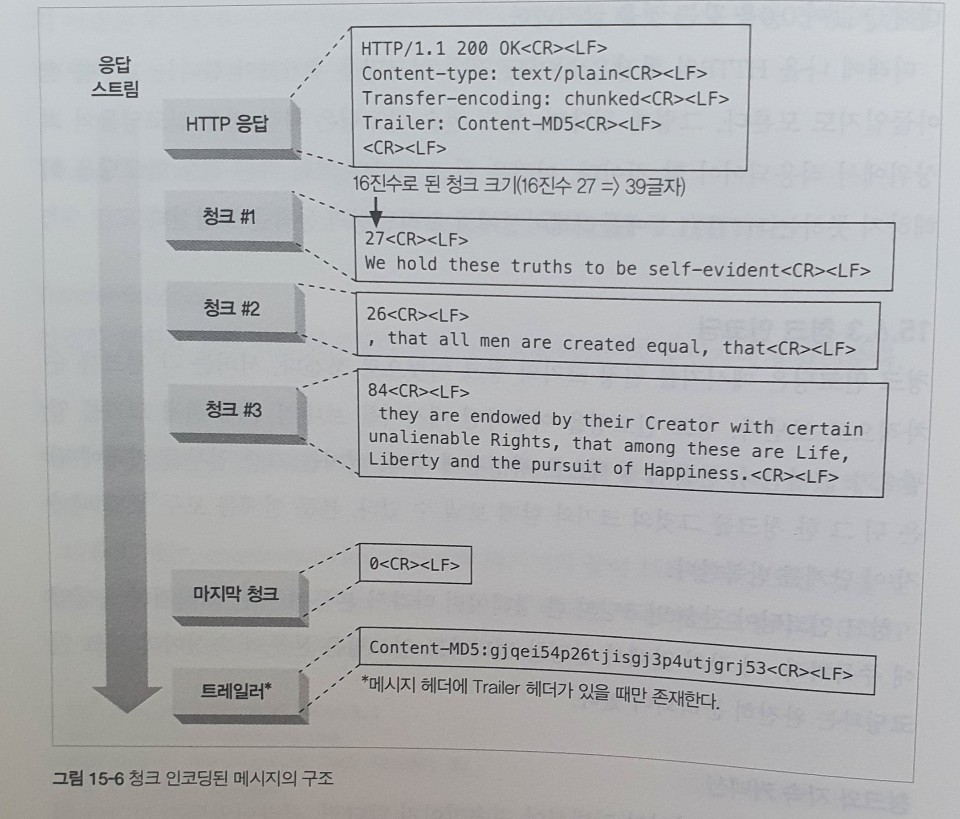
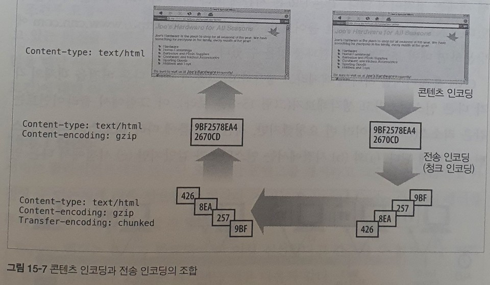

# 15. 엔터티와 인코딩

## 메시지는 컨테이너, 엔터티는 화물

HTTP 메시지를 인터넷 운송 시스템의 컨테이너라고 생각한다면, HTTP 엔터티는 메시지의 실질적인 화물이다.

### 엔터티 본문

엔터티 본문은 가공되지 않은 데이터만을 담고 있다. 다른 정보들은 모두 헤더에 담겨 있다. 엔터티 본문은 가공되지 않은 날 데이터에 불과하기 때문에 엔터티 헤더는 그 데이터의 의미에 대해 설명할 필요가 있다.

엔터티 본문은 헤더 필드의 끝을 의미하는 빈 CRLF 줄 바로 다음부터 시작한다. 콘텐츠가 텍스트든 바이너리든, 문서든 이미지든, 압축되었든 안되었든, 한국어든 영어든 상관없이 항상 CRLF 바로 다음에 위치한다.

## Content-Length

Content-Length 헤더는 메시지의 엔터티 본문의 크기를 바이트 단위로 나타낸다. 어떻게 인코딩 되었든 상관없이 크기를 표현할 수 있다. \(gzip으로 압축된 텍스트 파일이라면 압축된 후의 크기다.\)

Content-Length 헤더는 엔터티 본문을 포함한 메시지에서는 필수적으로 있어야 한다. Content-Length는 서버 충돌로 인해 메시지가 잘렸는지 감지하고자 할 때와 지속 커넥션을 공유하는 메시지를 올바르게 분할하고자 할 때 필요하다.

### 잘림 검출

옛날 버전의 HTTP는 커넥션이 닫힌 것을 보고 메시지가 끝났음을 인지했다. 그러나 Content-Length가 없다면 클라이언트는 커넥션이 정상적으로 닫힌 것인지 메시지 전송 중에 서버에 충돌이 발생한 것인지 구분하지 못한다. 클라이언트는 메시지 잘림을 검출하기 위해 Content-Length를 필요로 한다. 잘린 메시지를 캐시하는 위험을 줄이기 위해, 캐싱 프락시 서버는 명시적으로 Content-Length 헤더를 갖고 있지 않은 HTTP 본문은 보통 캐시하지 않는다.

### 잘못된 Content-Length

Content-Length가 잘못된 값을 담고 있을 경우 아예 빠진 것보다도 큰 피해를 유발할 수 있다. 공식적으로 HTTP/1.1 사용자 에이전트는 잘못된 길이를 받고 그 사실을 인지했을 때 사용자에게 알려주게 되어 있다.

### Content-Length와 지속 커넥션

Content-Length는 지속 커넥션을 위해 필수다. 만약 응답이 지속 커넥션을 통해서 온 것이라면, 또 다른 HTTP 응답이 즉시 그 뒤를 이을 것이다. 커넥션이 지속적이기 때문에, 클라이언트가 커넥션이 닫힌 위치를 근거로 메시지의 끝을 인식하는 것은 불가능하다. HTTP 애플리케이션은 Content-Length 헤더 없이는 어디까지가 엔터티 본문이고 어디부터가 다음 메시지인지 알 수 없을 것이다.

### 콘텐츠 인코딩

만약 본문의 콘텐츠가 인코딩되어 있다면, Content-Length 헤더는 인코딩된 본문의 길이를 바이트 단위로 정의한다.

### 엔터티 본문 길이 판별을 위한 규칙

이 규칙들은 반드시 다음에 나열된 순서대로 적용되어야 한다.

1. 본문을 갖는 것이 허용되지 않는 특정 타입의 HTTP 메시지에서는, 본문 계산을 위한 Content-Length 헤더가 무시된다. 가장 중요한 예는 [HEAD](https://developer.mozilla.org/ko/docs/Web/HTTP/Methods/HEAD) 응답이다.
2. 메시지가 [Transfer-Encoding](https://developer.mozilla.org/ko/docs/Web/HTTP/Headers/Transfer-Encoding) 헤더를 포함하고 있다면, 메시지가 커넥션이 닫혀서 먼저 끝나지 않는 이상 엔터티는 0바이트 청크라 불리는 특별한 패턴으로 끝나야 한다.
3. 메시자가 Content-Length 헤더를 갖는다면, Transfer-Encoding 헤더가 존재하지 않는 이상 Content-Length 값은 본문의 길이를 담게 된다. 만약 Transfer-Encoding 헤더 필드를 갖고 있는 메시지를 받았다면 반드시 Content-Length 헤더를 무시해야 한다. \(왜냐하면 전송 인코딩은 엔터티 본문을 표현하고 전송하는 방식을 바꿀 것이기 때문이다.\)
4. 메시지가 multipart/byteranges 미디어 타입을 사용하고 엔터티 길이가 별도로 정의되지 않았다면, 멀티파트 메시지의 각 부분은 각자가 스스로의 크기를 정의할 것이다.
5. 위의 어떤 규칙에도 해당되지 않는다면, 엔터티는 커넥션이 닫힐 때 끝난다.
6. HTTP/1.0 과의 호환을 위해, 엔터티 본문을 갖고 있는 HTTP/1.1 요청은 반드시 유효한 Content-Length 헤더도 갖고 있어야 한다.

## 엔터티 요약

HTTP가 일반적으로 TCP/IP와 같이 신뢰할 만한 전송 프로토콜 위에서 구현됨에도 불구하고, 불완전한 트랜스코딩 프락시나 버그 많은 중개자 프락시를 비롯한 여러가지 이유로 메시지의 일부분이 전송 중에 변형되는 일이 일어난다. 엔터티 본문 데이터에 대한 의도하지 않은 변경을 감지하기 위해, 최초 엔터티가 생성될 때 송신자는 데이터에 대한 [체크섬](https://blog.naver.com/PostView.nhn?blogId=gkenq&logNo=220996158493&proxyReferer=https%3A%2F%2Fwww.google.co.uk%2F)을 생성할 수 있으며, 수신자는 모든 의도하지 않은 엔터티의 변경을 잡아내기 위해 그 체크섬으로 기본적인 검사를 할 수 있다.

## 미디어 타입과 Charset

Content-Type 헤더 필드는 엔터티 본문의 MIME 타입을 기술한다. MIME 타입은 전달되는 데이터 매체의 기저 형식\(HTML, 워드 문서, MPEG 비디오 등\)의 표준화된 이름이다. 클라이언트 애플리케이션은 콘텐츠를 적절히 해독하고 처리하기 위해 MIME 타입을 이용한다.

MIME 타입은 주 미디어 타입\(텍스트, 이미지, 오디오 등\)으로 시작해서 뒤이어 빗금\(/\), 그리고 미디어 타입을 더 구체적으로 서술하는 부 타입\(subtype\)으로 구성된다. 엔터티가 콘텐츠 인코딩을 거친 경우에도 Content-Type 헤더는 여전히 인코딩 전의 엔터티 본문 유형을 명시할 것이다.

### 텍스트 매체를 위한 문자 인코딩

Content-Type 헤더는 내용 유형을 더 자세히 지정하기 위한 선택적인 매개변수도 지원한다. 엔터티의 비트 집합을 텍스트 파일의 글자들로 변환하기 위한 charset 매개변수가 대표적인 예이다.

### 멀티파트 미디어 타입

HTTP는 멀티파트 본문도 지원한다. 그러나 일반적으로는 폼을 채워서 제출할 때와 문서의 일부분을 실어 나르는 범위 응답을 할 때의 두가지 경우에만 사용된다.

### 멀티파트 폼 제출

HTTP 폼을 채워서 제출하면, 가변 길이 텍스트 필드와 업로드 될 객체는 각각이 멀티파트 본문을 구성하는 하나의 파트가 되어 보내진다.

### 멀티파트 범위 응답

범위 요청에 대한 HTTP 응답 또한 멀티파트가 될 수도 있다. 그러한 응답은 Content-Type: multipart/byteranges 헤더 및 각각 다른 범위를 담고 있는 멀티파트 본문이 함께 온다.

## 콘텐츠 인코딩

HTTP 애플리케이션은 때때로 콘텐츠를 보내기 전에 인코딩을 하려고 한다. 예를 들어, 전송 시간을 줄이기 위해 압축을 할 수 있고, 콘텐츠를 암호화하거나 뒤섞어서 보낼 수도 있다.

### 콘텐츠 인코딩 과정

1. 웹 서버가 원본 Content-Type과 Content-Length 헤더를 수반한 원본 응답 메시지를 생성한다.
2. 콘텐츠 인코딩 서버가 인코딩된 메시지를 생성한다. 인코딩된 메시지는 Content-Type은 같지만 Content-Length는 다르다. 인코딩 서버는 Content-Encoding 헤더를 인코딩된 메시지에 추가하여, 수신측 애플리케이션이 그것을 디코딩할 수 있도록 한다.
3. 수신측 프로그램은 인코딩된 메시지를 받아서 디코딩하고 원본을 얻는다.

### 콘텐츠 인코딩 유형

몇 가지 흔히 쓰이는 콘텐츠 인코딩 토큰이다.

| 콘텐츠 인코딩 값 | 설명 |
| :--- | :--- |
| [gzip](https://ko.wikipedia.org/wiki/Gzip) | 엔터티에 GNU zip 인코딩이 적용되었음을 의미한다. |
| compress | 엔터티에 대해 유닉스 파일 압축 프로그램인 compress가 실행되었음을 의미한다 |
| deflate | 엔터티가 zlib 포맷으로 압축되었음을 의미한다. |
| identity | 엔터티에 어떤 인코딩도 수행되지 않았음을 의미한다. Content-Encoding 헤더가 존재하지 않는다면 이 값인 것으로 간주된다. |

### Accept-Encoding 헤더

서버에서 클라이언트가 지원하지 않는 인코딩을 사용하는 것을 막기 위해, 클라이언트는 자신이 지원하는 인코딩의 목록을 Accept-Encoding 요청 헤더를 통해 전달한다. 만약 HTTP 요청에 Accept-Encoding 헤더를 포함하지 않는다면, 서버는 클라이언트가 어떤 이노딩이든 받아들일 수 있는 것으로 간주한다. \(Accept-Encoding: \*\)

```http
Accept-Encodig: compress, gzip
Accept-Encodig: 
Accept-Encodig: *
Accept-Encodig: compress;q=0.5, gzip;q=1.0
Accept-Encodig: gzip;q=1.0, identity; q=0.5, *;q=0
```

클라이언트는 각 인코딩에 Q\(quality\) 값을 매개변수로 더해 선호도를 나타낼 수 있다. 0.0에서 가장 선호함을 의미하는 1.0까지다. 토큰 `*` 은 `그 외 모두`를 의미한다.

## 전송 인코딩과 청크 인코딩

콘텐츠 인코딩된 메시지는 단지 메시지의 엔터티 부분만 인코딩한다. 전송 인코딩된 메시지에서는 인코딩은 전체 메시지에 대해 적용되어 메시지 자체의 구조를 바꾼다.

### 안전한 전송

역사적으로 전송 인코딩은 다른 프로토콜에서도 네트워크를 통한 안전한 전송을 위해 존재했다. 표준화된 전송 기반을 갖춘 HTTP는 안전한 전송의 초점을 다른 데에 맞추고 있다. HTTP에서 전송된 메시지의 본문이 문제를 일으킬 수 있는 이유는 몇 가지 밖에 없다.

#### 알 수 없는 크기

몇몇 게이트웨이 애플리케이션과 콘텐츠 인코더는 콘텐츠를 먼저 생성하지 않고서는 메시지 본문의 최종 크기를 판단할 수 없다. 몇몇 서버는 데이터의 끝을 알리는 특별한 종결 꼬리말을 포함시켜 전송 인코딩으로 데이터를 보내려 시도한다.

#### 보안

메시지 콘텐츠를 보내기 전에 전송 인코딩을 사용해 알아보기 어렵게 뒤섞어버리는 방법도 있다. 그러나 이미 SSL과 같은 전송 계층 보안 방식이 있기 때문에 전송 인코딩 보안은 흔하지 않다.

### Transfer-Encoding

전송 인코딩을 제어하고 서술하기 위해 정의된 헤더는 단 두 개뿐이다.

#### Transfer-Encoding

안전한 전송을 위해 어떤 인코딩이 메시지에 적용되었는지 수신자에게 알려준다.   
ex. Transfer-Encoding: chunked

#### TE

어떤 확장된 전송 인코딩을 사용할 수 있는지 서버에게 알려주기 위해 요청 헤더에 사용한다.  
ex. TE: trailers, chunked

### 청크 인코딩

청크 인코딩은 메시지를 일정 크기의 청크 여럿으로 쪼갠다. 서버는 각 청크를 순차적으로 보낸다. 청크 인코딩을 이용하면 메시지를 보내기 전에 전체 크기를 알 필요가 없어진다. 본문이 동적으로 생성됨에 따라, 서버는 그 중 일부를 버퍼에 담은 뒤 그 한 청크를 그것의 크기와 함께 보낼 수 있다. 본문 전체를 모두 보낼 때까지 이 단계를 반복한다.

#### 청크와 지속 커넥션

클라이트와 서버 사이의 커넥션이 지속적이지 않다면, 클라이언트는 자신이 읽고 있는 본문의 크기를 알 필요가 없다. 클라이언트는 서버가 커넥션을 닫을 때까지를 본문으로 간주하고 읽을 것이다.

지속 커넥션에서는 본문을 쓰기 전에 반드시 Content-Length 헤더에 본문의 길이를 담아서 보내줘야 한다. 콘텐츠가 서버에서 동적으로 생성되는 경우에는 보내기 전에 본문의 길이를 알아내는 것이 불가능할 것이다.

청크 인코딩은 서버가 본문을 여러 청크로 쪼개 보낼 수 있게 해줌으로써 이 딜레마에 대한 해법을 제공한다. 서버는 크기가 0인 청크로 본문이 끝났음을 알리고 다음 응답을 위해 커넥션을 열린 채로 유지할 수 있다.



#### 청크 인코딩된 메시지의 트레일러

[트레일러](https://developer.mozilla.org/en-US/docs/Web/HTTP/Headers/Trailer)에는 본문의 콘텐츠가 먼저 생성되어야 한다거나 하는 등의 이유로 메시지 시작 시점에서는 그 값을 알 수 없는 추가적인 헤더 필드를 담을 수 있다. 트레일러로 보낼 수 있는 헤더의 예로 Content-MD5가 있다.\(문서가 생성되기 전에 그 문서의 MD5를 계산하는 것은 어렵다\) 

메시지 헤더는 청크 인코딩된 메시지 다음에 오게 될 헤더들을 나열하는 Trailer 헤더를 포함한다. 마지막 청크 다음에 Trailer 헤더에 나열했던 헤더들이 온다.

### 콘텐츠와 전송 인코딩의 조합

콘텐츠 인코딩과 전송 인코딩은 동시에 사용될 수 있다.



### 전송 인코딩 규칙

* 전송 인코딩의 집합은 반드시 `chunked`를 포함해야 한다. 유일한 예외는 메시지가 커넥션의 종료로 끈나는 경우뿐이다.
* 청크 전송 인코딩이 사용되었다면, 메시지 본문에 적용된 마지막 전송 인코딩이 존재해야 한다.
* 청크 전송 인코딩은 반드시 본문에 한 번 이상 적용되어야 한다.

## 시간에 따라 바뀌는 인스턴스

웹 객체는 정적이지 않다. 같은 URL은 시간에 따라 다른 버전의 객체를 가리킬 수 있다. 클라이언트는 같은 리소스\(URL\)를 여러 번 요청했지만, 시간이 흐름에 따라 리소스의 다른 인스턴스를 받게 된다.

HTTP 프로토콜은 어떤 특정한 종류의 요청이나 응답을 다루는 방법들을 정의하는데, 이것은 인스턴스 조작이라 불리며 객체의 인스턴스에 작용한다. 대표적인 두 가지가 `범위 요청`과 `델타 인코딩`이다. 이 둘 모두가 클라이언트가 자신이 갖고 있는 리소스의 사본이 서버가 갖고 있는 것과 정확히 같은지 판단하고, 상황에 따라서는 새 인스턴스를 요청할 수 있는 능력을 가질 것을 요구한다.

## 검사기와 신선도

### 신선도

서버는 클라이언트에게 얼마나 오랫동안 콘텐츠를 캐시하고 그것이 신선하다고 가정할 수 있는지에 대한 정보를 줄 것이다. 서버는 Expires나 Cache-Control 헤더를 통해 이러한 정보를 제공할 수 있다.

### 조건부 요청과 검사기

캐시의 사본이 요청되었을 때 그것이 더 이상 신선하지 않다면 캐시는 신이 갖고 있는 사본을 신선한 것으로 만들 필요가 있다. 캐시는 원 서버에서 현 시점의 사본을 가져올 수 있지만, 대개 서버에 있는 문서는 여전히 캐시에 들어있는 신선하지 못한 사본과 같을 것이다. 사본과 같음에도 불구하고 항상 그 문서를 가져온다면 네트워크 대역폭을 낭비하고, 불필요한 부하를 주고, 모든 것을 느려지게 만들게 된다.

HTTP는 클라이언트에게 리소스가 바뀐 경우에만 사본을 요청하는 `조건부 요청`이라 불리는 특별한 요청을 할 수 있는 방법을 제공한다. 조건부 요청은 평범한 HTTP 요청 메시지이지만, 특정 조건이 참일 때에만 수행된다.

```http
GET /announce.html HTTP/1.0
If-Modified-Since: Sat, 29 Aug 2020, 14:30:00 GMT
```

조건부 요청은 `If-`로 시작하는 조건부 헤더에 의해 구현된다. 만약 조건이 참이 아니면 서버는 HTTP 에러 코드를 돌려보낸다. 각 조건부 요청은 특정 검사기 위에서 동작한다. 검사기는 문서의 테스트된 특정 속성이다.

| 요청 유형 | 검사기 | 설명 |
| :--- | :--- | :--- |
| If-Modified-SInce | Last-Modified | 지난번 Last-Modified 응답 헤더에 들어있었던 시각에 마지막으로 수정된 버전이 더 이상 최신 버전이 아니라면, 그 리소스의 사본을 보내라. |
| If-Unmodified-Since | Last-Modified | 지난번 Last-modified 응답 헤더에 들어있었던 시각에 마지막으로 수정된 버전에서 변한 것이 없다면, 그 리소스의 사본을 보내라. |
| If-Match | ETag | 지난번 ETag 응답 헤더에 들어있었던 것과 엔터티 태그가 같다면, 그 리소스의 사본을 보내라. |
| If-None-Match | ETag | 지난번 ETag 응답 헤더에 들어있었던 것과 엔터티 태그가 다르다면, 그 리소스의 사본을 보내라. |

HTTP는 검사기를 `약한 검사기`와 `강한 검사기`의 두 가지로 분류한다. 약한 검사기는 리소스의 인스턴스를 고유하게 식별하지 못하는 경우도 있다. 강한 검사기는 언제나 고유하게 식별한다.

약한 검사기의 예로 객체의 바이트 단위 크기가 있다. 리소스 콘텐츠는 크기가 같더라도 내용이 다를 수 있으므로, 바이트의 개수를 세는 방식으로 동작하는 가상의 횟수 검사기는 변경이 발생했음을 약하게만 감지할 수 있다. 그러나 리소스의 콘텐츠에 대한 암호 체크섬\(MD5 등\)은 강한 검사기다. 이것은 문서가 변경되면 함께 변경된다.

## 범위 요청

HTTP는 클라이언트가 문서의 일부분이나 특정 범위만 요청할 수 있도록 해준다. 범위 요청을 이용하면, HTTP 클라이언트는 받다가 실패한 엔터티를 일부 혹은 범위로 요청함으로써 다운로드를 중단된 시점에서 재개할 수 있다.

```http
GET /bigfile.html HTTP/1.1
Host: www.haky.com
Range: bytes=4000-
...
```

모든 서버가 범위 요청을 받아들일 수 있는 것은 아니지만 많은 경우 가능하다. 서버는 ㅡㄹ라이언트에게 자신이 범위를 받아들일 수 있는지 응답에 Accept-Range 헤더를 포함시키는 방법으로 알려줄 수 있다. 이 헤더의 값은 측정의 단위로, 주로 바이트다.

```http
HTTP/1.1 200 OK
Date: Fri, 05 Aug 2020 23:46:00 GMT
Server: Apache/1.2.4
Accept-Range: bytes
...
```

## 델타 인코딩

새 페이지 전

## 참고

* [TCP 헤더](https://evan-moon.github.io/2019/11/10/header-of-tcp/#checksum)
* [HTTP 조건부 요청](https://developer.mozilla.org/ko/docs/Web/HTTP/Conditional_requests)

