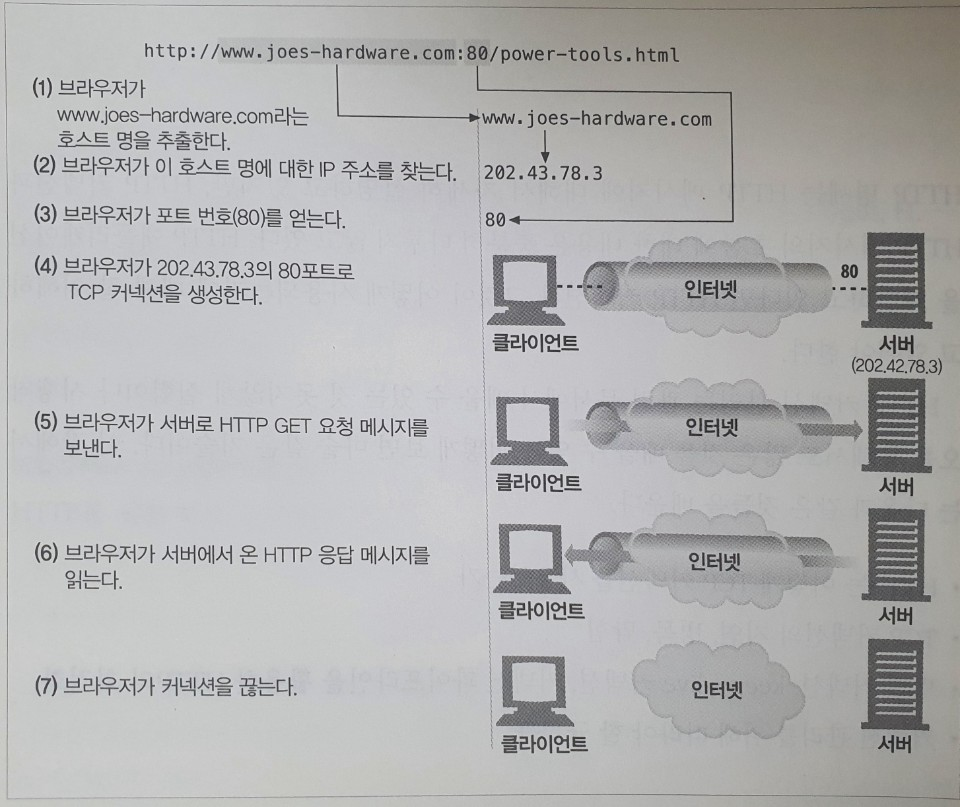
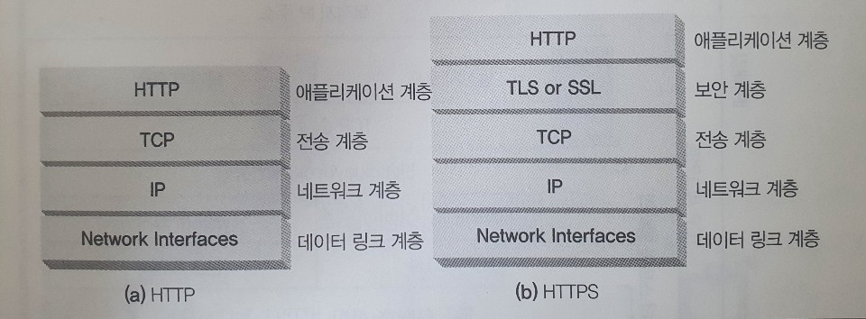
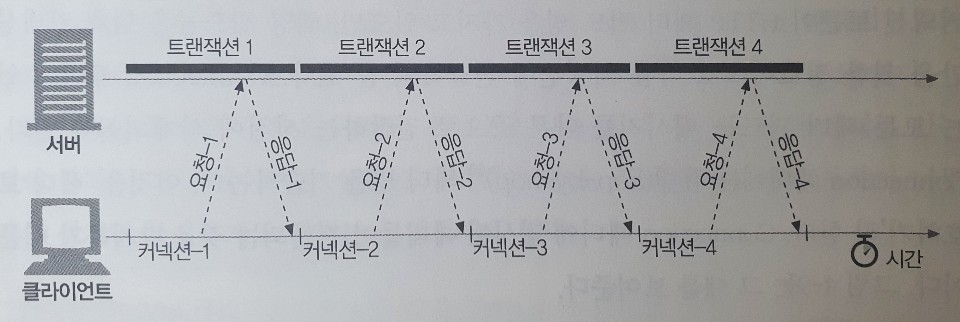
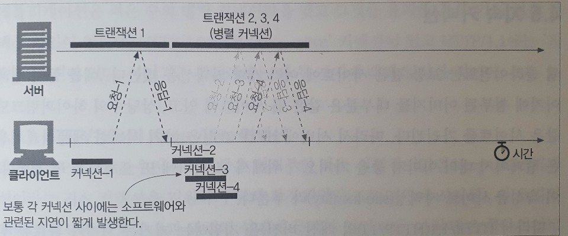
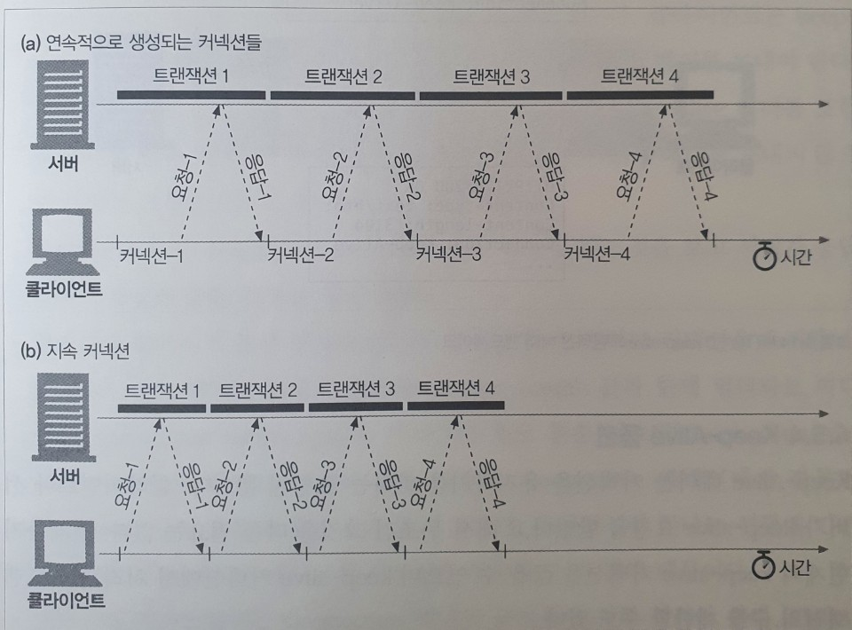
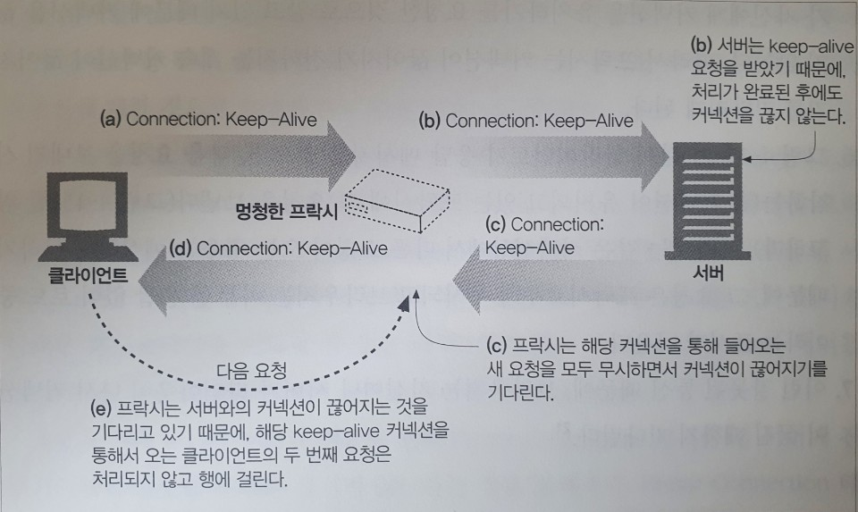
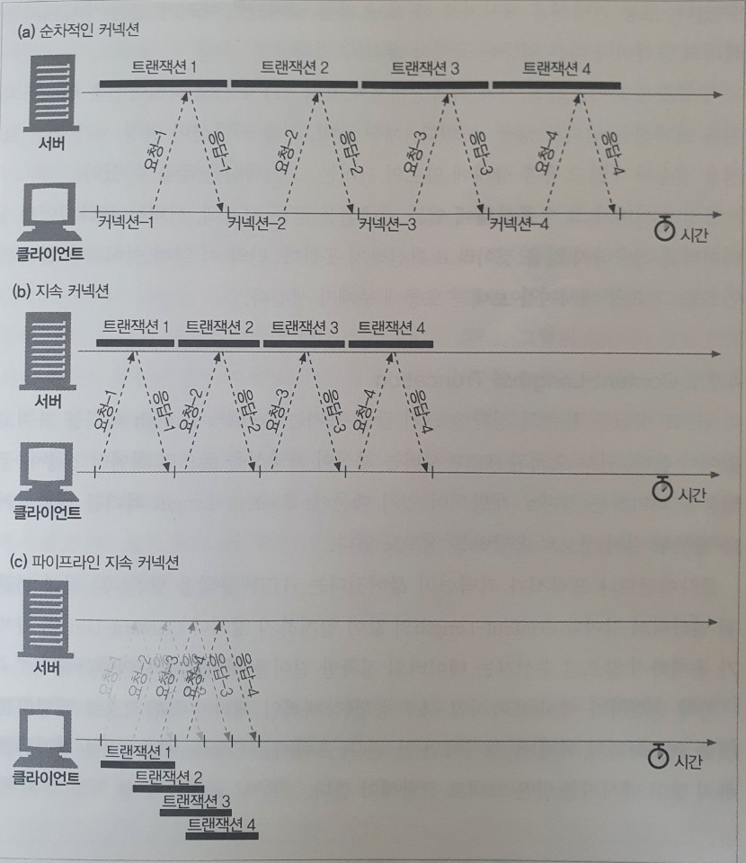

# 04. 커넥션 관리

## TCP 커넥션

모든 HTTP 통신은 패킷 교환 네트워크 프로토콜들의 계층화된 집합인 TCP/IP를 통해 이루어진다.

* TCP는 HTTP에게 신뢰할 만한 통신 방식을 제공한다. \(손실 및 손상 되지 않고 순서가 바뀌지 않는다\)
* TCP 스트림은 세크먼트로 나뉘어 IP 패킷을 통해 전송된다.

* TCP는 포트 번호를 통해서 여러 개의 커넥션을 유지한다.
* TCP는 발신지 `IP 주소, 발신지 포트, 수신지 IP 주소, 수신지 포트` 값으로 식별한다.

## **TCP 성능 고려**

HTTP는 TCP 바로 위에 있는 계층이기 때문에 HTTP 트랜잭션의 성능은 그 아래 계층인 TCP 성능에 영향을 받는다.

### HTTP 트랜잭션 지연

트랜잭션을 처리하는 시간은 TCP 커넥션을 설정하고, 요청을 전송하고, 응답 메시지를 보내는 것에 비하면 상당히 짧다. 대부분의 HTTP 지연은 TCP 네트워크 지연 때문에 발생한다.

* 호스트 명을 IP 주소로 변환하는 것
* 커넥션 설정 시간
* 요청 메시지 전달 및 처리 시간
* 응답 시간

## **HTTP 커넥션 관리**

* HTTP 트랜잭션은 기본적으로 순차적으로 처리가 되므로 느림
* HTTP 커넥션의 여러 방법을 써서 해결해야함 \(병렬, 지속, 파이프라인\)

### **병렬 커넥션**

* 여러개의 커넥션을 동시에 맺는것
* 병렬이 항상 빠르지는 않다. 
  * 네트워크가 느릴때 \(대역폭이 좁을때\). 느린데 병렬이라 더 느려짐. 
  * 메모리 소모가 많고 성능 문제 발생\(객체가 많은 페이지 같은데서\). 그래서 적은 수의 커넥션만 허용 \(6~8개\)
  * 각 트랜잭션마다 새로운 커넥션을 맺고 끝는 시간과 대역폭 소요
* 병렬이 더 빠르게 느껴질 수는 있다. 동시에 여러개가 보여질테니.

### **지속 커넥션**

* 커넥션 처리가 완료된 후에도 계속 연결된 상태로 있는 것
* 커넥션을 맺기 위한 사전 작업과 지연이 없는 장점
* 기존 커넥션의 전송 성공으로 한 번에 다수의 패킷을 전송할 수 있는 권한도 있음
* 병렬과 같이 사용될때 효과적
* 잘못 관리할 경우, 계속 연결된 커넥션이 쌓여 리소스에 불필요한 소모를 발
* http/1.0에서는 keep-alive로 사용 \(기본:비활성화\)
  * 헤더에 Connection:Keep-Alive 포함시켜 사용
* http/1.1에서는 지속 커넥션으로 개선 \(기본:활성화\)
  * HTTP/1.1 애플리케이션은 트랜잭션이 끝난 다음 커넥션을 끊으려면 Connection: close 헤더를 명시해야 한다.

#### Keep-Alive와 멍청한\(dumb\) 프락시

### **파이프라인 커넥션**

* 연달아 처리하는 커넥션 \(파이프라이닝 **-** 실행중인 명령이 끝나기 전에 다른 명령의 실행을 시작\)
* 대기시간을 줄여서 성능 높임
  * 첫번째 요청이 서버에 전달되면, 이어서 두 번째 세번째 요청이 전달되게 된다.

    이로써, 여러 개의 요청은 응답이 도착하기 전에 큐에 쌓여 네트워크 상 왕복 시간을 줄여준다.
* 지속 커넥션일때만 사용
* 응답은 요청 순서에 맞게 와야함

### **커넥션 끊기**

* 커넥션 괸리\(특히 끊기\)에는 기준이 없기 때문에 애플리케이션 간의 입출력 채널 끊기는 조심히 해야함. 서로 간의 상태 검사를 주기적으로 하면서.

