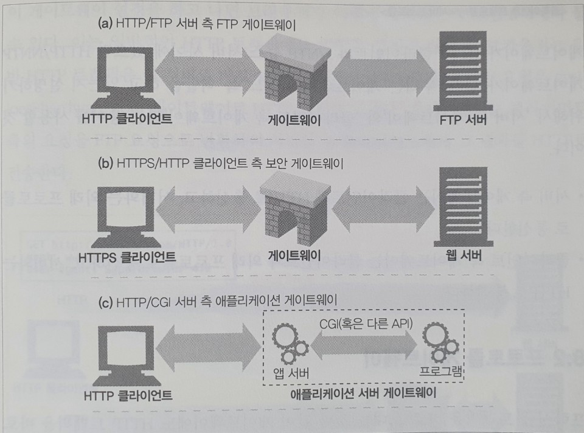
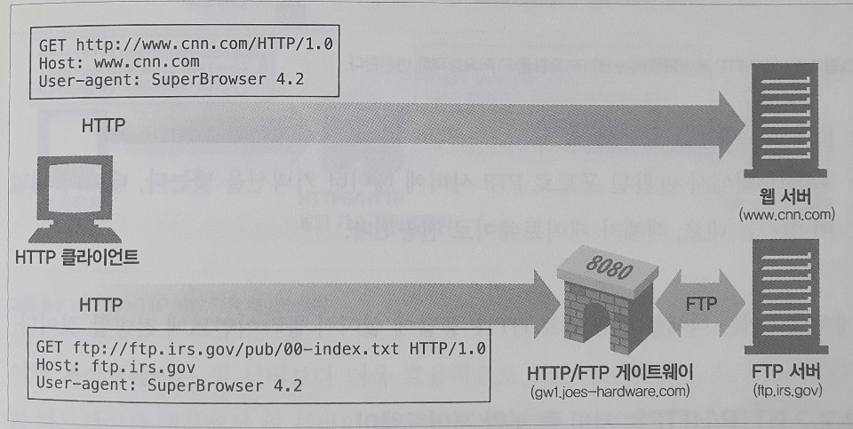
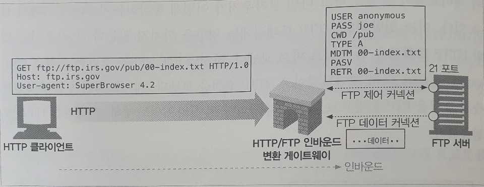
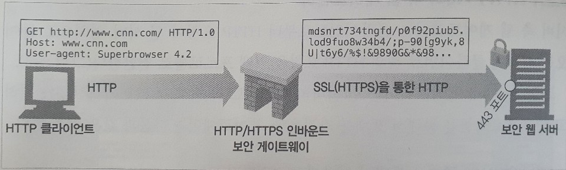
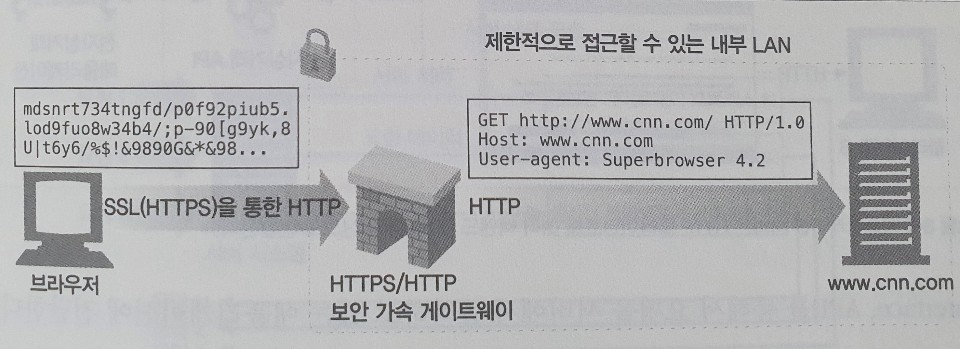

# 08. 통합점: 게이트웨이, 터널, 릴레이

## 게이트웨이

웹에 더 복잡한 리소스를 올려야 할 필요가 생기면서, 모든 리소스를 한 개의 애플리케이션으로만 처리할 수 없다는 것은 분명해졌다. 개발자들은 이 문제에 대한 해결책으로, 인터프리터 같이 리소스를 받기 위한 경로를 안내하는 역할을 하는 `게이트웨이`를 고안해냈다.

게이트웨이는 리소스와 애플리케이션을 연결하는 역할을 한다. 게이트웨이는 요청을 받고 응답을 보내는 포털 같이 동작하는데, 동적인 콘텐츠를 생성하거나 데이터베이스에 질의를 보낼 수 있다.

게이트웨이는 HTTP 트래픽을 다른 프로토콜로 자동으로 변환하여, HTTP 클라이언트가 다른 프로토콜을 알 필요 없이 서버에 접속할 수 있게 하기도 한다.

* 게이트웨이는 FTP URL을 가리키는 HTTP 요청을 받는다. 게이트웨이는 FTP 커넥션을 맺고 FTP 서버에 명령을 전송한다. 클라이언트는 적절한 HTTP 헤더와 함께 HTTP를 통해서 문서를 받는다.
* 게이트웨이는 암호화된 웹 요청을 SSL을 통해 받고, 요청을 해독해서 생성한 일반 HTTP 요청을 목적지 서버로 전달한다. \(게이트웨이에 해당 서버 인증서가 설치되어 있어야 한다.\)
* 게이트웨이는 애플리케이션 서버 게이트웨이 API를 통해서 HTTP 클라이언트를 서버 측 애플리케이션 프로그램에 연결한다.

### 클라이언트 측 게이트웨이와 서버 측 게이트웨이

웹 게이트웨이는 한쪽에서는 HTTP로 통신하고 다른 한쪽에서는 HTTP가 아닌 다른 프로토콜로 통신한다. 게이트웨이는 클라이언트 측 프로토콜과 서버 측 프로토콜을 빗금으로 구분해 기술한다. 

`클라이언트 프로토콜/서버 프로토콜`


웹 프락시는 게이트웨이와 같다. 하지만 양쪽에서 HTTP로 통신하기 때문에, 기술적으로는 프락시다.


서버 측 게이트웨이는 클라이언트와 HTTP로 통신하고, 서버와는 외래 프로토콜로 통신한다. 클라이언트 측 게이트웨이는 클라이언트와 외래 프로토콜로 통신하고, 서버와는 HTTP로 통신한다.

## 프로토콜 게이트웨이

게이트웨이에도 HTTP 트래픽을 바로 보낼 수 있다. 보통, 브라우저에 명시적으로 게이트웨이를 설정하여 자연스럽게 트래픽이 게이트웨이를 거쳐 가게 하거나, 게이트웨이를 대리 서버\(리버스 프락시\)로 설정할 수도 있다.

### HTTP/\*: 서버 측 웹 게이트웨이

서버 측 웹 게이트웨이는 클라이언트로부터 HTTP 요청이 원 서버 영역으로 들어오는 시점에 클라이언트 측의 HTTP 요청을 외래 프로토콜로 전환한다.

### HTTP/HTTPS: 서버 측 보안 게이트웨이

클라이언트는 일반 HTTP를 사용하여 웹을 탐색할 수 있지만, 게이트웨이는 자동으로 사용자의 모든 세션을 암호화할 것이다.

### HTTPS/HTTP: 클라이언트 측 보안 가속 게이트웨이

HTTPS/HTTP 게이트웨이는 보안 가속기로 유명하다. 이 HTTPS/HTTP 게이트웨이는 웹 서버의 앞단에 위치하고, 보이지 않는 인터셉트 게이트웨이나 리버스 프락시 역할을 한다. 이 게이트웨이는 보안 HTTPS 트래픽을 받아서 복호화하고, 웹 서버로 보낼 일반 HTTP 요청을 만든다.

## 리소스 게이트웨이

게이트웨이의 가장 일반적인 형태인 애플리케이션 서버는 목적지 서버와 게이트웨이를 한 개의 서버로 결합한다. 애플리케이션 서버는 HTTP를 통해서 클라이언트와 통신하고 서버 측에 있는 애플리케이션 프로그램에 연결하는 서버 측 게이트웨이다.

애플리케이션 게이트웨이에서 유명했던 최초의 API는 공용 게이트웨이 인터페이스\(Common Gateway Interface, CGI\)였다. CGI는 특정 URL에 대한 HTTP 요청에 따라 프로그램을 실행하고, 프로그램의 출력을 수집하고, HTTP 응답으로 회신하는데 웹 서버가 사용하는 표준화된 인터페이스 집합이다.

공용 게이트웨이 인터페이스는 최초의 서버 확장이자 지금까찌도 가장 널리 쓰이는 서버 확장이다. 이는 웹에서 동적인 HTML, 신용카드 처리, 데이터베이스 질의 등을 제공하는 데 사용한다.

## 터널

웹 터널은 HTTP 프로토콜을 지원하지 않는 애플리케이션에 HTTP 애플리케이션을 사용해 접근하는 방법을 제공한다. 웹 터널을 사용하면 HTTP 커넥션을 통해서 HTTP가 아닌 트래픽을 전송할 수 있고, 다른 프로토콜을 HTTP 위에 올릴 수 있다. 웹 터널을 사용하는 가장 일반적인 이유는 HTTP 커넥션 안에 HTTP가 아닌 트래픽을 얹기 위해서다. 따라서 웹 터널을 사용하면 웹 트래픽만을 허락하는 방화벽이 있더라도 HTTP가 아닌 트래픽을 전송할 수 있다.

## 릴레이

HTTP 릴레이는 HTTP 명세를 완전히 준수하지는 않는 간단한 HTTP 프락시다. 릴레이는 커넥션을 맺기 위한 HTTP 통신을 한 다음, 바이트를 맹목적으로 전달한다.

HTTP는 복잡하기에, 모든 헤더와 메서드 로직을 수행하지 않고 맹목적으로 트래픽을 전달하는 간단한 프락시를 구현하는 방식이 유용할 때가 있다. 데이터를 맹목적으로 전달하도록 구현하기는 쉽기 때문에, 단순 필터링이나 진단 혹은 컨텐츠 변환을 하는데 사용되기도 한다.

단순 맹목적 릴레이를 구현하는데 관련된 일반적인 문제 중 하나는, 맹목적 릴레이가 Connection 헤더를 제대로 처리하지 못해서 keep-alive 커넥션이 행에 걸리는 것이다.

