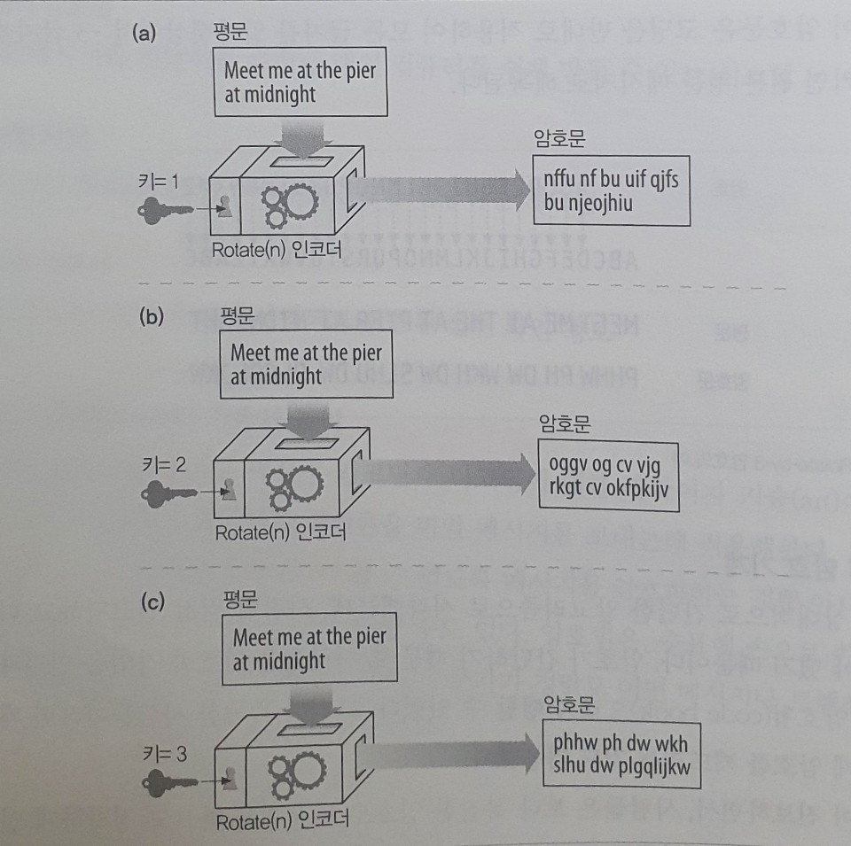
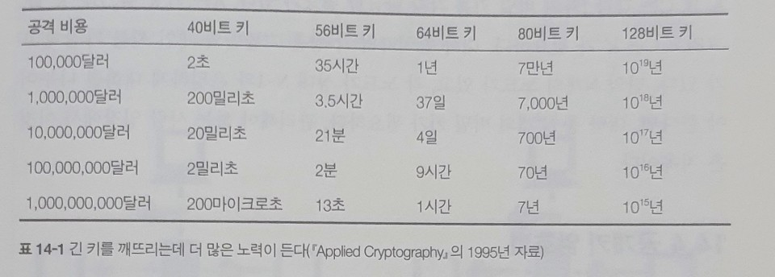
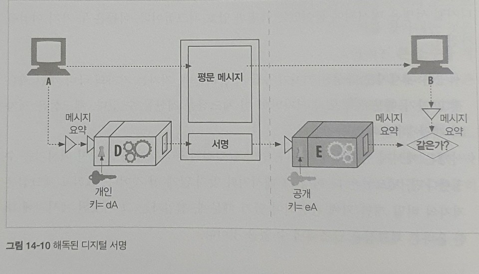
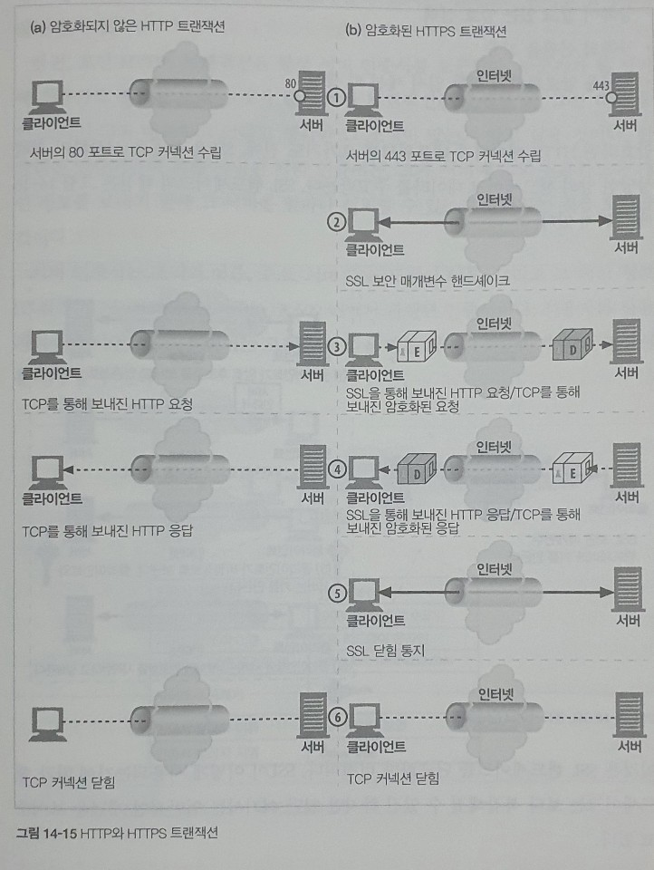
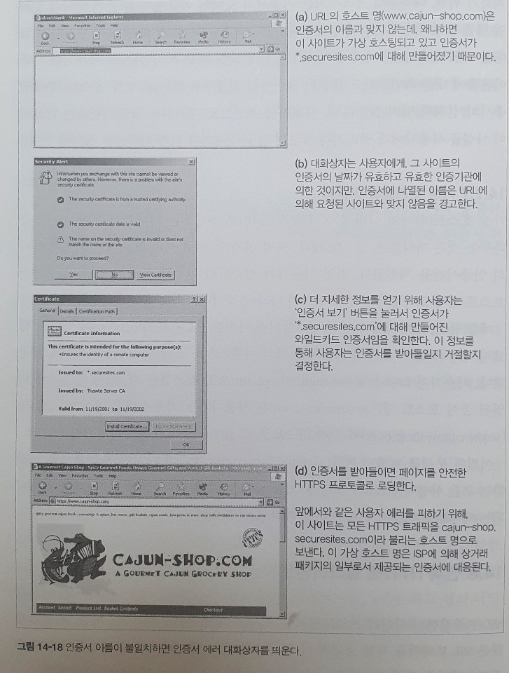
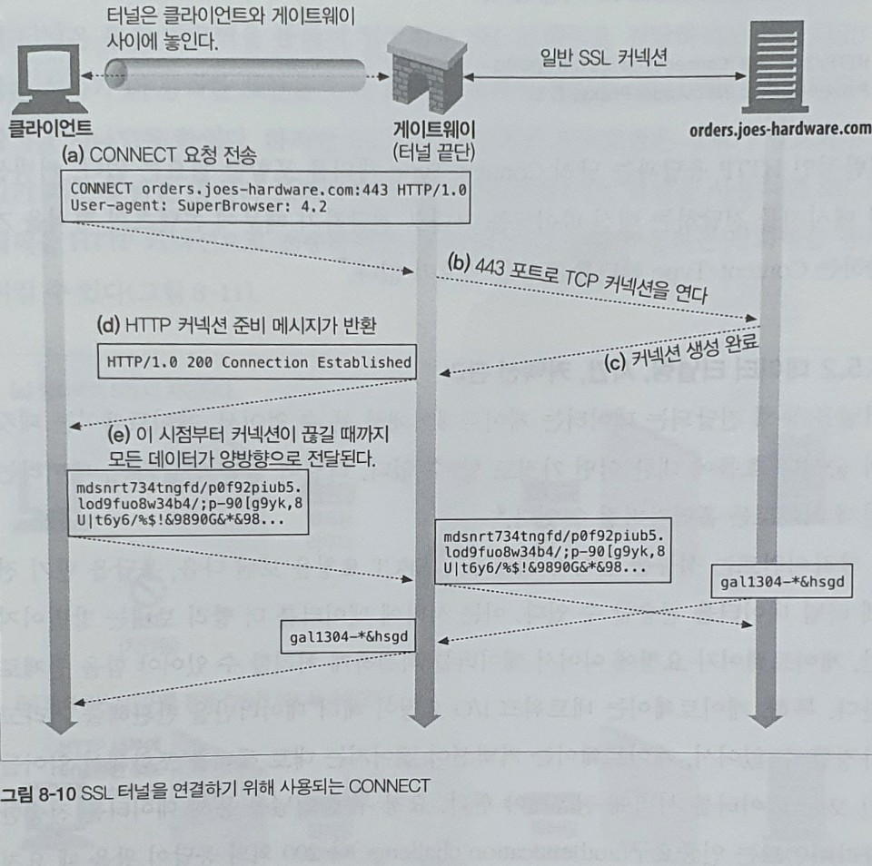

# 14. 보안 HTTP

## HTTP를 안전하게 만들기

### HTTPS

HTTPS는 HTTP를 안전하게 만드는 방식 중에서 가장 인기 있는 것이다. 모든 주류 브라우저와 서버에서 지원한다. 웹페이지에 HTTP가 아닌 HTTPS로 접근하고 있는 경우, URL이 http:// 대신 `https://`로 시작하는 것을 보고 그 사실을 알아챌 수 있다.

HTTPS를 사용할 때, 모든 HTTP 요청과 응답 데이터는 네트워크로 보내지기 전에 암호화된다. HTTPS는 HTTP의 하부에 전송 레벨 암호 보안 계층을 제공함으로써 동작하는데, 이 보안 계층은 안전 소켓 계층\(Secure Sockets Layer, SSL\) 혹은 그를 계승한 전송 계층 보안\(Transport Layer Security, TLS\)을 이용하여 구현된다.

어려운 인코딩 및 디코딩 작업은 대부분 SSL 라이브러리 안에서 일어나기 때문에, 보안 HTTP를 사용하기 위해 웹 클라이언트와 서버가 프로토콜을 처리하는 로직을 크게 변경할 필요는 없다. 대부분의 경우, TCP 입력/출력 호출을 SSL 호출로 대체하고, 보안 정보를 설정하고 관리하기 위한 몇 가지 호출을 추가하기만 하면 된다.

## 디지털 암호학

### 비밀 코드의 기술과 과학

암호법\(cryptography\)은 메시지 인코딩과 디코딩에 대한 과학이자 기술이다. 사람들은 수천 년간 암호법의 방법론을 비밀 메시지를 보내는데 적용해왔다. 암호법은 메시지를 암호화하는 것뿐 아니라, 메시지의 변조를 방지하기 위해 사용할 수도 있다. 또한, 어떤 메시지나 트랜잭션의 저자임을 증명하는 데도 사용될 수 있다.

### 암호

암호법은 암호\(cipher\)라 불리는 비밀 코드에 기반한다. 암호란 메시지를 인코딩하는 어떤 특정한 방법과 나중에 그 비밀 메시지를 디코딩하는 방법이다. 인코딩되기 전의 원본 메시지는 흔히 텍스트 혹은 평문이라고 불린다. 암호가 적용되어 코딩된 메시지는 보통 암호문이라고 불린다.

### 암호 기계

기술이 진보하면서, 사람들은 보다 복잡한 암호로 메시지를 빠르고 정확하게 인코딩하고 디코딩하는 기계를 만들기 시작했다. 

### 키가 있는 암호

암호 매개변수를 키라고 부른다. 디코딩 과정을 바르게 동작시키려면 올바른 키를 암호 기계에 입력할 필요가 있다. 암호 키는 하나의 암호 기계를 여러 가상 암호 기계의 집합처럼 만들어준다. 이 가상 암호 기계들은 서로 다른 키 값을 갖고 있기 때문에 제각각 다르게 동작한다. 오늘날 거의 대부분의 암호 알고리즘은 키를 사용한다.

### 디지털 암호

기계 장치의 물리적인 금속 키나 다이얼 설정과는 달리, 디지털 키는 그냥 숫자에 불과하다. 이들 디지털 키 값은 인코딩과 디코딩 알고리즘에 대한 입력값이다. 코딩 알고리즘은 데이터 덩어리를 받아서 알고리즘과 키의 값에 근거하여 인코딩하거나 디코딩하는 함수이다.

## 대칭키 암호법

많은 디지털 암호 알고리즘은 대칭키 암호라 불리는데, 왜냐하면 그들이 인코딩을 할 때 사용하는 키가 디코딩을 할 때와 같기 때문이다. 대칭키 암호에서 발송자와 수신자 모두 통신을 위해 비밀 키를 똑같이 공유할 필요가 있다.

### 키 길이와 열거 공격

좋은 암호 알고리즘은 공격자가 코드를 크래킹하려면 모든 가능한 키 값을 시도해보는 것 외에 다른 방법이 없게 만든다. 무차별로 모든 키 값을 대입해보는 공격을 열거 공격이라고 한다.

가능한 키 값의 개수는 키가 몇 비트이며 얼마나 많은 키가 유효한지에 달려있다. 대칭키 암호에서는 보통 모든 키 값이 유효하다. 8비트 키라면 256가지 값이 가능하며, 40비트 키라면 2의 40승\(약 1조\) 가지가 가능하고 128비트 키라면 2의 128승 가지가 가능하다.

40비트 키는 초당 수십억 번의 계산이 가능한 오늘날의 빠른 워크스테이션에게는 쉽게 깨질 수 있다. 이에 반해 128비트 키를 사용한 대칭키 암호는 매우 강력한 것으로 간주된다.

### 공유키 발급하기

대칭키 암호의 단점 중 하나는 발송자와 수신자가 서로 대화하려면 둘 다 공유키를 가져야 한다는 것이다. 만약 n개의 노드가 있고, 각 노드가 상대 n-1과 대화를 나누어야 한다면, 대략 총 N의 2승개의 비밀 키가 필요하다. 관리해야 하는 입장에서는 지옥이다.

## 공개키 암호법

공개키 암호 방식은 두 개의 비대칭 키를 사용한다. 하나는 호스트의 메시지를 인코딩하기 위한 것이며, 다른 하나는 그 호스트의 메시지를 디코딩하기 위한 것이다. 인코딩 키는 모두를 위해 공개되어 있다. 하지만 호스트만이 개인 디코딩 키를 알고 있다.

각 호스트마다 누구나 사용할 수 있는 인코딩 키가 할당되어 있기 때문에, 공개키 암호 방식은 대칭 키의 쌍이 N의 2승으로 폭발적으로 증가하는 것을 피할 수 있다.

키의 분리는 메시지의 인코딩은 누구나 할 수 있도록 해주는 동시에, 메시지를 디코딩하는 능력은 소유자에게만 부여한다. 이는 노드가 서버로 안전하게 메시지를 발송하는 것을 더 쉽게 해주는데, 왜냐하면 서버의 공개 키만 있으면 되기 때문이다.

### RSA

공개키 비대칭 암호의 과제는 아래 내용을 알고 있다 해도 비밀인 개인 키를 계산할 수 없다는 것을 확신시켜 주는 것이다.

* 공개키\(누구나 얻을 수 있음\)
* 가로채서 얻은 암호문의 일부\(네트워크 스누핑\)
* 메시지와 그것을 암호화한 암호문\(인코더에 임의의 텍스트를 넣고 실행해서 획득\)

이 모든 요구를 만족하는 공개키 암호 체계 중 유명한 하나는 RSA 알고리즘이다. 위의 모든 조건들이 주어졌다 하더라도 암호를 크래킹하여 개인 키를 찾아내는 것은 큰 소수를 계산하는 문제만큼 어렵다고 한다.

### 혼성 암호 체계와 세션 키

공개키 암호 방식의 알고리즘은 계산이 느린 경향이 있다. 실제로는 대칭과 비대칭 방식을 섞은 것이 쓰인다. 예를 들어, 노드들 사이의 안전한 의사소통 채널을 수립할 때는 편리하게 공개 키 암호를 사용하고, 이렇게 만들어진 안전한 채널을 통해 임시의 무작위 대칭 키를 생성하고 교환하여 이후의 나머지 데이터를 암호화할 때는 빠른 대칭 키를 사용하는 방식이 흔히 쓰인다.

## 디지털 서명

암호 체계는 메시지를 암호화하고 해독하는 것뿐 아니라, 누가 메시지를 썻는지 알려주고 그 메시지가 위조되지 않았음을 증명하기 위해 메시지에 서명을 하도록하는 데에 이용될 수 있다. 디지털 서명이라 불리는 이 기법은 인터넷 보안 인증서에게 중요하다.

### 서명은 암호 체크섬이다

디지털 서명은 메시지에 붙어있는 특별한 암호 체크섬이다. 이들은 두 가지 이점을 가진다.

* 서명은 메시지를 작성한 저자가 누군지 알려준다. 저자는 저자의 극비 개인 키를 갖고 있기 때문에, 오직 저자만이 이 체크섬을 계산할 수 있다. 체크섬은 저자의 개인 서명처럼 동작한다.
* 서명은 메시지 위조를 방지한다. 만약 악의적인 공격자가 송신 중인 메시지를 수정했다면, 체크섬은 더 이상 그 메시지와 맞지 않게 될 것이다. 그리고 체크섬은 저자의 비밀 개인 키에 관련되어 있기 때문에, 침입자는 그 위조된 메시지에 대한 올바른 체크섬을 날조해낼 수 없을 것이다.

디지털 서명은 보통 비대칭 공개키에 의해 생성된다. 개인 키는 오직 소유자만이 알고 있기 때문에, 저자의 개인 키는 일종의 지문처럼 사용된다.

## 디지털 인증서

디지털 인증서\(흔히 `certs`라고 불리는\)는 신뢰할 수 있는 기관으로부터 보증 받은 사용자나 회사에 대한 정보를 담고 있다.

### 인증서의 내부

디지털 인증서에는 또한 공식적으로 인증 기관에 의해 디지털 서명된 정보의 집합이 담겨있다.

* 대상의 이름\(사람, 서버, 조직 등\)
* 유효 기간
* 인증서 발급자 \(누가 이 인증서를 보증하는가\)
* 인증서 발급자의 디지털 서명

### X.509 v3 인증서

디지털 인증서에 대한 전 세계적인 단일 표준은 없다. 하지만 오늘날 사용되는 대부분의 인증서가 그들의 정보를 X.509라 불리는 표준화된 서식에 저장하고 있다. X.509 v3 인증서는 인증 정보를 파싱 가능한 필드에 넣어 구조화하는 표준화된 방법을 제공한다. 다른 종류의 인증서는 다른 필드 값을 가지지만, 대부분은 X.509 v3 구조를 따른다.

### 서버 인증을 위해 인증서 사용하기

사용자가 HTTPS를 통한 안전한 웹 트랜잭션을 시작할 때, 최신 브라우저는 자동으로 접속한 서버에서 디지털 인증서를 가져온다. 만약 서버가 인증서를 갖고 있지 않다면 보안 커넥션은 실패한다. 서버 인증서는 다음을 포함한 많은 필드를 갖고 있다.

* 웹 사이트의 이름과 호스트 명
* 웹 사이트의 공개키
* 서명 기관의 이름
* 서명 기관의 서명

브라우저가 인증서를 받으면, 서명 기관을 검사한다. 만약 서명 기관이 모르는 곳이라면, 브라우저는 그 서명 기관을 신뢰해야 할지 확신할 수 없으므로, 대개 사용자가 서명 기관을 신뢰하는지 확인하기 위한 대화상자를 보여준다.

## HTTPS의 세부사항

HTTPS는 HTTP의 가장 유명한 보안 버전이다. 널리 구현되었으며 주류 상용 브라우저와 서버에 구현되어 있다. HTTPS는 HTTP 프로토콜에 대칭, 비대칭 인증서 기반 암호 기법의 강력한 집합을 결합한 것이다.

### HTTPS 개요

HTTPS는 보안 전송 계층을 통해 전송되는 HTTP이다. 암호화되지 않은 HTTP 메시지를 TCP를 통해 전 세계의 인터넷 곳곳으로 보내는 대신에 HTTPS는 HTTP 메시지를 TCP로 보내기 전에 먼저 그것들을 암호화하는 보안 계층으로 보낸다.

### HTTPS 스킴

오늘날 보안 HTTP는 선택적이다. 따라서 웹 서버로의 요청을 만들 때, 웹서버에게 HTTP의 보안 프로토콜 버전을 수행한다고 말해줄 방법이 필요하다. 이것은 URL의 스킴을 통해 이루어진다.

보안이 되는 HTTPS 프로토콜에서 URL의 스킴 접두사는 `https`이다. 클라이언트는 웹 리소스에 대한 트랜잭션 수행을 요청받으면 URL의 스킴을 검사한다.

* 만약 URL이 http 스킴을 갖고 있다면, 클라이언트는 서버에 80번 포트로 연결하고 평범한 HTTP 명령을 전송한다.
* 만약 URL이 https 스킴을 갖고 있다면, 클라이언트는 서버에 443번 포트로 연결하고 서버와 바이너리 포맷으로 된 몇몇 SSL 보안 매개변수를 교환하면서 핸드셰이크를 하고, 암호화된 HTTP 명령이 뒤를 잇는다.

### 보안 전송 셋업

HTTPS에서 클라이언트는 먼저 443 포트로 연결한다. 일단 TCP 연결이 되고 나면 클라이언트와 서버는 암호법 매개변수와 교환 키를 협상하면서 SSL 계층을 초기화한다. 핸드셰이크가 완료되면 SSL 초기화는 완료되며, 클라이언트는 요청 메시지를 보안 계층에 보낼 수 있다. 이 메시지는 TCP로 보내기 전에 암호화된다.

### SSL 핸드셰이크

암호화된 메시지를 보낼 수 있게 되기 전에, 클라이언트와 서버는 SSL 핸드셰이크를 할 필요가 있다.

* 프로토콜 버전 번호 교환
* 양쪾이 알고 있는 암호 선택
* 양쪽의 신원을 인증
* 채널을 암호화하기 위한 임시 세션 키 생성

### 서버 인증서

보안 HTTPS 트랜잭션은 항상 서버 인증서를 요구한다. 서버 인증서는 조직의 이름, 주소, 서버 DNS 도메인 이름, 그리고 그 외의 정보를 보여주는 X.509 v3에서 파생된 인증서이다. 사용자와 사용자의 클라이언트 소프트웨어는 모든 것이 믿을 만한 것인지 확인하기 위해 인증서를 검증할 수 있다.

### 사이트 인증서 검사

SSL 자체는 사용자에게 웹 서버 인증서를 검증할 것을 요구하지 않지만, 최신 웹브라우저들 대부분은 인증서에 대해 간단하게 기본적인 검사를 하고 그 결과를 더 철저한 검사를 할 수 있는 방법과 함께 사용자에게 알려준다. 넷스케이프가 제안한 웹 서버 인증서 검사를 위한 알고리즘은 대부분의 웹브라우저의 검사 기법의 기초를 구축했다.

#### 날짜 검사

인증서의 시작 및 종료일을 검사한다

#### 서명자 신뢰도 검사

모든 인증서는 서버를 보증하는 어떤 인증 기관\(Certificate Authority, CA\)에 의해 서명되어 있다. 누구나 인증서를 생성할 수 있지만, 몇몇 CA는 잘 알려진 기관이다. 이러한 이유로, 브라우저는 신뢰할 만한 서명 기관의 목록을 포함한 채로 배포된다. 만약 브라우저가 알려져 있지 않은 인증기관으로부터 서명된 인증서를 받았다면, 브라우저는 보통 경고를 보여준다.

#### 서명 검사

서명 기관리 믿을 만하다고 판단하면, 브라우저는 서명기관의 공개키를 서명에 적용하여 그의 체크섬과 비교해봄으로써 인증서의 무결성을 검사한다.

#### 사이트 신원 검사

대부분의 브라우저는 인증서의 도메인 이름이 대화 중인 서버의 도메인 이름과 비교하여 맞는지 검사한다.

### 가상 호스팅과 인증서

가상 호스트로 운영되는 사이트의 보안 트래픽을 다루는 것은 까다로운 경우도 많다. 몇몇 인기 있는 웹 서버 프로그램은 오직 하나의 인증서만을 지원한다. 만약 사용자가 인증서의 이름과 정확히 맞지 않는 가상 호스트 명에 도착했다면 경고 상자가 나타날 것이다.

## 진짜 HTTPS 클라이언트

SSL은 복잡한 바이너리 프로토콜이다. 몇 가지 SSL 클라이언트와 서버 프로그래밍을 쉽게 만들어주는 상용 혹은 오픈 소스 라이브러리들이 존재한다.

### OpenSSL

OpenSSL은 SSL과 TLS의 가장 인기 있는 오픈 소스 구현이다.

## 프락시를 통한 보안 트래픽 터널링

프락시 사용 중 클라이언트가 서버로 보낼 데이터를 서버의 공개키로 암호화하기 시작했다면, 프락시는 더 이상 HTTP 헤더를 읽을 수 없다. HTTPS가 프락시와도 잘 동작할 수 있게 하기 위해, 클라이언트가 프락시에게 어디에 접속하려고 하는지 말해주는 방법을 약간 수정해야 한다. 인기 있는 기법 하나는 HTTPS SSL 터널링 프로토콜이다. 

HTTPS 터널링 프로토콜을 사용해서, 클라이언트는 먼저 프락시에게 자신이 연결하고자 하는 안전한 호스트와 포트를 말해준다. 클라이언트는 이 내용을 프락시가 읽을 수 있도록 암호화가 시작되기 전의 평문으로 말해준다.

## 참고

* [체크섬이란?](https://galid1.tistory.com/310)
* [X.509](https://ko.wikipedia.org/wiki/X.509)

