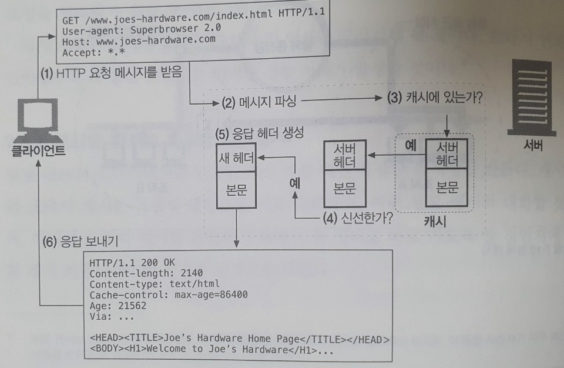

# 07. 캐시

* 캐시는 불필요한 데이터 전송을 줄여서, 네트워크 요금으로 인한 비용을 줄여준다.
* 캐시는 네트,워크 병목을 줄여준다. 대역폭을 늘리지 않고도 페이지를 빨리 불러 올 수 있게 된다.
* 캐시는 원 서버에 대한 요청을 줄여준다. 서버는 부하를 줄일 수 있으며 더 빨리 응답할 수 있게 된다.
* 페이지를 먼 곳에서 불러올수록 시간이 많이 걸리는데, 캐시는 거리로 인한 지연을 줄여준다.

## 불필요한 데이터 전송

첫 번째 서버 응답은 캐시에 보관된다. 캐시된 사본이 뒤이은 요청들에 대한 응답으로 사용될 수 있기 때문에, 원 서버가 중복해서 트래픽을 주고받는 낭비가 줄어들게 된다.

## 대역폭 병목

많은 네트워크가 원격 서버보다 로컬 네트워크 클라이언트에 더 넓은 대역폭을 제공한다. 클라이언트들이 서버에 접근할 때의 속도는, 그 경로에 있는 가장 느린 네트워크의 속도와 같다. 만약 클라이언트가 빠른 LAN에 있는 캐시로부터 사본을 가져온다면, 캐싱은 성능을 대폭 개선할 수 있을 것이다.

## 갑작스런 요청 쇄도

캐싱은 갑작스런 요청 쇄도\(Flash Crowds\)에 대처하기 위해 특히 중요하다. 갑작스런 사건으로 인해 많은 사람이 거의 동시에 웹 문서에 접근할 때 이런 일이 발생한다.

## 거리로 인한 지연

대역폭이 문제가 되지 않더라도, 거리가 문제가 될 수 있다. 모든 네트워크 라우터는 제각각 인터넷 트래픽을 지연시킨다.

## 적중과 부적중

캐시가 세상 모든 문서의 사본을 저장하지는 않는다. 캐시에 요청이 도착했을 때, 만약 그에 대응하는 사본이 있다면 그를 이용해 요청이 처리될 수 있다. 이것을 캐시 적중\(cache hit\)이라고 부른다. 만약 대응하는 사본이 없다면 그냥 원 서버로 전달되기만 할 뿐이다. 이것을 캐시 부적중\(cache miss\)이라고 부른다.

### 재검사

원 서버 콘텐츠는 변경될 수 있기 때문에, 캐시는 반드시 그들이 갖고 있는 사본을 서버를 통해 점검해야 한다. 이것을 재검사라 부른다. 캐시 재검사가 필요할 때, 원 서버에 재검사 요청을 보낸다. 

#### 재검사 적중

콘텐츠가 변경되지 않았다면, 서버는 304\(Not Modified\) 응답을 보낸다.

#### 재검사 부적중

서버 객체가 캐시된 사본과 다르다면, 서버는 콘텐츠 전체와 함께 200\(OK\) 응답을 보낸다.

#### 객체 삭제

만약 서버 객체가 삭제되었다면, 서버는 404\(Not Found\) 응답을 돌려보내며, 캐시는 사본을 삭제한다.

### 적중률

캐시가 요청을 처리하는 비율이다. 0%는 모든 요청이 캐시 부적중임을, 100%는 모든 요청이 캐시 적중임을 의미한다. 오늘날 적중률 40%면 웹 캐시로 괜찮은 편이다.

## 캐시 [토폴로지](http://www.ktword.co.kr/abbr_view.php?m_temp1=356)

한 명에게만 할당된 캐시를 개인 전용 캐시\(private cache\)라 부르고, 공유된 캐시는 공용 캐시\(public cache\)라고 부른다

### 개인 전용 캐시

개인 전용 캐시는 많은 에너지나 저장 공간을 필요로 하지 않으므로, 작고 저렴할 수 있다. 웹브라우저는 개인 전용 캐시를 내장하고 있다. 대부분의 브라우저는 자주 쓰이는 문서를 개인용 컴퓨터의 디스크와 메모리에 캐시해 놓고, 사용자가 캐시 사이즈와 설정을 수정할 수 있도록 허용한다.

### 공용 프락시 캐시

공유 캐시는 캐시 프락시 서버 혹은 프락시 캐시라고 불리는 특별한 종류의 공유된 프락시 서버다. 공용 캐시에는 여러 사용자가 접근하기 때문에, 불필요한 트래픽을 줄일 수 있는 더 많은 기회가 있다.

## 캐시 처리 단계

1. 요청 받기 - 캐시는 네트워크로부터 도착한 요청 메시지를 읽는다
2. 파싱 - 캐시는 메시지를 파싱하여 URL과 헤더들을 추출한다.
3. 검색 - 캐시는 로컬 복사본이 있는지 검사하고, 사본이 없다면 사본을 받아온다\(그리고 로컬에 저장한다\)
4. 신선도 검사 - 캐시는 캐시된 사본이 충분히 신선한지 검사하고, 신선하지 않다면 변경사항이 있는지 서버에게 물어본다.
5. 응답 생성 - 캐시는 새로운 헤더와 캐시된 본문으로 응답 메시지를 만든다.
6. 발송 - 캐시는 네트워크를 통해 응답을 클라이언트에게 돌려준다.
7. 로깅 - 선택적으로, 캐시는 로그파일에 트랜잭션에 대해 서술한 로그 하나를 남긴다.

## 사본을 신선하게 유지하기

캐시된 사본 모두가 서버의 문서와 항상 일치하는 것은 아니다. 결국 문서들은 시간에 따라 변경된다. 오래된 데이터를 제공하는 캐시는 불필요하다. 캐시된 데이터는 서버의 데이터와 일치하도록 관리되어야 한다. HTTP는 캐시된 사본이 서버와 충분히 일치하도록 유지할 수 있게 해주는 메커니즘을 갖고 있다. 문서 만료와 서버 재검사라고 부른다.

### 문서 만료

HTTP는 Cache-Control과 Expires라는 특별한 헤더들을 이용해서 원 서버가 각 문서에 유효기간을 붙일 수 있게 해준다. 캐시된 문서가 만료되면, 캐시는 반드시 서버와 문서에 변경된 것이 있는지 검사해야 하며, 만약 그렇다면 신선한 사본을 얻어 와야 한다\(새 유효기간과 함께\).

<table>
  <thead>
    <tr>
      <th style="text-align:left">&#xD5E4;&#xB354;</th>
      <th style="text-align:left">&#xC124;&#xBA85;</th>
    </tr>
  </thead>
  <tbody>
    <tr>
      <td style="text-align:left">Cache-Control: max-age</td>
      <td style="text-align:left">
        
max-age &#xAC12;&#xC740; &#xBB38;&#xC11C;&#xC758; &#xCD5C;&#xB300; &#xB098;&#xC774;&#xB97C;
          &#xC815;&#xC758;&#xD55C;&#xB2E4;. &#xCD5C;&#xB300; &#xB098;&#xC774;&#xB294;
          &#xBB38;&#xC11C;&#xAC00; &#xCC98;&#xC74C; &#xC0DD;&#xC131;&#xB41C; &#xC774;&#xD6C4;&#xBD80;&#xD130;,
          &#xC81C;&#xACF5;&#xD558;&#xAE30;&#xC5D4; &#xB354; &#xC774;&#xC0C1; &#xC2E0;&#xC120;&#xD558;&#xC9C0;
          &#xC54A;&#xB2E4;&#xACE0; &#xAC04;&#xC8FC;&#xB420; &#xB54C;&#xAE4C;&#xC9C0;
          &#xACBD;&#xACFC;&#xD55C; &#xC2DC;&#xAC04;&#xC758; &#xCD5C;&#xB313;&#xAC12;(&#xCD08;
          &#xB2E8;&#xC704;)&#xC774;&#xB2E4;.

        

        
Cache-Control: max-age=484200

      </td>
    </tr>
    <tr>
      <td style="text-align:left">Expires</td>
      <td style="text-align:left">
        
&#xC808;&#xB300; &#xC720;&#xD6A8; &#xAE30;&#xAC04;&#xC744; &#xBA85;&#xC2DC;&#xD55C;&#xB2E4;.
          &#xB9CC;&#xC57D; &#xC720;&#xD6A8;&#xAE30;&#xAC04;&#xC774; &#xACBD;&#xACFC;&#xD588;&#xB2E4;&#xBA74;,
          &#xADF8; &#xBB38;&#xC11C;&#xB294; &#xB354; &#xC774;&#xC0C1; &#xC2E0;&#xC120;&#xD558;&#xC9C0;
          &#xC54A;&#xB2E4;.

        

        
Expires: Fri, 05 Sep 2020, 05:00:00 GMT

      </td>
    </tr>
  </tbody>
</table>

### 서버 재검사

캐시된 문서가 만료되었다는 것은, 그 문서가 원 서버에 현재 존재하는 것과 실제로 다르다는 것을 의미하지는 않으며, 다만 이제 검사할 시간이 되었음을 뜻한다. 이 검사를 캐시가 원 서버에게 문서가 변경되었는지의 여부를 물어볼 필요가 있음을 의미하는 서버 재검사라고 부른다.

* 재검사 결과 콘텐츠가 변경되었다면, 캐시는 그 문서의 새로운 사본을 가져와 오래된 데이터 대신 저장한 뒤 클라이언트에게도 보내준다.
* 재검사 결과 콘텐츠가 변경되지 않았다면, 캐시는 새 만료일을 포함한 새 헤더들만 가져와서 캐시 안의 헤더들을 갱신한다.

### 조건부 메서드와의 재검사

HTTP는 캐시가 서버에게 `조건부 GET`이라는 요청을 보낼 수 있도록 해준다. 이 요청은 서버가 갖고 있는 문서가 캐시가 갖고 있는 것과 다른 경우에만 객체 본문을 보내달라고 하는 것이다. HTTP는 다섯 가지 조건부 요청 헤더를 정의한다. 그 중 둘은 캐시 재검사를 할 때 가장 유용한 If-Modified-Since와 If-None-Match이다.

| 헤더 | 설명 |
| :--- | :--- |
| If-Modified-Since: &lt;date&gt; | 만약 문서가 주어진 날짜 이후로 수정되었다면 요청 메서드를 처리한다. 이것은 캐시된 버전으로부터 콘텐츠가 변경된 경우에만 콘텐츠를 가져오기 위해 Last-Modified 서버 응답 헤더와 함께 사용한다. |
| If-None-Match: &lt;tags&gt; | 마지막 변경된 날짜를 맞춰보는 대신, 서버는 문서에 대한 일련번호와 같이 동작하는 특별한 태그를 제공할 수 있다. If-None-Match 헤더는 캐시된 태그가 서버에 있는 문서의 태그와 다를 때만 요청을 처리한다. |

## 캐시 제어

HTTP는 문서가 만료되기 전까지 얼마나 오랫동안 캐시될 수 있게 할 것인지 서버가 설정할 수 있는 여러 가지 방법을 정의한다.

### no-cache와 no-store

no-store가 표시된 응답은 캐시가 그 응답의 사본을 만드는 것을 금지한다. no-cache로 표시된 응답은 사실 로컬 캐시 저장소에 저장될 수 있다. 다만 먼저 서버와 재검사를 하지 않고서는 캐시에서 클라이언트로 제공될 수 없을 뿐이다.

### Max-Age

문서가 서버로부터 온 이후로 흐른 시간이고, 초로 나타낸다.

### Expires

더 이상 사용하지 않기를 권하는 헤더이며 초 단위의 시간 대신 실제 만료 날짜를 명시한다.

### Must-Revalidate

캐시가 이 객체의 신선하지 않은 사본을 원 서버와의 최초의 재검사 없이는 제공해서는 안 됨을 의미한다.

### 휴리스틱 만료

만약 응답이 max-age, Expires 헤더 중 어느 것도 포함하지 않고 있다면, 캐시는 경험적인 방법으로\(heuristic\) 최대 나이를 계산할 것이다.

## 참고

* [If-Modified-Since](https://developer.mozilla.org/ko/docs/Web/HTTP/Headers/If-Modified-Since)
* [HTTP 조건부 요청](https://developer.mozilla.org/ko/docs/Web/HTTP/Conditional_requests)

