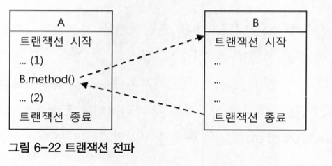
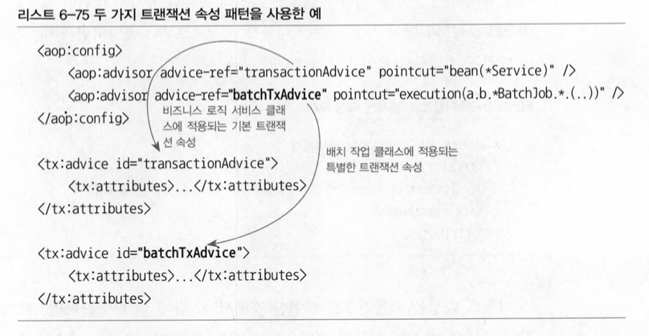
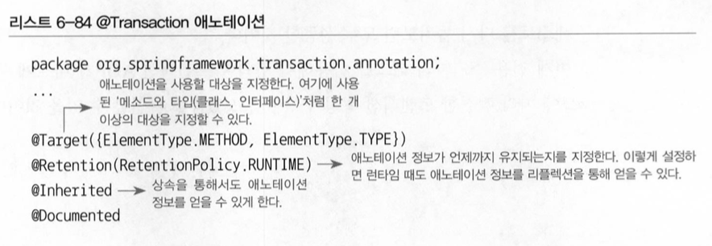
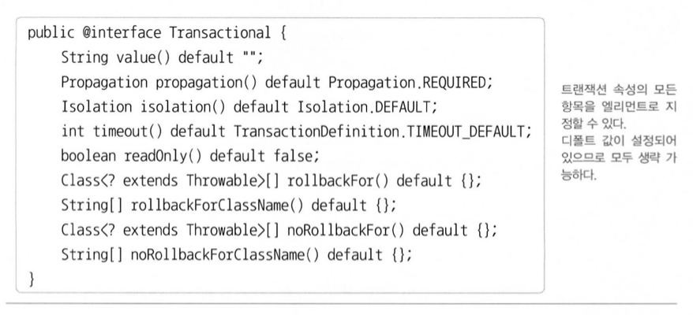
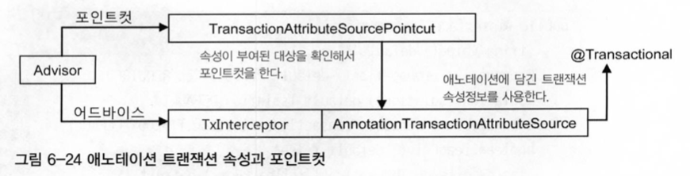

# 6. AOP

## 트랜잭션

트랜잭션 경계 안에서 진행된 작업은 commit\(\)을 통해 모두 성공하든지 아니면 rollback\(\)을 통해 모두 취소돼야 한다.

### 트랜잭션 전파

트랜잭션 전파란 트랜잭션의 경계에서 이미 진행 중인 트랜잭션이 있을 때 또는 없을 때 어떻게 동작할 것인가를 결정하는 방식을 말한다.



#### PROPAGATION\_REQUIRED

가장 많이 사용되는 전파 속성. 진행 중인 트랜잭션이 없으면 새로 시작하고, 이미 시작된 트랜잭션이 있으면 이에 참여한다.

#### PROPAGATION\_REQUIRES\_NEW

항상 새로운 트랜잭션을 시작한다.

#### PROPAGATION\_NOT\_SUPPORTED

트랜잭션 없이 동작하도록 만들 수 있다. 진행 중인 트랜잭션이 있어도 무시한다.

트랜잭션 경계설정은 보통 AOP를 이용해 한 번에 많은 메소드에 동시 적용하는 방법을 사용한다. 하지만 그 중 특별한 메소드만 트랜잭션 적용에서 제외하려고 할때 사용한다. 포인트컷을 이용하여 할 수도 있지만 상당히 복잡해질 수 있으므로, 전체에 AOP가 적용되도록 하고 전파 속성을 달리 두어 처리하는 편이 낫다.

### [격리 수준](https://nesoy.github.io/articles/2019-05/Database-Transaction-isolation)

모든 DB 트랜잭션은 격리수준을 갖고 있어야 한다. 서버환경에서는 여러 개의 트랜잭션이 동시에 진행될 수 있다. 따라서 적절하게 격리수준을 조정해서 가능한 한 많은 트랜잭션을 동시에 진행시키면서도 문제가 발생하지 않게 하는 제어가 필요하다.

격리수준은 기본적으로 DB에 설정되어 있지만 JDBC 드라이버나 DataSource 등에서 재설정할 수 있고, 트랜잭션 단위로 격리수준을 조정할 수 있다. 

### 제한시간

트랜잭션을 수행하는 제한시간을 설정할 수 있다.

### 읽기전용

읽기전용으로 설정해두면 트랜잭션 내에서 데이터를 조작하는 시도를 막아줄 수 있다. 또한 데이터 액세스 기술에 따라서 성능이 향상될 수도 있다.

### 트랜잭션 인터셉터와 트랜잭션 속성

메소드별로 다른 트랜잭션 정의를 적용하려면 어드바이스의 기능을 확장해야 한다.

### [TransactionInterceptor](https://reiphiel.tistory.com/entry/understanding-of-spring-transaction-management-practice)

스프링에는 편리하게 트랜잭션 경계설정 어드바이스로 사용할 수 있도록 만들어진 TransactionInterceptor가 존재한다.

트랜잭션 인터셉터에는 기본적으로 두 가지 종류의 예외 처리 방식이 있다. 런타임 예외가 발생하면 트랜잭션은 롤백된다. 반면에 타깃 메소드가 런타임 예외가 아닌 체크 예외를 던지는 경우에는 이것을 예외상황으로 해석하지 않고 일종의 비즈니스 로직에 따른, 의미가 있는 리턴 방식의 한 가지로 인식해서 트랜잭션을 커밋해버린다. 그런데 이러한 예외처리 기본 원칙을 따르지 않는 경우가 있다면 rollbackOn\(\) 이라는 속성을 둬서 기본 원칙과 다른 예외처리가 가능하게 해준다. rollbackOn\(\)메소드는 어떤 예외가 발생하면 롤백을 할 것인가를 결정하는 메소드다.

### 포인트컷과 트랜잭션 속성의 적용 전략

#### 트랜잭션 포인트컷 표현식은 타입 패턴이나 빈 이름을 이용한다

일반적으로 트랜잭션을 적용할 타깃 클래스의 메소드는 모두 트랜잭션 적용 후보가 되는 것이 바람직하다.

쓰기 작업이 없는 단순한 조회 작업만 하는 메소드에도 모두 트랜잭션을 적용하는게 좋다. 조회의 경우에는 읽기전용으로 트랜잭션 속성을 설정해두면 그만큼 성능의 향상을 가져올 수 있다. 또, 복잡한 조회의 경우는 제한시간을 지정해줄 수도 있고, 격리 수준에 따라 조회도 반드시 트랜잭션 안에서 진행해야 할 필요가 발생하기도 한다.

따라서 트랜잭션용 포인트컷 표현식에는 메소드나 파라미터, 예외에 대한 패턴을 정의하지 않는게 바람직하다. 트랜잭션의 경계로 삼을 클래스들이 선정됐다면, 그 클래스들이 모여 있는 패키지를 통째로 선택하거나 클래스 이름에서 일정한 패턴을 찾아서 표현식으로 만들면 된다. 가능하면 클래스보다는 인터페이스 타입을 기준으로 타입 패턴을 적용하는 것이 좋다. 인터페이스는 클래스에 비해 변경 빈도가 적고 일정한 패턴을 유지하기 쉽기 때문이다.

#### 공통된 메소드 이름 규칙을 통해 최소한의 트랜잭션 어드바이스와 속성을 정의한다

실제로 하나의 애플리케이션에서 사용할 트랜잭션 속성의 종류는 그다지 다양하지 않다. 너무 다양하게 속성을 부여하면 관리만 힘들어질 뿐이다. 따라서 기준이 되는 속성을 정의하고 그에 따라 적절한 메소드 명명 규칙을 만들어 두면 하나의 어드바이스만으로 모든 트랜잭션 속성을 지정할 수 있다. 다만, 적용 패턴이 일반적인 경우와 크게 다른 오브젝트가 존재하는 경우에는 어드바이스와 포인트컷을 새롭게 추가해줄 필요가 있다.



#### 프록시 방식 AOP는 같은 타깃 오브젝트 내의 메소드를 호출할 때는 적용되지 않는다

프록시 방식의 AOP에서는 프록시를 통한 부가 기능의 적용은 클라이언트로부터 호출이 일어날 때만 가능하다. 반대로 타깃 오브젝트가 자기 자신의 메소드를 호출할 때는 프록시를 통한 부가기능의 적용이 일어나지 않는다. REQUIRES\_NEW라고 해놨더라도 전파 속성이 적용되지 않으므로 기존 트랜잭션에 참여하게 된다.

해결할 수 있는 방법은 두 가지가 있다.

하나는 스프링 API를 이용해 프록시 오브젝트에 대한 레퍼런스를 가져온 뒤에 같은 오브젝트의 메소드 호출도 프록시를 이용하도록 강제하는 방법이다. 하지만 순수한 비즈니스 로직만을 남겨둬야 하는데 프록시 호출 코드를 섞는 것은 바람직하지 않다. 추천되지 않는다.

다른 방법은 AspectJ와 같은 타깃의 바이트코드를 직접 조작하는 방식의 AOP 기술을 적용하는 것이다. 불편한 부분도 있기 때문에 꼭 필요한 경우에만 사용해야 한다.

### 트랜잭션 속성 적용

1. 트랜잭션 경계설정의 일원화
   * 트랜잭션 경계설정의 부가기능을 여러 계층에서 중구난방으로 적용하는 건 좋지 않다. 일반적으로 특정 계층의 경계를 트랜잭션 경계와 일치시키는 것이 바람직하다. 비즈니스 로직을 담고 있는 서비스 계층의 메소드가 트랜잭션 경계를 부여하기에 가장 적절한 대상이다.
   * 트랜잭션은 보통 서비스 계층의 메소드 조합을 통해 만들어지기 때문에 DAO가 제공하는 주요 기능은 서비스 계층에 위임 메소드를 만들어둘 필요가 있다. 가능하면 다른 모듈의 DAO에 접근할 때는 서비스 계층을 거치도록 하는 게 바람직하다. 그래야 트랜잭션 속성도 제어가 가능하고 부가 로직을 적용할 수도 있기 때문이다.
2. 서비스 빈에 적용되는 포인트컷 표현식 등록
3. 트랜잭션 속성을 가진 트랜잭션 어드바이스 등록
4. 트랜잭션 속성 테스트

## 애노테이션 트랜잭션 속성과 포인트컷

포인트컷과 트랜잭션 속성을 이용한 트랜잭션 일괄 적용 방식은 복잡하지 않은 대부분의 상황에 잘 맞는다. 하지만 클래스나 메소드에 따라 속성이 다르고, 세밀하게 튜닝된 트랜잭션 속성을 적용해야 하는 경우도 있다. 이럴때는 일괄적으로 속성을 부여하는 방식은 적합하지 않다. 기본 속성과 다른 경우가 있을 때마다 일일이 포인트컷과 어드바이스를 새로 추가해줘야 하기 때문이다. 포인트컷 자체가 지저분해지고 설정파일도 복잡해지기 쉽다. 이런때에는 스프링이 제공하는 애노테이션을 지정하는 방법이 있다.

### 트랜잭션 애노테이션

#### @Transactional







#### 대체 정책

스프링은 @Transactional을 적용할 때 4단계의 대체 정책을 이용하게 해준다. 메소드의 속성을 확인할 때 타깃 메소드, 타깃 클래스, 선언 메소드, 선언 타입\(클래스, 인터페이스\)의 순서에 따라서 @Transactional이 적용됐는지 차례로 확인하고, 가장 먼저 발견되는 속성정보를 사용하게 하는 방법이다. 인터페이스에 @Transactional을 두면 구현 클래스가 바뀌더라도 트랜잭션 속성을 유지할 수 있다는 장점이 있다. 만약 끝까지 발견되지 않으면 해당 메소드는 트랜잭션 적용 대상이 아니라고 판단한다. 

## 트랜잭션 지원 테스트

### 선언적 트랜잭션과 트랜잭션 전파 속성

AOP를 이용해 코드 외부에서 트랜잭션의 기능을 부여해주고 속성을 지정할 수 있게 하는 방법을 `선언적 트랜잭션`이라고 한다. 반대로 TransactionTemplate이나 개별 데이터 기술의 트랜잭션 API를 사용해 직접 코드 안에서 사용하는 방법은 `프로그램에 의한 트랜잭션`이라고 한다. 스프링은 이 두 가지 방법을 모두 지원하며, 특별한 경우가 아니라면 선언적 방식의 트랜잭션을 사용하는 것이 바람직하다.

### 트랜잭션 동기화

트랜잭션의 자유로운 전파와 이로 인한 유연한 개발이 가능할 수 있었던 기술적인 배경에는 `AOP`가 있다. AOP 덕분에 프록시를 이용한 트랜잭션 부가기능을 간단하게 애플리케이션 전반에 적용할 수 있었다. 또 한 가지 중요한 기술적인 기반은 스프링의 `트랜잭션 추상화`다. 데이터 액세스 기술에 상관없이, 또 트랜잭션 기술에 상관없이 DAO에서 일어나는 작업들을 하나의 트랜잭션으로 묶어서 추상 레벨에서 관리하게 해주는 트랜잭션 추상화가 없었다면 AOP를 통한 선언적 트랜잭션이나 트랜잭션 전파 등은 불가능했을 것이다.

#### 트랜잭션 매니저와 트랜잭션 동기화

트랜잭션 추상화 기술의 핵심은 트랜잭션 매니저와 트랜잭션 동기화다. 트랜잭션 매니저를 통해 구체적인 트랜잭션 기술의 종류에 상관없이 일관된 트랜잭션 제어가 가능했다. 또한 트랜잭션 동기화 기술이 있었기에 시작된 트랜잭션 정보를 저장소에 보관해뒀다가 DAO에서 공유할 수 있었다.

### 테스트를 위한 트랜잭션 애노테이션

#### @Transactional

테스트에도 @Transactional을 적용할 수 있다. 테스트용 트랜잭션은 테스트가 끝나면 자동으로 롤백된다. 테스트에 적용된 @Transactional 기본적으로 강제 롤백시키도록 설정되어 있다.

#### @Rollback

@Transactional은 기본적으로 테스트에서 사용할 용도로 만든 게 아니기 때문에 롤백 테스트에 관한 설정을 담을 수 없다. 따라서 롤백 기능을 제어하려면 별도의 애노테이션을 사용해야 한다. @Rollback은 롤백 여부를 지정하는 값을 갖고 있다. @Rollback의 기본 값은 true다.  따라서 트랜잭션은 적용되지만 롤백을 원치 않는다면 @Rollback\(false\)라고 해줘야 한다.

```java
@Test
@Transactional
@Rollback(false)
public void transactionTest() {
    ...
}
```

#### @TransactionConfiguration

@Transactional은 클래스에 넣어서 모든 메소드에 일괄 적용할 수 있지만 @Rollback은 메소드 레벨에만 적용할 수 있다. @TransactionConfiguration을 사용하면 롤백에 대한 공통 속성을 지정할 수 있다. 디폴트 속성은 false로 해두고, 필요한 메소드에만 @Rollback을 부여해주면 된다.


Spring 4.2부터 deprecated 처리 됐고, @Rollback 클래스 단위로 처리 가능하며, @Rollback\(false\) 대신 @Commit 사용 가능


#### Propagation.NEVER

클래스 레벨에서 @Transactional이 적용되었는데, 굳이 트랜잭션이 필요 없는 메소드에 NEVER 전파 속성을 지정해주면 트랜잭션이 시작되지 않는다.

## 참고

[트랜잭션 롤백과 관련하여](https://woowabros.github.io/experience/2019/01/29/exception-in-transaction.html)

