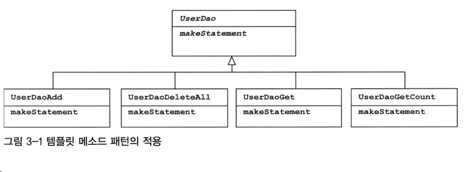
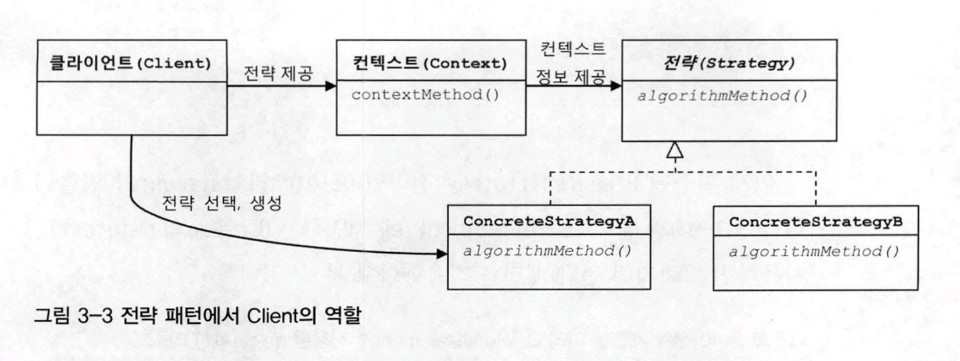

# 3. 템플릿

## 예외처리 기능을 갖춘 DAO

```java
// 예외 처리 기능이 없다!
public void deleteAll() throws SQLException {
    Connection c = dataSource.getConnection();
    
    // 아래에서 예외 발생시 close 되지 않고 리소를 반환을 하지 못한다.
    PreparedStatement ps = c.prepareStatement("delete from users");
    ps.executeUpdate();
    
    ps.close();
    c.close();
}
```

```java
// 예외 처리 완료! 하지만...
public void deleteAll() throws SQLException {
    Connection c = null;
    PreparedStatement ps = null;
    
    try {
        c = dataSource.getConnection();
        ps = c.prepareStatement("delete from users");
        ps.executeUpdate();
    } catch (SQLException e) {
        throw e;
    } finally {
        if (ps != null) {
            try {
                ps.close();
            } catch (SQLException e) {}
        }
        if (c != null) {
            try {
                c.close();
            } catch (SQLException e) {}
        }
    }
}
```

## JDBC try/catch/finally의 문제점

예외처리 코드가 중첩되고, 메소드마다 반복되고 있다. 이러한 코드가 많은 부분에 있으면 실수가 발생할 확률이 높아지며, 당장에는 문제가 발생하지 않더라도 누군가 로직을 수정하려 한다면 언젠가 문제가 발생할 수 있다.

### 분리와 재사용을 위한 디자인 패턴 적용

비슷한 기능의 메소드에서 동일하게 나타날 수 있는 변하지 않고 고정되는 부분과, 각 메소드마다 로직에 따라 변하는 부분을 구분한다.

#### 메소드 추출

변하지 않는 부분이 변하는 부분을 감싸고 있어서 변하지 않는 부분을 추출하기가 어려워 보이기 때문에 반대로 한 코드이다.

```java
public void deleteAll() throws SQLException {
    ...
    try {
        c = dataSource.getConnection();
        // 변하는 부분을 메소드로 추출
        ps = makeStatement(c);
        ps.executeUpdate();
    } catch (SQLException e) {
    ...
}

private PreparedSatatement makeStatement((Connection c) throws SQLException {
    PreparedSatement ps;
    ps = c.prepareStatement("delete from users");
    return ps;
}
```

보통 메소드 추출 리팩토링을 적용하는 경우에는 분리시킨 메소드를 다른 곳에서 재사용할 수 있어야 하는데, 이건 반대로 분리시키고 남은 메소드가 재사용이 필요한 부분이고, 분리된 메소드는 DAO 로직마다 새롭게 만들어서 확장돼야 하는 부분이라 이득이 없어 보인다.

#### 템플릿 메소드 패턴의 적용

`템플릿 메소드 패턴은 상속을 통해 기능을 확장해서 사용`하는 부분이다. 변하지 않는 부분은 슈퍼클래스에 두고 변하는 부분은 추상 메소드로 정의해둬서 서브클래스에서 오버라이드하여 새롭게 정의해 쓰도록 하는 것이다.

```java
public class UserDaoDeleteAll extends UserDao {
    protected PreparedStatement makeStatement(Connection c) throws SQLException {
        PreparedStatement ps = c.prepareStatement("delete from users");
        return ps;
    }
}
```

UserDao 클래스의 기능을 확장하고 싶을 때마다 상속 통해 자유롭게 확장할 수 있고, 확장 때문에 상위 클래스에 불필요한 변화는 생기지 않도록 할 수 있으니 개방 패쇄 원칙을 그럭저럭 지킬 수 있을 것 같다.

하지만 템플릿 메소드 패턴으로의 접근은 제한이 많다.



가장 큰 문제는 DAO 로직마다 상속을 통해 새로운 클래스를 만들어야 한다는 점이다. 또 확장 구조가 이미 클래스를 설계하는 시점에서 고정되어 버려 유연성이 떨어진다.

#### 전략 패턴의 적용

개방 패쇄 원칙을 잘 지키는 구조이면서도 템플릿 메소드 패턴보다 유연하고 확장성이 뛰어난 것이, `오브젝트를 아예 둘로 분리하고 클래스 레벨에서는 인터페이스를 통해서만 의존하도록 만드는 전략 패턴`이다.

```java
public interface StatementStrategy {
    PreparedStatement makePreparedStatement(Connection c) throws SQLEception;
}

public class DeleteAllStatement implements StatementStrategy {
    public PreparedStatement makePreparedStatement(Connection c) throws SQLException {
        PreparedStatement ps = c.prepareStatement("delete from users");
        return ps;
    }
}

public void delteAll() throws SQLException {
    ...
    try {
        c = dataSource.getConnection();
        StatementStrategy strategy = new DeleteAllStatement();
        ps = strategy.makePreparedStatement(c);
        ps.executeUpdate();
    } catch (SQLException e) {
    ...
}
```

전략 패턴은 필요에 따라 컨텍스트는 그대로 유지되면서\(ocp\) 전략을 바꿔 쓸 수 있다는 것인데, 이렇게 컨텍스트 안에서 이미 구체적인 전략 클래스인 DeleteAllStatement를 사용하도록 고정되어 있다면 이상하다. 컨텍스트가 인터페이스뿐 아니라 특정 구현 클래스를 직접 알고 있다는건 OCP에 어긋나는 것이다.

#### DI 적용을 위한 클라이언트/컨텍스트 분리

전략 패턴에 따르면 컨텍스트가 어떤 전략을 사용하게 할 것인가는 컨텍스트를 사용하는 클라이언트가 결정하는게 일반적이다. 클라이언트가 구체적인 전략의 하나를 선택하고 오브젝트로 만들어서 컨텍스트에 전달하는 것이다. 컨텍스트는 전달받은 전략 구현 클래스의 오브젝트를 사용한다.



```java
// 컨텍스트
public void jdbcContextWithStatementStrategy(StatementStrategy stmt)
 throws SQLException {
    Connection c = null;
    PreparedStatement ps = null;
    
    try {
        c = dataSource.getConnection();
        ps = stmt.makePreparedStatement(c);
        ps.executeUpdate();
    } catch (SQLException e) {
        throw e;
    } finally {
        if (ps != null) {
            try {
                ps.close();
            } catch (SQLException e) {}
        }
        if (c != null) {
            try {
                c.close();
            } catch (SQLException e) {}
        }
    }
}

// 클라이언트
public void deleteAll() throws SQLException {
    // 선정한 전략 클래스의 오브젝트 생성
    StatementStrategy st = new DeleteAllStatement();
    // 컨텍스트 호출(전략 오브젝트 전달)
    jdbcContextWithStatementStrategy(st);
}
```

## JDBC 전략 패턴의 최적화

전략 패턴을 적용하여 코드가 깔끔해졌지만 여전히 개선할 부분이 있다.

DAO 메소드마다 새로운 전략 구현 클래스를 만들어야 한다는 점이다. 이렇게 되면 기존 템플릿 패턴보다 클래스 파일의 개수가 많이 늘어난다. 런타임 시점에 다이나믹하게 DI 해준다는 점을 제외하면 템플릿 메소드 패턴보다 나을게 없다.   
또 다른 개선할 점은, DAO 메소드에서 전략에 전달할 부가적인 정보가 있는 경우 이를 위해 오브젝트를 전달받는 생성자와 이를 저장해둘 인스턴스 변수를 번거롭게 만들어야 한다는 점이다.

### 로컬 클래스

외부에서는 사용되지 않는다면 내부 클래스로 정의하는 것도 방법이다.


#### 중첩 클래스의 종류

* 중첩 클래스 : 다른 클래스 내부에 정의되는 클래스
  * 스태틱 클래스 : 독립적으로 오브젝트로 만들어질 수 있는 클래스
  * 내부 클래스 : 자신이 정의된 클래스의 오브젝트 안에서만 만들어질 수 있는 클래스
    * 멤버 내부 클래스 : 멤버 필드처럼 오브젝트 레벨에 정의
    * 로컬 클래스 : 메소드 레벨에 정의
    * 익명 내부 클래스 : 이름을 갖지 않는 클래스


클래스 파일이 줄고, 로직을 함께 볼 수 있으니 코드를 이해하기도 좋다. 또한 로컬 클래스는 자신이 선언된 곳의 정보에 접근할 수 있다. 따라서 클래스를 정의하면서 번거롭게 생성자를 통해 부가정보를 전달해줄 필요가 없다.

```java
public void add(final User user) throws SQLException {
    class AddStatement implements StatementStrategy {
        public PreparedStatement makePreparedStatement(Connection c) 
            throws SQLException {
                PreparedStatement ps = c.prepareStatement(
                    "insert into users(id, name, password) values(?, ?, ?)");
                ps.setString(1, user.getId());
                ps.setString(2, user.getName());
                ps.setString(3, user.getPassword());
                
                return ps;
        }
    }
    
    StatementStrategy st = new AddStatement();
    jdbcContextWithStatementStrategy(st);
}
```

#### 익명 내부 클래스

```java
public void add(final User user) throws SQLException {
    jdbcContextWithStatementStrategy(new StatementStrategy() {
        public PreparedStatement makePreparedStatement(Connection c) 
                throws SQLException {
                    PreparedStatement ps = c.prepareStatement(
                        "insert into users(id, name, password) values(?, ?, ?)");
                    ps.setString(1, user.getId());
                    ps.setString(2, user.getName());
                    ps.setString(3, user.getPassword());
                    
                    return ps;
            }
    );
}
```

## 컨텍스트와 DI

#### 빈 의존관계 변경

```java
public class JdbcContext {
    private DataSource dataSource;
    
    // di 준비
    public void setDataSource(DataSource dataSource) {
        this.dataSource = dataSource;
    }
    
    public void workWithSatementStrategy(StatementStrategy stmt)
        throws SQLException {
            Connection c = null;
            PreparedStatement ps = null;
            
            try {
                c = dataSource.getConnection();
                ps = stmt.makePreparedStatement(c);
                ps.executeUpdate();
            } catch (SQLException e) {
                throw e;
            } finally {
                if (ps != null) {
                    try {
                        ps.close();
                    } catch (SQLException e) {}
                }
                if (c != null) {
                    try {
                        c.close();
                    } catch (SQLException e) {}
                }
            }
    }
}


public class UserDao {
    ...
    private JdbcContext jdbcContext;
    
    // di 처리
    public void setJdbcContext(JdbcContext jdbcContext) {
        this.jdbcContext = jdbcContext;
    }
    
    public void add(final User user) throws SQLException {
        this.jdbcContext.workWithStatementStrategy(
            new StatementStrategy() {...}
        );
    }
    public void deleteAll() throws SQLException {
        this.jdbcContext.workWithStatementStrategy(
            new StatementStrategy() {...}
        );
    }
    ...
}
```

스프링의 DI는 기본적으로 인터페이스를 사이에 두고 의존 클래스를 바꿔서 사용하도록 하는게 목적이다.   
스프링의 빈 설정은 클래스 레벨이 아니라 런타임 시에 만들어지는 오브젝트 레벨의 의존관계에 따라 정의된다.

UserDao와 JdbcContext 사이에는 인터페이스를 사용하지 않고 DI를 적용했다. 지금까지 적용했던 DI는 클래스 레벨에서 구체적인 의존관계가 만들어지지 않도록 인터페이스를 사용했다.

인터페이스를 사용하지 않았다면 엄밀히 말해서 온전한 DI라고 볼 수는 없다. 그러나 스프링의 DI는 넓게 보자면 객체의 생성과 관계 설정에 대한 제어 권한을 오브젝트에서 제거하고 외부로 위임했다는 IoC라는 개념을 포괄한다. 그런 의미에서 JdbcContext를 스프링을 이용해 UserDao 객체에서 사용하게 주입했다는 건 DI의 기본을 따르고 있다고 볼 수 있다.

인터페이스를 사용하지 않았지만 DI 구조로 사용한 이유는 두가지이다.

첫째는 JdbcContext가 스프링 컨테이너의 싱글톤 레지스트리에서 관리되는 싱글톤 빈이 되기 때문이다. 싱글톤으로 등록돼서 여러 오브젝트에서 공유해 사용되는 것이 이상적이다.

둘째는 JdbcContext가 DI를 통해 다른 빈에 의존하고 있기 때문이다. JdbcContext는 DataSource 오브젝트를 주입받고 있다. DI를 위해서는 주입되는 오브젝트와 주입받는 오브젝트 양쪽 모두 스프링 빈으로 등록돼야 한다. 스프링이 생성하고 관리하는 IoC 대상이어야 DI에 참여할 수 있다.

#### 코드를 이용하는 수동 DI

스프링의 빈으로 등록해서 DI 하는 대신 사용할 수 있는 방법은 코드 내부에서 직접 DI를 적용하는 수동 DI 방법이 있다. 이 방법을 쓰면 싱글톤으로 만들려는 것은 포기해야한다. 또한, DI 컨테이너를 통해서 DI를 받을 수 없으므로 클라이언트에게 DI까지 맡겨야 한다.

```java
public class UserDao {
    ...
    private JdbcContext jdbcContext;
    
    // 수정자 이면서 JdbcContext 생성 DI 작업을 동시에 수행
    public void setDataSource(DataSource dataSource) {
        // JdbcContext 생성 (IoC)
        this.jdbcContext = new JdbcContext();
        // 의존 오브젝트 주입 (DI)
        this.jdbcContext.setDataSource(dataSource);
        
        this.dataSource = dataSource;
    }
    ...
}
```

JdbcContext가 UserDao 내부에서 만들어지고 사용되면서 그 관계를 외부에는 드러내지 않는 장점이 있다. 하지만 싱글톤으로 만들 수 없고, DI 작업을 위한 부가적인 코드가 필요하다는 단점도 있다.

