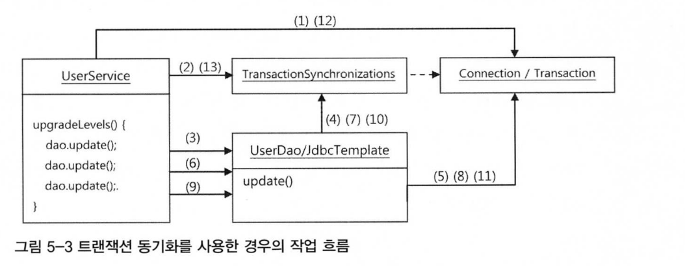
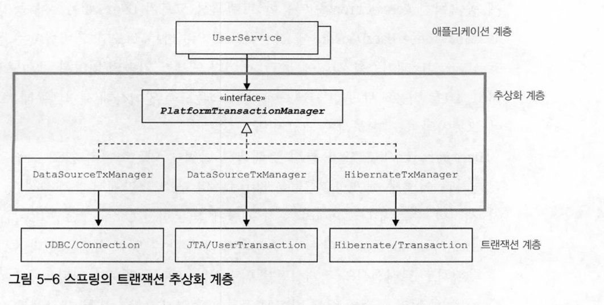
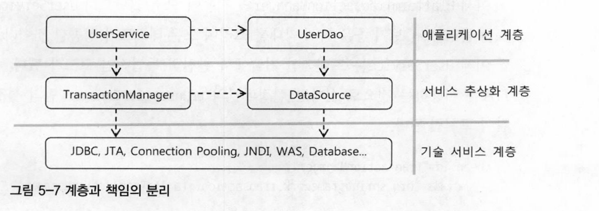

# 5. 서비스 추상화

## 트랜잭션 서비스 추상화

### 트랜잭션

트랜잭션이란 더 이상 나눌 수 없는 단위 작업을 말한다. 작업을 쪼개서 만들 수 없다는 것은 트랜잭션의 핵심 속성인 원자성을 의미한다.

DB는 그 자체로 완벽한 트랜잭션을 지원한다. SQL을 이용해 다중 로우의 수정이나 삭제를 위한 요청을 했을 때 일부 로우만 삭제되고 나머지는 안 된다거나, 일부 필드는 수정했는데 나머지 필드는 수정이 안 되고 실패로 끝나는 경우는 없다. 하나의 SQL 명령을 처리하는 경우는 DB가 트랜잭션을 보장해준다고 믿을 수 있다.

여러 개의 SQL이 사용되는 작업을 하나의 트랜잭션으로 취급해야 하는 경우도 있다. 두 가지 작업이 하나의 트랜잭션이 되려면, 두 번째 SQL이 성공적으로 DB에서 수행되기 전에 문제가 발생할 경우에는 앞에서 처리한 SQL 작업도 취소시켜야 한다. 이런 취소 작업을 `트랜잭션 롤백`이라고 한다. 반대로 여러 개의 SQL을 하나의 트랜잭션으로 처리하는 경우에 모든 SQL 수행 작업이 다 성공적으로 마무리됐다고 DB에 알려줘서 작업을 확장시켜야 한다. 이것을 `트랜잭션 커밋`이라고 한다.

### 트랜잭션 경계 설정

애플리케이션 내에서 트랜잭션이 시작되고 끝나는 위치를 트랜잭션의 경계라고 부른다. 복잡한 로직의 흐름 사이에서 정확하게 트랜잭션 경계를 설정하는 일은 매우 중요한 작업이다.

```java
Connection c = dataSource.getConnection();

// 트랜잭션 시작
c.setAutoCommit(false);

try {
    PreparedStatement st1 = c.prepareStatement("update users ...");
    st1. executeUpdate();
    PreparedStatement st2 = c.prepareStatement("delete users ...");
    st2. executeUpdate();
    
    c.commit();
} catch (Exception e) {
    c.rollback();
}

c.close();
```

JDBC의 트랜잭션은 하나의 Connection을 가져와 사용하다가 닫는 사이에서 일어난다. 트랜잭션의 시작과 종료는 Connection 오브젝트를 통해 이뤄지기 때문이다.

JDBC에서 트랜잭션을 시작하려면 자동커밋 옵션을 false로 만들어주면 된다. JDBC의 기본 설정은 DB 작업을 수행한 직후에 자동으로 커밋이 되도록 되어 있다.

일반적으로 작업 중에 예외가 발생하면 트랜잭션을 롤백한다. 예외가 발생했다는 건, 트랜잭션을 구성하는 데이터 액세스 작업을 마무리할 수 없는 상황이거나 DB에 결과를 반영하면 안 되는 이유가 생겼기 때문이다.

트랜잭션의 시작을 선언하고 commit\(\) 또는 rollback\(\)으로 트랜잭션을 종료하는 작업을 `트랜잭션의 경계설정`이라고 한다. 트랜잭션의 경계는 하나의 Connection이 만들어지고 닫히는 범위 안에 존재한다는 점도 기억해두자. 이렇게 하나의 DB 커넥션 안에서 만들어지는 트랜잭션을 `로컬 트랜잭션`이라고도 한다.

### 트랜잭션 동기화

트랜잭션 동기화란 service에서 트랜잭션을 시작하기 위해 만든 Connection 오브젝트를 특별한 저장소에 보관해두고, 이후에 호출되는 DAO의 메소드에서는 저장된 Connection을 가져다가 사용하게 하는 것이다. 정확히는 DAO가 사용하는 JdbcTemplate이 트랜잭션 동기화 방식을 이용하도록 하는 것이다. 그리고 트랜잭션이 모두 종료되면, 그때는 동기화를 마치면 된다.



트랜잭션 동기화 저장소는 작업 스레드마다 독립적으로 Connection 오브젝트를 저장하고 관리하기 때문에 다중 사용자를 처리하는 서버의 멀티스레드 환경에서도 충돌이 날 염려는 없다.

```java
private DataSource dataSource;

public void setDataSource(DataSource dataSource) {
    this.dataSource = dataSource;
}

public void upgradeLevels() throws Exception {
    // 트랜잭션 동기화 관리자를 이용해 동기화 작업을 초기화한다.
    TransactionSynchronizationManager.initSynchronization();
    // DB 커넥션 생성과 동기화를 함께 해주는 유틸리티 메소드
    Connection c = DataSourceUtils.getConnection(dataSource);
    c.setAutoCommit(false);
    
    try {
        ...
        c.commit();
    } catch (Exeption e) {
        c.rollback();
        throw e;
    } finally {
        // 스프링 유틸리티 메소드를 이용해 DB 커넥션을 안전하게 닫는다
        DataSourceUtils.releaseConnection(c, dataSource);
        // 동기화 작업 종료 및 정리
        TransactionSynchronizationManager.unbindResource(this.dataSource);
        TransactionSynchronizationManager.clearSynchronization();
    }
}
```

DataSource에서 Connection을 직접 가져오지 않고, 유틸리티 메소드를 쓰는 이유는 DataSourceUtils의 getConnection\(\) 메소드는 Connection 오브젝트를 생성해줄 뿐만 아니라 트랜잭션 동기화에 사용하도록 저장소에 바인딩해주기 때문이다.

### 스프링의 트랜잭션 서비스 추상화

DB에서 제공하는 DB 클라이언트 라이브러리와 API는 서로 전혀 호환이 되지 않는 독자적인 방식으로 만들어져 있다. 하지만 모두 SQL을 이용하는 방식이라는 공통점이 있다. 이 공통점을 뽑아내 추상화한 것이 JDBC다. JDBC라는 추상화 기술이 있기 때문에 자바의 DB 프로그램 개발자는 DB의 종류에 상관없이 일관된 방법으로 데이터 액세스 코드를 작성할 수 있다.



```java
public void upgradeLevels() {
    // JDBC 트랜잭션 추상 오브젝트 생성
    PlatformTransactionManager transactionManager = 
        // JDBC의 로컬 트랜잭션
        new DataSourceTransactionManager(dataSource);
        // JTA를 이용하는 글로벌 트랜잭션
//      new JTATransactionManager();
       
    // DB 커넥션 호출 및 트랜잭션 호출 
    TransactionStatus status = 
        transactionManager.getTransaction(new DefaultTransactionDefinition());
    
    try {
        ...
        transactionManager.commit(status);
    } catch (RuntimeExeption e) {
        transactionManager.rollback(status);
        throw e;
    }
}
```

어떤 클래스든 스프링의 빈으로 등록할 때 먼저 검토해야 할 것은 싱글톤으로 만들어져 여러 스레드에서 동시에 사용해도 괜찮은가 하는 점이다. 상태를 갖고 있고, 멀티스레드 환경에서 안전하지 않은 클래스를 빈으로 무작정 등록하면 심각한 문제가 발생하기 때문이다. 스프링이 제공하는 모든 PlatformTransactionManger 의 구현 클래스는 싱글톤으로 사용이 가능하다. 따라서 안심하고 스프링의 싱글톤 빈으로 등록해도 좋다.

```java
// DI 방식
public class UserService {
    ...
    private PlatformTransactionManager transactionManager;
    
    public void setTransactionManager(PlatformTransactionManager
        transactionManager) {
        this.transactionManager = transactionManager;
    }
    
    public void upgradeLevels() {
        // DI 받은 트랜잭션 매니저를 공유해서 사용. 멀티스레드 환경에서도 안전하다.
        TransactionStatus status = this.transactionManager
                    .getTransaction(new DefaultTransactionDefinition());
                    
        try {
            ...
            transactionManager.commit(status);
        } catch (RuntimeExeption e) {
            transactionManager.rollback(status);
            throw e;
        }
    }
}
```

## 서비스 추상화와 단일 책임 원칙

### 수직, 수평 계층구조와 의존관계

기술과 서비스에 대한 추상화 기법을 이용하면 특정 기술환경에 종속되지 않는 포터블한 코드를 만들 수 있다. UserService와 UserDao는 각각 담당하는 코드의 기능적인 관심에 따라 분리되고, 서로 불필요한 영향을 주지 않으면서 독자적으로 확장이 가능하도록 만든 것이다. 같은 애플리케이션 로직을 담은 코드지만 내용에 따라 분리했다. 같은 계층에서 수평적인 분리라고 볼 수 있다.

트랜잭션의 추상화는 이와는 좀 다르다. 애플리케이션의 비즈니스 로직과 그 하위에서 동작하는 로우레벨의 트랜잭션 기술이라는 아예 다른 계층의 특성을 갖는 코드를 분리한 것이다.



애플리케이션 로직의 종류에 따른 수평적인 구분이든, 로직과 기술이라는 수직적인 구분이든 모두 결합도가 낮으며, 서로 영향을 주지 않고 자유롭게 확장될 수 있는 구조를 만들 수 있는 데는 스프링의 DI가 중요한 역할을 하고 있다. DI의 가치는 이렇게 관심, 책임, 성격이 다른 코드를 깔끔하게 분리하는 데 있다.

### 단일 책임 원칙

단일 책임 원칙은 하나의 몯류은 한 가지 책임을 가져야 한다는 의미다. 하나의 모듈이 바뀌는 이유는 한 가지여야 한다고 설명할 수도 있다.

#### 단일 책임 원칙의 장점

단일 책임 원칙을 잘 지키고 있다면, 어떤 변경이 필요할 때 수정 대상이 명확해진다. 기술이 바뀌면 기술 계층과의 연동을 담당하는 기술 추상화 계층의 설정만 바꿔주면 된다. 데이터를 가져오는 테이블의 이름이 바뀌었다면 데이터 액세스 로직을 담고 있는 UserDao를 변경하면 된다. 비즈니스 로직도 마찬가지다.

적절하게 책임과 관심이 다른 코드를 분리하고, 서로 영향을 주지 않도록 다양한 추상화 기법을 도입하고, 애플리케이션 로직과 기술/환경을 분리하는 등의 작업은 갈수록 복잡해지는 엔터프라이즈 애플리케이션에는 반드시 필요하다. 이를 위한 핵심적인 도구가 바로 스프링이 제공하는 DI다. 스프링의 DI가 없었다면 인터페이스를 도입해서 나름 추상화를 했더라도 적지 않은 코드 사이의 결합이 남아있게 된다.

