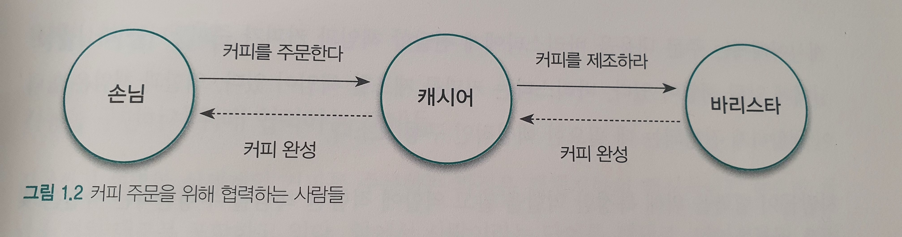

# 1. 협력하는 객체들의 공동체

## 전통적인 객체지향의 개념

`실세계를 직접적이고 직관적으로 모델링할 수 있는 패러다임`

* 많은 곳에서 위와 같이 설명한다. 철학적인 개념을 설명하는 데는 적합하지만 실제 분석, 설계를 설명하기에는 적합하지 않다.
* 실세계에 대한 비유가 객체지향이라는 용어에 담긴 기본 사상을 이해하고 학습하는 데는 효과적이다.

## 협력하는 사람들

### 요청과 응답으로 구성된 협력

* 협력은 거대하고 복잡한 문제를 해결할 수 있는 공동체를 형성할 수 있게 만든다.
* 협력은 요청과 응답으로 구성된다.
  * 문제 해결에 필요한 지식을 알고 있거나 서비스를 제공해 줄 수 있는 사람에게 도움을 요청
  * 다른 사람의 요청을 받아 주어진 책임을 다하면서 필요한 지식이나 서비스로 응답

### 역할과 책임

사람들은 다른 사람과 협력하는 과정 속에서 특정한 역할을 부여받는다. 역할은 어떤 협력에 참여하는 특정한 사람이 협력 안에서 차지하는 책임이나 임무를 의미한다.

* 여러 사람이 동일한 역할을 수행할 수 있다.
* 역할은 대체 가능성을 의미한다.
* 책임을 수행하는 방법은 자율적으로 선택할 수 있다.
* 한 사람이 동시에 여러 역할을 수행할 수 있다.

## 역할, 책임, 협력

