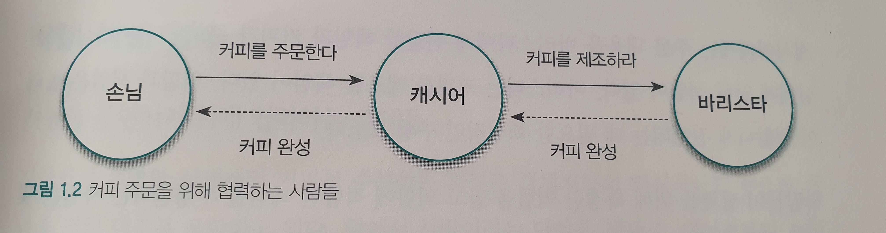

# 1. 협력하는 객체들의 공동체

> 시너지를 생각하라. 전체는 부분의 합보다 크다.
>
> by Stephen R. Covey

## 전통적인 객체지향의 개념

`실세계를 직접적이고 직관적으로 모델링할 수 있는 패러다임`

* 많은 곳에서 위와 같이 설명한다. 철학적인 개념을 설명하는 데는 적합하지만 실제 분석, 설계를 설명하기에는 적합하지 않다.
* 실세계에 대한 비유가 객체지향이라는 용어에 담긴 기본 사상을 이해하고 학습하는 데는 효과적이다.

## 협력하는 사람들

### 요청과 응답으로 구성된 협력

* 협력은 거대하고 복잡한 문제를 해결할 수 있는 공동체를 형성할 수 있게 만든다.
* 협력은 요청과 응답으로 구성된다.
  * 문제 해결에 필요한 지식을 알고 있거나 서비스를 제공해 줄 수 있는 사람에게 도움을 요청
  * 다른 사람의 요청을 받아 주어진 책임을 다하면서 필요한 지식이나 서비스로 응답

### 역할과 책임

사람들은 다른 사람과 협력하는 과정 속에서 특정한 역할을 부여받는다. 역할은 어떤 협력에 참여하는 특정한 사람이 협력 안에서 차지하는 책임이나 임무를 의미한다.

* 여러 사람이 동일한 역할을 수행할 수 있다.
* 역할은 대체 가능성을 의미한다.
* 책임을 수행하는 방법은 자율적으로 선택할 수 있다.
* 한 사람이 동시에 여러 역할을 수행할 수 있다.

## 역할, 책임, 협력

### 역할과 책임을 수행하며 협력하는 객체들

* 협력의 핵심은 특정한 책임을 수행하는 역할들 간의 연쇄적인 요청과 응답을 통해 목표를 달성한다는 것이다.
* 객체지향 설계는 적절한 객체에게 적절한 책임을 할당하는 것에서 시작된다. 책임은 설계 품질을 결정하는 가장 중요한 요소다.
* 역할은 유연하고 재사용 가능한 협력 관계를 구축하는 데 중요한 설계 요소다.

## 협력 속에 사는 객체

객체지향 애플리케이션의 윤곽을 결정하는 것은 역할, 책임, 협력이지만 실제로 협력에 참여하는 주체는 `객체`다.

* 객체는 협력적이어야 한다.
  * 다른 객체의 요청을 받아들일 줄 알아야한다.
  * 다른 객체에게 적극적으로 요청할 줄 알아야한다.
* 객체는 자율적이어야 한다.
  * 객체 스스로의 원칙에 따라 응답을 판단하고 결정해야 한다.

### 상태와 행동을 함께 지닌 자율적인 객체

`객체는 상태와 행동을 함께 지닌 실체`

객체를 흔히 이렇게 정의한다. 이 말은 객체가 협력에 참여하기 위해 어떤 행동을 해야 한다면 그 행동을 하는 데 필요한 상태도 함께 지니고 있어야 한다는 것을 의미한다.

객체의 자율성은 객체의 내부와 외부를 명확하게 구분하는 것으로부터 나온다.  
객체의 내부는 스스로 관리하고 외부에서 간섭할 수 없도록 차단해야하며, 외부에서는 접근이 허락된 수단을 통해서만 객체와 의사소통 해야 한다. 객체는 다른 객체가 `무엇`을 수행하는지는 알 수 있지만 `어떻게` 수행하는지에 대해서는 알 수 없다.

### 협력과 메시지

객체지향의 세계에서는 오직 한 가지 의사소통 수단만이 존재한다. 이를 `메시지`라고 한다.  
한 객체가 다른 객체에게 요청하는 것을 메시지를 전송한다고 말하고 다른 객체로부터 요청을 받는 것을 메시지를 수신한다고 말한다.

### 메서드와 자율성

객체는 다른 객체와 협력하기 위해 메시지를 전송한다. 객체가 수신된 메시지를 처리하는 방법을 `메서드`라고 부른다.  
메시지를 수신한 객체가 실행 시간에 메서드를 선택할 수 있다는 점은 다른 프로그래밍 언어와 객체지향 프로그래밍 언어를 구분 짓는 핵심적인 특징 중 하나다. 이것은 실행 코드를 컴파일 시간에 결정하는 절차적인 언어와 구분되는 특징이다.

외부의 요청이 무엇인지를 표현하는 메시지와 요청을 처리하기 위한 구체적인 방법인 메서드를 분리하는 것은 객체의 자율성을 높이는 핵심 메커니즘이다. 이것은 `캡슐화`라는 개념과도 깊이 관련돼 있다.

## 객체지향의 본질

* 객체지향이란 시스템을 상호작용하는 자율적인 객체들의 공동체로 바라보고 객체를 이용해 시스템을 분할하는 방법이다.
* 자율적인 객체란 상태와 행위를 함께 지니며 스스로 자기 자신을 책임지는 객체를 의미한다.
* 객체는 시스템의 행위를 구현하기 위해 다른 객체와 협력한다. 각 객체는 협력 내에서 정해진 역할을 수행하며 역할은 관련된 책임의 집합이다.
* 객체는 다른 객체와 협력하기 위해 메시지를 전송하고, 메시지를 수신한 객체는 메시지를 처리하는 데 적합한 메서드를 자율적으로 선택한다.

### 객체를 지향하라

클래스가 객체지향 언어의 관점에서 매우 중요한 구성요소인것은 분명하지만 객체지향의 핵심을 이루는 중심 개념이라고 말하기에는 무리가 있다. 지나치게 클래스를 강조하는 프로그래밍 언어적인 관점은 객체의 캡슐화를 저해하고 클래스를 서로 강하게 결합시킨다. 애플리케이션을 협력하는 객체들의 공동체가 아닌 클래스로 구성된 설계도로 보는 관점은 유연하고 확장 가능한 애플리케이션의 구축을 방해한다.

훌륭한 객체지향 설계자가 되기 위해서는 코드를 담는 클래스의 관점에서 메시지를 주고받는 객체의 관점으로 사고의 중심을 전환해야 한다. 중요한 것은 어떤 클래스가 필요한가가 아니라 `어떤 객체들이 어떤 메시지를 주고받으며 협력하는가`다. 클래스는 객체들의 협력 관계를 코드로 옮기는 도구에 불과하다.

객체지향의 핵심은 클래스가 아니라 적절한 책임을 수행하는 역할 간의 유연하고 견고한 협력 관계를 구축하는 것이다. 클래스는 협력에 참여하는 객체를 만드는 데 피룡한 구현 메커니즘일 뿐이다. 중요한 것은 클래스들의 정적인 관계가 아니라 메시지를 주고받는 객체들의 동적인 관계다.

`객체지향은 객체를 지향하는 것이지 클래스를 지향하는 것이 아니다.`

