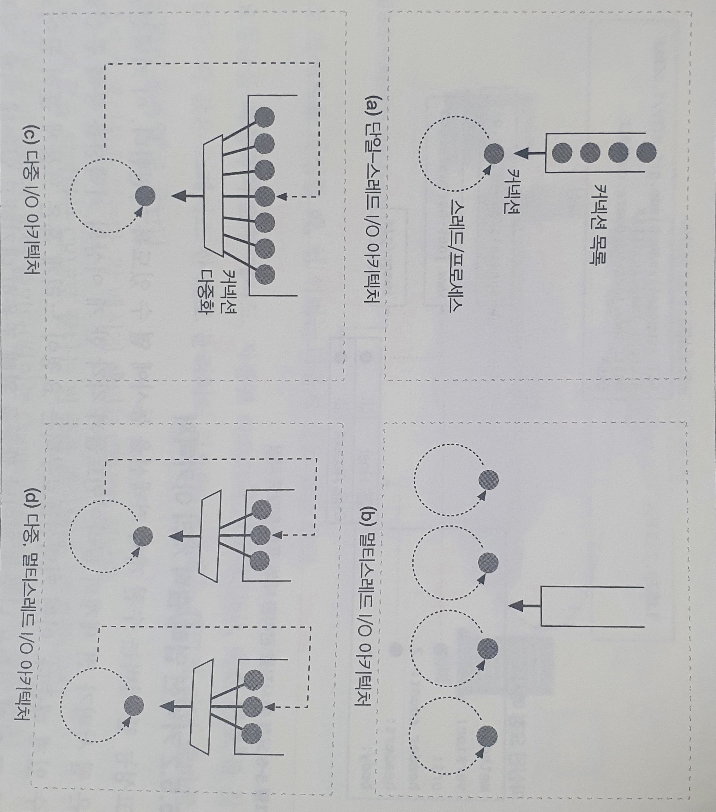
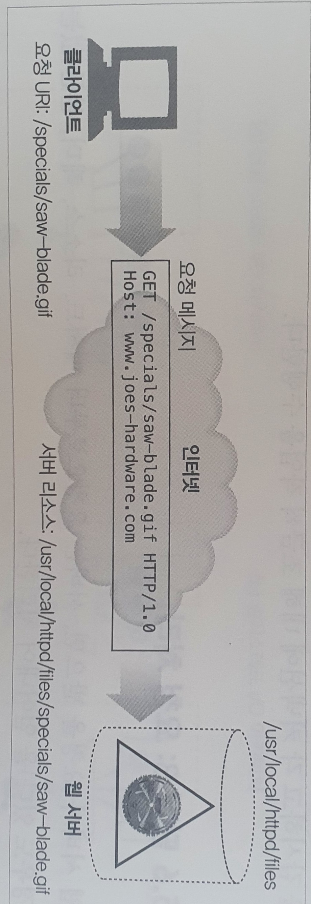
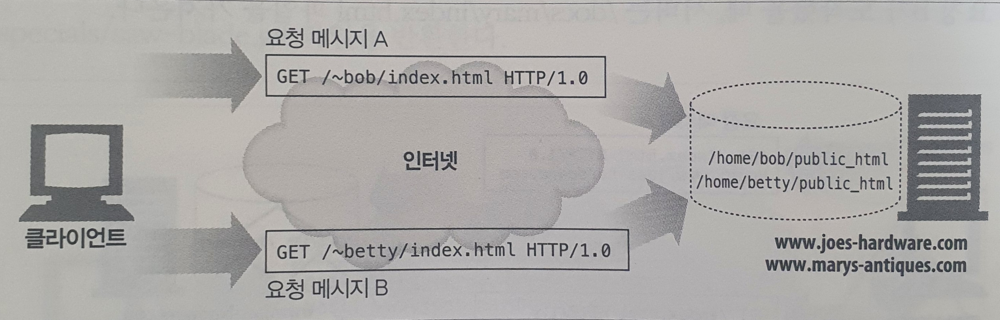

# 05. 웹서버

## 다채로운 웹 서버

웹 서버는 HTTP 요청을 처리하고 응답을 제공한다. `웹 서버` 라는 용어는 웹 서버 소프트웨어와 웹페이지 제공에 특화된 장비 양쪽 모두를 가리킨다. 웹 서버는 HTTP 프로토콜을 구현하고, 웹 리소스를 관리하고, 웹 서버 관리 기능을 제공한다.

### 다목적 소프트웨어 웹 서버

다목적 소프트웨어 웹 서버는 네트워크에 연결된 표준 컴퓨터 시스템에서 동작한다. 마이크로소프트, 아파치, nginx가 대표적인 웹 서버를 제공하는 회사들이다.

### 임베디드 웹 서버

임베디드 웹 서버는 일반 소비자용 제품에 내장될 목적으로 만들어진 작은 웹 서버이다. 사용자가 그들의 일반 소비자용 기기를 간편한 웹 브라우저 인터페이스로 관리할 수 있게 해준다. \(ex. 프린터, 가전제품 등\)

## 진짜 웹 서버가 하는 일

1. 커넥션을 맺는다
   * 클라이언트의 접속을 받아들이거나, 원치 않는 클라이언트라면 닫는다.
2. 요청을 받는다
   * HTTP 요청 메시지를 네트워크로부터 읽어 들인다.
3. 요청을 처리한다
   * 요청 메시지를 해석하고 행동을 취한다.
4. 리소스에 접근한다
   * 메시지에서 지정한 리소스에 접근한다.
5. 응답을 만든다
   * 올바른 헤더를 포함한 HTTP 응답 메시지를 생성한다.
6. 응답을 보낸다
   * 응답을 클라이언트에게 돌려준다.
7. 트랜잭션을 로그로 남긴다
   * 로그파일에 트랜잭션 완료에 대한 기록을 남긴다.

### 클라이언트 커넥션 수락

클라이언트가 이미 서버에 대해 열려있는 지속적 커넥션을 갖고 있다면, 클라이언트는 요청을 보내기 위해 그 커넥션을 사용할 수 있다. 그렇지 않다면, 클라이언트는 서버에 대한 새 커넥션을 열 필요가 있다.

웹 서버는 어떤 커넥션이든 마음대로 거절하거나 즉시 닫을 수 있다. 어떤 웹 서버들은 클라이언트의 IP 주소나 호스트 명이 인가되지 않았거나 악의적이라고 알려진 것인 경우 커넥션을 닫는다.

### 요청 메시지 수신

커넥션에 데이터가 도착하면, 웹 서버는 네트워크 커넥션에서 그 데이터를 읽어 들이고 파싱하여 요청 메시지를 구성한다.

고성능 웹 서버는 수천 개의 커넥션을 동시에 열 수 있도록 지원한다. 웹 서버 아키텍처의 차이에 따라 요청을 처리하는 방식도 달라진다.



#### 단일 스레드 웹 서버

단일 스레드 웹 서버는 한 번에 하나씩 요청을 처리한다. 트랜잭션이 완료되면, 다음 커넥션이 처리된다.  
구현이 간단하지만 처리 도중에 모든 다른 커넥션은 무시된다. 성능 문제가 있으므로 로드가 적은 진단도구에서만 적당하다.

#### 멀티 스레드 웹 서버

여러 요청을 동시에 처리하기 위해 여러 개의 프로세스 혹은 고효율 스레드를 할당한다.  
서버가 많아지면 동시 커넥션 처리를 위해 수많은 프로세스나 스레드가 너무 많은 메모리나 시스템 리소스를 소비한다. 따라서 많은 멀티 스레드 웹 서비스가 스레드/프로세스의 최대 개수에 제한을 건다.

#### 다중 I/O 서버

대량의 커넥션을 지원하기 위해, 많은 웹 서버는 다중 아키텍처를 채택했다. 다중 아키텍처에서는 모든 커넥션은 동시에 활동을 감시당한다. 커넥션의 상태가 바뀌면, 그 커넥션에 대해 작은 양의 처리가 수행된다. 그 처리가 완료되면, 커넥션은 다음번 상태 변경을 위해 열린 커넥션 목록으로 돌아간다.

#### 다중 멀티 스레드 웹 서버

멀티 스레딩과 다중화를 결합한 아키텍쳐. 여러 개의 스레드는 각각 열려있는 커넥션을 감시하고 각 커넥션에 대해 조금씩 작업을 수행한다.

### 요청 처리

웹 서버가 요청을 받으면, 서버는 요청으로부터 메서드, 리소스, 헤더, 본문을 얻어내어 처리한다.

### 리소스의 매핑과 접근

웹 서버는 리소스 서버다. html, jpeg와 같은 정적 컨텐츠를 제공하며, 서버 위에서 동작하는 리소스 생성 애플리케이션을 통해 만들어진 동적 컨텐츠도 제공한다.

#### Docroot

웹 서버는 여러 종류의 리소스 매핑을 지원한다. 하지만 리소스 매핑의 가장 단순한 형태는 요청 URI를 웹 서버의 파일 시스템 안에 있는 파일 이름으로 사용하는 것이다. 일반적으로 웹 서버 파일 시스템의 특별한 폴더를 웹 컨텐츠를 위해 예약해 둔다. 이 폴더는 문서 루트 혹은 docroot로 불린다. 웹 서버는 요청 메시지에서 URI를 가져와서 문서 루트 뒤에 붙인다.



다음과 같이 httpd.conf 설정 파일에 DocumentRoot 줄을 추가하여 아파치 웹 서버의 문서 루트를 설정할 수 있다.  
`DocumentRoot /usr/local/httpd/file`

* 가상 호스팅된 docroot

가상 호스팅 웹 서버는, 각 사이트에 그들만의 분리된 문서 루트를 주는 방법으로 한 웹 서버에서 여러 개의 웹 사이트를 호스팅 한다. 이 방법으로, 하나의 웹 서버 위에서 두 개의 사이트가 완전히 분리된 컨텐츠를 갖고 호스팅 되도록 할 수 있다.

```bash
// 아파치 웹 서버 가상 호스트 docroot 설정
<VirtualHost www.joes-hardware.com>
    ServerName    www.joes-hardware.com
    DocumentRoot    /docs/joe
    TransferLog    /logs/joe.acces_log
    ErrorLog    /logs/joe.error_log
</VirtualHost>

<VirtualHost www.marys-antiques.com>
    ServerName    www.marys-antiques.com
    DocumentRoot    /docs/mary
    TransferLog    /logs/mary.access_log
    ErrorLog    /logs/mary.error_log
</VirtualHost>
...
```

* 사용자 홈 디렉터리 docroot

docroot의 또 다른 대표적인 활용은, 사용자들이 한 대의 웹 서버에서 각자의 개인 웹 사이트를 만들 수 있도록 해주는 것이다. 보통 빗금\(/\)과 물결표\(~\) 다음에 사용자 이름이 오는 것으로 시작하는 URI는 그 사용자의 개인 문서 루트를 가리킨다. 개인 docroot는 주로 사용자 홈 디렉터리 안에 있는 public\_html로 불리는 디렉터리지만, 설정에 따라 다르다. 



#### 디렉터리 목록

웹 서버는 경로가 파일이 아닌 디렉터리를 가리키는 디렉터리 URL에 대한 요청을 받을 수 있다. 디렉터리 URL을 요청했을 때 다음과 같은 행동을 취하도록 설정할 수 있다.

* 에러를 반환한다
* 디렉터리 대신 특별한 색인 파일을 반환한다
* 디렉터리를 탐색해서 그 내용을 담은 HTML 페이지를 반환한다

대부분의 웹 서버는 요청한 URL에 대응되는 디렉터리 안에서 index.html 혹은 index.htm으로 이름 붙은 파일을 찾는다. 만약 해당 파일을 가지고 있다면, 서버는 그 파일의 컨텐츠를 반환할 것이다.

아파치 웹 서버에서, `DirectoryIndex` 설정 지시자를 사용해서 기본 디렉터리 파일로 사용될 파일 이름의 집합을 설정할 수 있다. DirectoryIndex 지시자는 디렉터리 색인 파일로 사용될 모든 파일의 이름을 우선순위로 나열한다.

`DirectoryIndex index.html index.htm home.html home.htm index.cgi`

사용자가 디렉터리 URI를 요청했을 때 기본 색인 파일이 없고 디렉터리 색인 기능이 꺼져 있지 않다면, 많은 웹 서버는 자동으로 그 디렉터리의 파일들을 크기, 변경일 및 그 파일에 대한 링크와 함께 열거한 HTML 파일을 반환한다. 이 파일 열거는 편리하기는 하지만, 일반적으로는 발견할 수 없는 파일도 드러나게 된다는 단점이 있다.  
다음과 같이 아파치 지시자로 디렉터리 색인 파일 자동 생성을 끌 수 있다.

`Options -Indexes`

#### 동적 컨텐츠 리소스 매핑

웹 서버는 URI를 동적 리소스에 매핑할 수도 있다. 웹 서버들 중에서 애플리케이션 서버라고 불리는 것들은 웹 서버를 복잡한 백엔드 애플리케이션과 연결하는 일을 한다.

#### 서버사이드 인클루드 \(SSI\)

어떤 리소스가 서버사이드 인클루드를 포함하고 있는 것으로 설정되어 있다면, 서버는 그 리소스의 컨텐츠를 클라이언트에게 보내기 전에 처리한다.  
서버는 컨텐츠에 변수 이름이나 내장된 스크립트가 될 수 있는 어떤 특별한 패턴이 있는지\(주로 특별한 HTML 주석 안에 포함된다\) 검사를 받는다. 특별한 패턴은 변수 값이나 실행 가능한 스크립트의 출력 값으로 치환된다.

#### 접근 제어

웹 서버는 각각의 리소스에 접근 제어를 할당할 수 있다. 접근 제어되는 리소스에 대한 요청이 도착했을 때 웹 서버는 클라이언트의 IP 주소에 근거하여 접근을 제어할 수 있고 혹은 리소스에 접근하기 위한 비밀번호를 물어볼 수도 있다.

### 응답 만들기

한번 서버가 리소스를 식별하면, 서버는 요청 메서드로 서술되는 동작을 수행한 뒤 응답 메시지를 반환한다. 응답 메시지는 응답 상태 코드, 응답 헤더 그리고 응답 본문을 포함한다.

#### 응답 엔터티

만약 트랜잭션이 응답 본문을 생성한다면 응답 메시지는 주로 다음을 포함한다.

* 응답 본문의 MIME 타입을 서술하는 Content-Type 헤더
* 응답 본문의 길이를 서술하는 Content-Length 헤더
* 실제 응답 본문의 내용

#### MIME 타입 결정하기

1. mime.types
   * 웹 서버는 MIME 타입을 나타내기 위해 파일 이름의 확장자를 사용할 수 있다. 가장 흔한 방법이다.
2. 매직 타이핑
   * 파일의 내용을 검사해서 알려진 패턴에 대한 테이블\(매직 파일\)에 해당하는 패턴이 있는지 찾아 볼 수 있다.
3. 유형 명시
   * 특정 파일이나 디렉터리 안의 파일들이 확장자나 내용에 상관없이 특정 타입을 갖도록 웹 서버를 설정할 수 있다.
4. 유형 협상
   * 어떤 웹 서버는 한 리소스가 여러 종류의 문서 형식에 속하도록 설정할 수 있다.

#### 리다리렉션

웹 서버는 종종 성공 메시지 대신 리다이렉션 응답을 반환한다. 리다이렉션 응답은 3XX 상태 코드로 지칭된다. Location 응답 헤더는 콘텐츠의 새로운 혹은 선호하는 위치에 대한 URI를 포함한다.

* 영구히 리소스가 옮겨진 경우 \(301\[Moved Permanently\]\)
* 임시로 리소스가 옮겨진 경우 \(303\[See Other\], 307\[Temporary Redirect\]\)
* URL 증강 - 상태 정보를 내포한 새 URL로 리다이렉트 \(303, 307\)
* 부하 균형 \(303, 307\)
* 친밀한 다른 서버가 있을 때 - 클라이언트 정보가 필요할때, 해당 정보를 가진 서버로 리다이렉트 \(303, 307\)
* 디렉터리 이름 정규화 \(빗금을 빠뜨렸다면, 빗금을 추가한 URI로 리다이렉트\)

### 응답 보내기

서버는 여러 클라이언트에 대한 많은 커넥션을 가질 수 있다. 그들 중 일부는 아무것도 안하고 있는 상태이고, 일부는 서버로 데이터를 보내고 있으며, 또 다른 일부는 클라이언트로 돌려줄 응답 데이터를 실어 나르고 있을 것이다.

서버는 커넥션 상태를 추적해야 하며 지속적인 커넥션은 특별히 주의해서 다룰 필요가 있다.   
비지속적인 커넥션이라면, 서버는 모든 메시지를 전송했을 때 자신쪽의 커넥션을 닫을 것이다.  
지속적인 커넥션이라면, 서버가 Contetn-Length 헤더를 바르게 계산하기 위해 특별한 주의를 필요로 하는 경우나, 클라이언트가 응답이 언제 끝나는지 알 수 없는 경우에 커넥션은 열린 상태를 유지할 것이다.

### 로깅

트랜잭션이 완료되었을 때 웹 서버는 트랜잭션이 어떻게 수행되었는지에 대한 로그를 로그파일에 기록한다.

