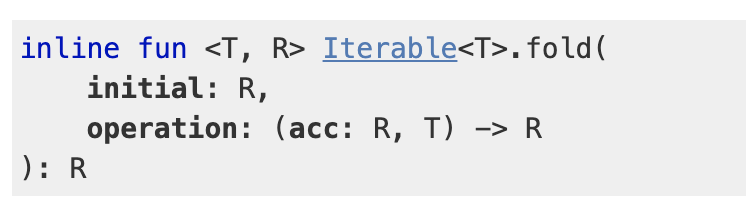

# 4. 함수형 프로그래밍

## 알고리즘에서 fold 사용하기

fold 함수는 배열 또는 반복 가능한 컬렉션에 적용할 수 있는 축약 연산이다. fold는 2개의 인자를 받는다. 첫 번째는 누적자의 초기값이며 두 번째는 두 개의 인자를 받아 누적자를 위해 새로운 값을 리턴하는 함수다.



```kotlin
// trailing lambda
fun sum(vararg nums: Int) =
    nums.fold(0) { acc, n -> acc + n }
    

fun factorialFold(n: Long): BigInteger =
    when (n) {
        0L, 1L -> BigInteger.ONE
        else -> (2..n).fold(BigInteger.ONE) { acc, i ->
            acc * BigInteger.valueOf(i)
        }
    }
    
fun fibonacciFold(n: Int) =
    (2 until n).fold(1 to 1) { (prev, curr), _ -> curr to (prev + curr) }.second    
```

참고

* [fold](https://kotlinlang.org/api/latest/jvm/stdlib/kotlin.collections/fold.html)
* [Variable number of arguments \(Varargs\)](https://kotlinlang.org/docs/reference/functions.html#variable-number-of-arguments-varargs)
* [Kotlin - 함수를 정의하는 다양한 방법 알아보기](https://codechacha.com/ko/kotlin-function-declarations-usage/)
* [Passing trailing lambdas](https://kotlinlang.org/docs/reference/lambdas.html#passing-a-lambda-to-the-last-parameter)
* [Underscore for unused variables \(Higher-Order Functions and Lambdas\)](https://kotlinlang.org/docs/reference/lambdas.html#underscore-for-unused-variables-since-11)
* [Underscore for unused variables \(Destructuring Declarations\)](https://kotlinlang.org/docs/reference/multi-declarations.html#underscore-for-unused-variables-since-11)

