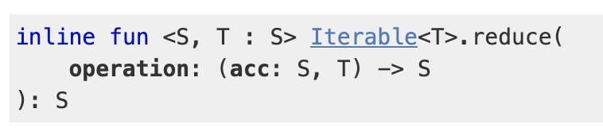

# 4. 함수형 프로그래밍

## 알고리즘에서 fold 사용하기

fold 함수는 배열 또는 반복 가능한 컬렉션에 적용할 수 있는 축약 연산이다. fold는 2개의 인자를 받는다. 첫 번째는 누적자의 초기값이며 두 번째는 두 개의 인자를 받아 누적자를 위해 새로운 값을 리턴하는 함수다.


```kotlin
// trailing lambda
fun sum(vararg nums: Int) =
    nums.fold(0) { acc, n -> acc + n }
    

fun factorialFold(n: Long): BigInteger =
    when (n) {
        0L, 1L -> BigInteger.ONE
        else -> (2..n).fold(BigInteger.ONE) { acc, i ->
            acc * BigInteger.valueOf(i)
        }
    }
    
fun fibonacciFold(n: Int) =
    (2 until n).fold(1 to 1) { (prev, curr), _ -> curr to (prev + curr) }.second    
```

참고

* [fold](https://kotlinlang.org/api/latest/jvm/stdlib/kotlin.collections/fold.html)
* [Variable number of arguments \(Varargs\)](https://kotlinlang.org/docs/reference/functions.html#variable-number-of-arguments-varargs)
* [Kotlin - 함수를 정의하는 다양한 방법 알아보기](https://codechacha.com/ko/kotlin-function-declarations-usage/)
* [Passing trailing lambdas](https://kotlinlang.org/docs/reference/lambdas.html#passing-a-lambda-to-the-last-parameter)
* [Underscore for unused variables \(Higher-Order Functions and Lambdas\)](https://kotlinlang.org/docs/reference/lambdas.html#underscore-for-unused-variables-since-11)
* [Underscore for unused variables \(Destructuring Declarations\)](https://kotlinlang.org/docs/reference/multi-declarations.html#underscore-for-unused-variables-since-11)

## reduce 함수를 사용해 축약하기

reduce 함수는 fold 함수랑 거의 같은데 사용 목적도 같다. reduce 함수에는 누적자의 초기값 인자가 없다는 것이 가장 큰 차이점이다. 누적자의 초기값은 컬렉션의 첫 번째 값으로 초기화된다. 따라서 reduce 함수는 누적자를 컬렉션의 첫 번째 값으로 초기화할 수 있는 경우에만 사용할 수 있다.



```kotlin
fun sumReduce(vararg nums: Int) =
    nums.reduce { acc, i -> acc + i }
```

컬렉션의 첫 번째 값으로 누적자를 초기화하고 컬렉션의 다른 값에 추가 연산을 필요로 하지 않는 경우에만 reduce를 사용하자.

```kotlin
// 첫 번째 값은 누적자 초기화, 두 번째 값부터 추가 연산 실행
fun sumReduceDoubles(vararg nums: Int) =
    nums.reduce { acc, i ->
        println("acc=$acc, i=$i")
        acc + 2 * i
    }
```

## 꼬리 재귀 적용하기

재귀 프로세스를 실행하는 데 필요한 메모리를 최소화하고 싶은 경우 꼬리 재귀\(tail recursion\)를 사용해 프로세스 알고리즘을 표현하고 해당 함수에 `tailrec` 키워드를 추가한다.

```kotlin
fun recursiveFactorial(n: Long): BigInteger =
    when (n) {
        0L, 1L -> BigInteger.ONE
        else -> BigInteger.valueOf(n) * recursiveFactorial(n - 1)
    }
```

각각의 새로운 재귀 호출은 콜 스택에 추가하기 때문에 결국 사용 가능한 메모리를 초과하게 된다.\(StackOverflowError\)

꼬리 재귀로 알려진 접근법은 콜 스택에 새 스택 프레임을 추가하지 않게 구현하는 특별한 종류의 재귀다. tailrec 키워드는 컴파일러에게 해당 재귀 호출을 최적화해야 한다고 알려준다. 자바에서 똑같은 알고리즘을 재귀로 작성하면 메모리 제약이 있다.

```kotlin
@JvmOverloads
tailrec fun factorial(n: Long, acc: BigInteger = BigInteger.ONE): BigInteger =
    when (n) {
        0L -> BigInteger.ONE
        1L -> acc
        else -> factorial(n - 1, acc * BigInteger.valueOf(n))
    }
```

tailrec 변경자를 적용할 수 있는 자격 요건

* 해당 함수는 반드시 수행하는 마지막 연산으로서 자신을 호출해야 한다.
* try/catch/finally 블록 안에서는 tailrec을 사용할 수 없다.
* 오직 JVM 백엔드에서만 꼬리 재귀가 지원된다.

