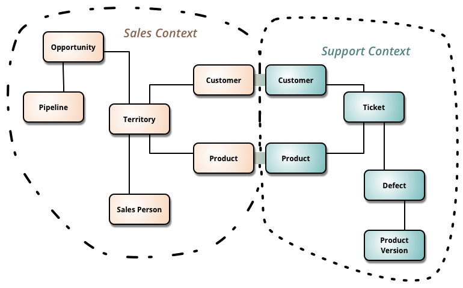

# 07. 리액티브 방식으로 데이터베이스 사용하기

## 최근 데이터 처리 패턴

### 도메인 주도 설계

DDD의 가장 중요한 결과 중 하나는 DDD의 관점에서 정의한 각각의 바운디드 컨텍스트가 하나의 마이크로서비스로 매핑된다는 것이다.

DDD는 비즈니스 핵심 도메인에 집중한다. 그 중에서도 특히 도메인 모델을 표현, 생성, 검색하는 수단에 중점을 두고 있다.

### 마이크로서비스 시대의 데이터 저장소

MSA가 도입됨에 따라 영속 계층에 생긴 가장 큰 변화라고 한다면 서비스 간에 데이터 저장소를 공유하지 않게 된 것이라고 할 수 있다. 즉, 논리적으로 분할된 각각의 서비스가 데이터베이스를 소유하고 관리하는 경우\(데이터베이스가 필요한 경우\), 서비스 API 호출을 제외한 방식으로는 다른 서비스의 데이터에 액세스할 수 없는 것이 이상적이다.

### 다중 저장소 영속화

요즘에는 시스템이 둘 이상의 서로 다른 데이터베이스 기술을 동시에 사용하는 것이 거의 일상적인 일이다. \(RDBMS, NoSQL\)

### 마이크로서비스 사이의 데이터 공유

실제 비즈니스 시스템에서는 클라이언트 요청을 처리하기 위해 두 개 이상의 서비스가 소유한 데이터를 쿼리해야 하는 경우가 있다. 모놀리식 아키텍처에서는 단일 조인 쿼리로 구현했겠지만, 마이크로서비스에서는 금지되는 방식이다. 다중 서비스 요청을 처리하려면 필요한 데이터 모두 쿼리하고 데이터를 변환해 집계 결과를 클라이언트에 반환하는 어댑터 서비스를 구현해야 한다. 또한 두 서비스 사이에 데이터 요청이 많거나 의존성이 강한 경우에는 하나의 서비스로 병합하는 것이 나을 수도 있다.

데이터를 조회하는 것은 간단하지만, 한 번에 몇 가지 서비스를 동시에 업데이트하는 것은 어렵다. 모든 서비스에는 자체 데이터베이스가 있으므로 워크플로 내에서 두 개 이상의 마이크로서비스와 데이터베이스가 비즈니스 트랜잭션에 참여한다. 이러한 문제를 해결하는 데는 몇 가지 방법이 있고, 가장 많이 사용되는 두 가지 방법은 **분산 트랜잭션**과 **이벤트 기반 아키텍처**이다.

#### 분산 트랜잭션

분산 트랜잭션은 네트워크가 분리된 두 개 이상의 컴퓨터 시스템에 저장된 데이터를 업데이트하는 트랜잭션이다. 기존 모놀리식 아키텍처에서 많이 사용된 방식이며 마이크로서비스 아키텍처에서는 권장되지 않는다. \(결합성 및 확장성 저하 등의 이유\)

#### 이벤트 기반 아키텍처

마이크로서비스 환경에서 분산된 비즈니스 트랜잭션을 구현하는 가장 좋은 방법은 이벤트 중심 아키텍처를 사용하는 것이다.  
시스템의 상태를 변경해야 하는 경우, 첫 번째 서비스가 자체 데이터베이스에서 데이터를 변경하고 동일한 내부 트랜잭션에서 이벤트를 메시지 브로커에 전달한다. 따라서 트랜잭션과 관련됐더라도 서비스 경계를 넘지 않는다. 이벤트 메시지를 전달받은 두 번째 서비스는 이벤트를 수신하고 이에 따라 저장 데이터를 변경한다. 서비스는 동시에 블로킹 되지 않으며 상호 의존성이 없다. 이벤트 기반 아키텍처를 사용하면 첫 번째 서비스가 작동하는 시점에 두 번째 서비스가 실행 중이 아니라고 해도 요청에 대한 처리를 계속할 수 있다.

## 데이터 조회를 위한 동기식 모델

