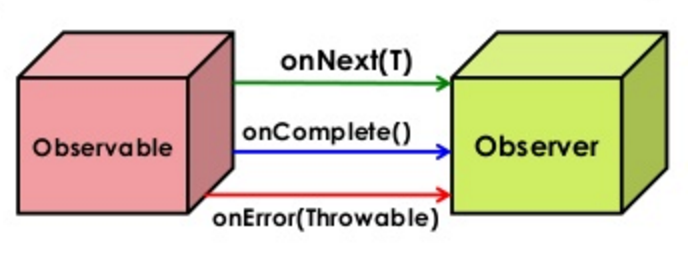

# 02. 스프링을 이용한 리액티브 프로그래밍

## 리액티브를 위한 스프링 프레임워크의 초기 해법

### 관찰자 패턴

관찰자 패턴\(Observer partern\)을 약간만 수정하면 그것이 리액티브 프로그래밍의 기초가 된다. 관찰자 패턴에는 이벤트를 발생시키는 역할\(주체\)과 이벤트를 수신하는 역할\(객체, 즉 관찰자\)이라는 두 가지 핵심 요소가 존재합니다. 이 패턴은 이벤트 처리를 기반으로 시스템을 구현할때 필수적이다. MVC패턴의 중요한 부분이며, 거의 모든 UI 라이브러리가 내부적으로 이 패턴을 사용한다.


일반적인 관찰자 패턴은 Subject와 Observer 2개의 인터페이스로 구성된다. 관찰자는 주체에 등록되고 주체로부터 알림을 수신한다. 주체는 스스로 이벤트를 발생시키거나 다른 구성 요소에 의해 호출 될 수 있다.

```java
public class ConcreteObserverA implements Observer<String> {
   @Override
   public void observe(String event) {
      System.out.println("Observer A: " + event);
   }
}

public class ConcreteObserverB implements Observer<String> {
   @Override
   public void observe(String event) {
      System.out.println("Observer B: " + event);
   }
}

public class ConcreteSubject implements Subject<String> {
   private final Set<Observer<String>> observers =
           new CopyOnWriteArraySet<>();

   public void registerObserver(Observer<String> observer) {
      observers.add(observer);
   }

   public void unregisterObserver(Observer<String> observer) {
      observers.remove(observer);
   }

   public void notifyObservers(String event) {
      observers.forEach(observer -> observer.observe(event));
   }
}
```

대기 시간이 긴 이벤트를 처리하는 관찰자가 많을 경우 추가적인 스레드 할당 또는 스레드 풀을 사용해 메시지를 병렬로 전달할 수 있다는 것을 기억해야 한다. 그러나 이러한 개선은 비효율성 및 내재된 버그를 포함하는 파악하기 어려운 코드를 만드는 길일 수 있다. 가령 스레드 풀 크기를 제한하는 것을 깜박할 수 있고  그것은 OOM을 발생시킬 것이다. 고민 없이 작성된 ExecutorService는 클라이언트가 executor가 현재의 작업을 마치기도 전에 새로운 작업을 예약하도록 요청하는 상황에서 점점 더 많은 수의 스레드를 생성하게 된다. 각 스레드는 자바에서 약 1MB를 소비하므로 일반 JVM 응용 프로그램은 단 몇천 개의 스레드만으로도 사용 가능한 메모리를 모두 소모할 수 있다. 결과적으로 다중 스레드를 위한 관찰자 패턴이 필요할 때는 검증된 라이브러리를 사용하는 것이 좋다.

### @EventListener를 사용한 발행-구독 패턴

스프링은 이벤트 처리를 위한 @EventListener와 이벤트 발행을 위한 ApplicationEventPublisher 클래스를 제공한다. @EventListener와 ApplicationEventPublisher가 관찰자 패턴의 변형으로 보일 수도 있지만, 발행-구독 패턴을 구현한다는 것을 명확히 알 필요가 있다. 관찰자 패턴과는 달리, 발행-구독 패턴에서 게시자와 구독자는 서로를 알 필요가 없습니다.


발행-구독 패턴은 게시자와 구독자 간에 간접적인 계층\(이벤트 채널. 메시지 브로커 또는 이벤트 버스라고도 함\)을 제공한다.

## 리액티브 프레임워크 RxJava

### 관찰자 + 반복자 = 리액티브 스트림

```java
public interface Observer<T> {
   void observe(T event);
}

public interface Subject<T> {
   void registerObserver(Observer<T> observer);

   void unregisterObserver(Observer<T> observer);

   void notifyObservers(T event);
}
```

관찰자 패턴은 무한한 데이터 스트림에 대해서는 매력적이었지만, 끝을 알리는 기능이 있다면 더 좋을것 같다. 또한 컨슈머가 준비하기 전에 프로듀서가 이벤트를 생성하는 것은 바라는 바가 아니다. 동기식에서는 이러한 때를 대비하여 반복자 패턴이 존재한다.

```java
public interface Iterator<T> {
   boolean hasNext();
   T next();
}
```

관찰자 패턴에 의한 비동기 실행과 반복자 패턴을 혼합한 아이디어는 다음과 같다.

```java
public interface RxObserver<T> {
   void onNext(T next);
   void onComplete();
   void onError(Exception e);
}
```

RxJava의 기본 개념인 Observer 인터페이스다. RxObserver는 onNext\(\) 콜백에 의해 RxObserver에 새로운 값이 통지된다. 또한 onComplete\(\)를 통해 스트림의 끝을 알린다. onError를 통해 오류 전파를 할 수 있다. 이 인터페이스는 리액티브 스트림의 모든 컴포넌트 사이에 데이터가 흐르는 방법을 정의한다.

이랙티브 Observable 클래스는 관찰자 패턴의 주체\(Subject\)와 일치한다. 결과적으로 Observable은 이벤트를 발생시킬 때 이벤트 소스 역할을 수행한다.

Subscriber 추상 클래스는 Observer 인터페이스를 구현하고 이벤트를 소비한다. 런타임에 Observable과 Subscriber 간의 관계는 메시지 구독 상태를 확인하고 필요한 경우 취소할 수도 있는 구독에 의해 제어된다.



### 스트림의 생산과 소비

자바 스트림과 달리 Observable은 재사용이 가능하며 모든 구독자는 구독하자마자 **Hello**라는 이벤트를 받게 된다.

```java
Observable<String> observable = Observable.create(
    sub -> {
        sub.onNext("Hello");
        sub.onCompleted();
    }
); 

Subscriber<String> subscriber = new Subscriber<String>() {
    @Override
    public void onNext(String s) {
        System.out.println(s);
    }
    @Override
    public void onComplete() {
        System.out.println("Done!");
    }
    @Override
    public void onError(Throwable e) {
        System.err.println(e);
    }
};

observable.subscribe(subscriber);

// lambda
Observable.create(
    sub -> {
        sub.onNext("Hello");
        sub.onCompleted();
    }
).subscribe(
    System.out::println,
    System.out::println,
    () -> System.out.println("Done!");
);
```


RxJava 1.2.7부터 Observable을 생성하는 방식은 더 이상 사용되지 않는다. 이 방식은 생성하는 것들이 너무 많고, 구독자에게 과도한 부하를 줄 수 있어 안전하지 않다. 다만, 기초를 익히기에는 좋다.


### 비동기 시퀀스 생성하기

```java
Observable.interval(1, TimeUnit.SECONDS)
    .subscribe(e -> System.out.println("Received: " + e));
```

```java
interface Subscription {
    void unsubscribe();
    boolean isUnsubscribed();
}
```

unsubscribe\(\) 를 사용하면 구독자는 Observable에 새 이벤트를 보낼 필요가 없음을 알릴 수 있다. Observable은 isUnsubscribed\(\)를 호출해 구독자가 여전히 이벤트를 기다리고 있는지 확인한다.

### RxJava 사용의 전제 조건 및 이점

서로 다른 리액티브 라이브러리는 API도 다르고 구현 방식도 다양하다. 하지만 구독자가 관찰 가능한 스트림에 가입한 후, 비동기적으로 이벤트를 생성해 프로세스를 시작한다는 핵심 개념은 동일하다. 프로듀서와 구독자 사이에는 프로듀서-컨슈머 관계를 해지할 수 있는 채널이 일반적으로 존재한다. 이러한 접근 방식은 매우 융통성이 있으며 생성 및 소비되는 이벤트의 양을 제어할 수 있게 해준다. 그로 인해 데이터 작성 시에만 필요하고 이후에는 사용되지 않는 CPU 사용량을 줄일 수 있다.

## 참고

* [Observer 패턴과 Publisher/Subscriber\(Pub-Sub\) 패턴의 차이점](https://jistol.github.io/software%20engineering/2018/04/11/observer-pubsub-pattern/)
* [RxJava - Observable, Observer](https://selfish-developer.com/entry/RxJava-Observable-Observer)
* [RxMarbles](https://rxmarbles.com)
* [메시지 브로커](https://heodolf.tistory.com/49)

