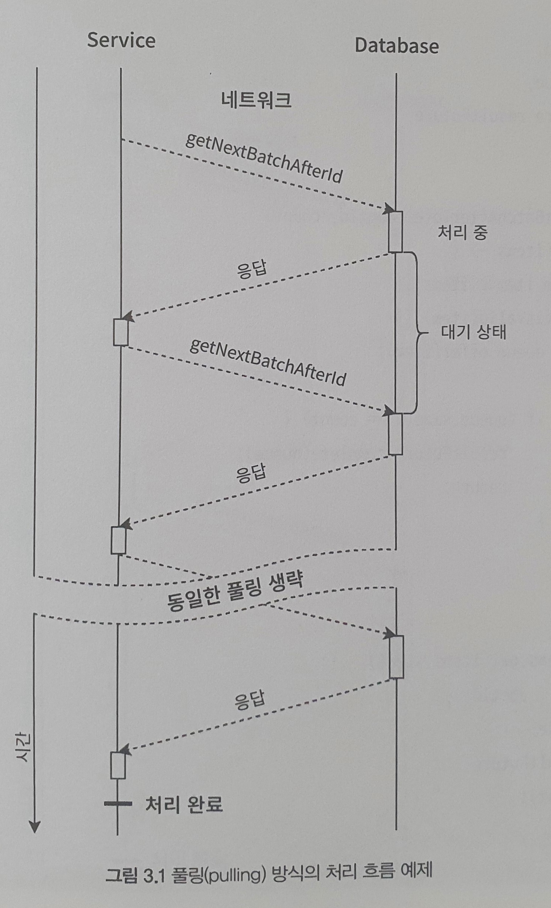
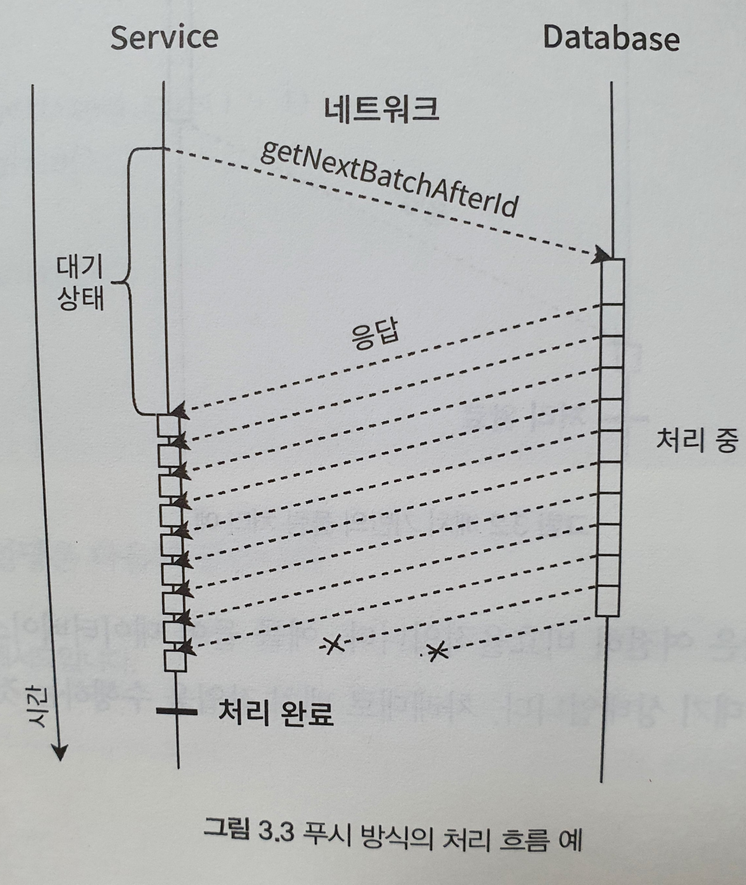
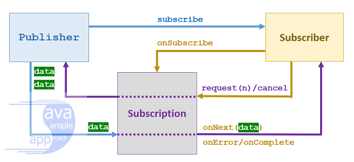
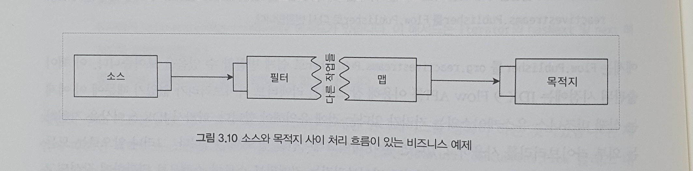
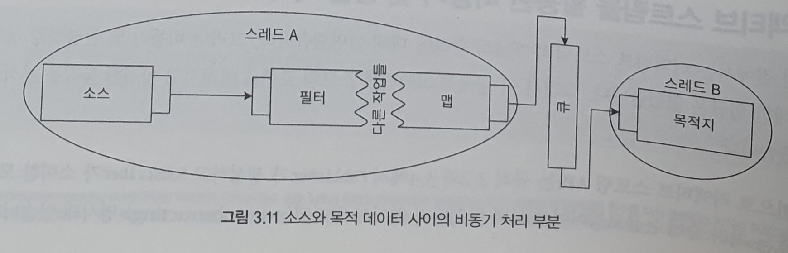
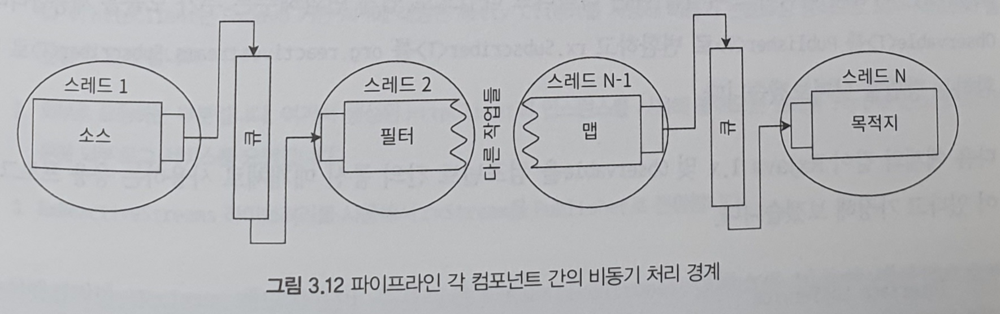

# 03. 스트림의 새로운 표준

## 모두를 위한 반응성

### API 불일치 문제

CompletionStage를 이용하는 자바 코어 라이브러리와 RxJava 같은 다양한 라이브러리가 있어서 코드를 작성할 때 다양한 선택을 할 수 있다. 그러나 과도하게 많은 선택지는 시스템을 지나치게 복잡하게 만들 수 있다. 예를 들어, 비동기 논블록킹 통신 개념에 의존하지만 서로 다른 API를 갖는 두 라이브러리가 존재한다면 하나의 콜백을 다른 콜백으로 ,또는 그 반대로 변환하기 위한 유틸리티 클래스를 추가로 제공해야 한다.

```java
public interface AsyncDatabaseClient {

	<T> CompletionStage<T> store(CompletionStage<T> stage);
}


public final class AsyncAdapters {

	public static <T> CompletionStage<T> toCompletion(ListenableFuture<T> future) {

		CompletableFuture<T> completableFuture = new CompletableFuture<>();

		future.addCallback(completableFuture::complete,
				completableFuture::completeExceptionally);

		return completableFuture;
	}

	public static <T> ListenableFuture<T> toListenable(CompletionStage<T> stage) {
		SettableListenableFuture<T> future = new SettableListenableFuture<>();

		stage.whenComplete((v, t) -> {
			if (t == null) {
				future.set(v);
			}
			else {
				future.setException(t);
			}
		});

		return future;
	}
}


@RestController
public class MyController {
	private final List<HttpMessageConverter<?>> messageConverters = new ArrayList<>();

	{
		this.messageConverters.add(new ByteArrayHttpMessageConverter());
		this.messageConverters.add(new StringHttpMessageConverter());
		this.messageConverters.add(new MappingJackson2HttpMessageConverter());
	}

	@RequestMapping(produces = MediaType.TEXT_PLAIN_VALUE)
	public ListenableFuture<?> requestData() {
		AsyncRestTemplate httpClient = new AsyncRestTemplate();
		AsyncDatabaseClient databaseClient = new FakeAsyncDatabaseClient();

		CompletionStage<String> completionStage = AsyncAdapters.toCompletion(httpClient.execute(
			"http://localhost:8080/hello",
			HttpMethod.GET,
			null,
			new HttpMessageConverterExtractor<>(String.class, messageConverters)
		));

		return AsyncAdapters.toListenable(databaseClient.store(completionStage));
	}
}                                                                  
```

예제에서 알 수 있듯이, 스프링 4.x에서 제공하는 ListenableFuture와 CompletionStage는 직접적인 통합을 제공하지 않는다. 많은 라이브러리와 프레임워크는 구성 요소 간의 비동기 통신을 위한 자체 인터페이스와 클래스를 제공한다. 대부분의 경우, 문제를 해결하고 여러 독립 라이브러리를 호환할 수 있게 하기 위해서는 개발자들이 라이브러리 일부를 수정해 재사용해야 한다. 개발자들이 라이브러리를 직접 수정하는 경우에는 버그가 유입될 수 있으며 추가적인 유지 관리가 필요하다. 핵심적인 문제는 라이브러리 공급자가 일관된 API를 만들어낼 수 있는 표준화된 방법이 없다는 것이다. 

RxJava 1.x는 시간이 지남에 따라 매우 빠르게 발전하여 많은 라이브러리 공급 업체는 신규 릴리즈에 대한 종속성을 제때 업데이트하지 못했다. 따라서 서로 다른 버전의 RxJava 1에 의존하는 다른 라이브러리와 프레임워크를 사용하면 원치 않는 문제가 발생하기도 했다. 

### 풀 방식과 푸시 방식

리액티브 초기 단계에서 모든 라이브러리의 데이터 흐름은 소스에서 구독자에게 푸시되는 방식이었다. 풀\(pull\) 방식이 때때로 충분히 효율적이지 못했으므로 이러한 결정이 내려졌다. 네트워크 경계를 지닌 시스템에서 다른 네트워크와 통신을 하는 경우를 예로 들 수 있다.



다음 요소를 하나씩 요청하면 서비스에서 서버로의 요청에 추가 시간이 소요된다. 서비스 관점에서 볼 때 전체 처리 시간 대부분이 유휴 상태에서 낭비된다. 리소스가 사용되지 않더라도 추가 네트워크 작업으로 인해 전체 처리 시간이 2배, 3배로 늘어난다. 또한, 데이터베이스는 미래에 들어올 요청의 개수를 알지 못하므로 데이터베이스가 사전에 데이터를 생성할 수 없어서 대기 상태에 있게 된다. 즉, 데이터베이스가 응답을 서비스에 전달하고 서비스가 응답을 처리한 다음, 데이터의 새 부분을 요청하는 동안 아무 일도 하지 않고 대기하므로 비효율적이다.



최적화를 통해 데이터를 한 번 요청할 수 있으며, 소스는 데이터를 사용할 수 있게 되면 비동기적으로 푸시합니다. 푸시된 원소를 수신하는 1급 객체로 RxJava 1.x 클래스를 사용합니다. 모든 요구사항이 충족되면 취소 신호가 보내지고 데이터베이스 연결이 닫힙니다.

### 흐름 제어

푸시 모델을 채택하는 가장 중요한 이유는 요청하는 횟수를 최소화해 전체 처리 시간을 최적화하는 것이다. 그래서 RxJava 1.x를 비롯한 유사 라이브러리들이 데이터 푸시를 위해 설계됐고, 그 덕분에 스트리밍이 분산 시스템 내 구성 요소 간의 통신을 위한 중요한 기술이 됐다.

반면에 푸시 모델만 사용하는 것으로는 기술적 한계가 있다. 메시지 기반 통신의 본질은 요청에 응답하는 것이다. 이는 비동기적이며 잠재적으로 무한한 메시지 스트림을 서비스가 수신할 수 있다고 가정해야 한다. 프로듀서가 컨슈머의 처리 능력을 무시하면 전반적인 시스템 안정성에 영향을 미칠 수 있다.

#### 느린 프로듀서와 빠른 컨슈머

이러한 구성은 굉장히 특이한 비즈니스 상황이거나 실제 런타임이 다르거나 컨슈머의 처리 능력이 동적으로 변하는 경우이다. 이러한 문제를 해결하기 위해 필요한 것은 실제적 요청이다. 하지만 순수 푸시 모델은 이러한 메트릭을 제공할 수 없으므로 동적으로 시스템의 처리량을 증가시키는 것은 불가능하다.

#### 빠른 프로듀서와 느린 컨슈머

이 구성의 문제는 프로듀서가 컨슈머가 처리할 수 있는 것보다 훨씬 많은 데이터를 전송할 수 있으며, 이로 인해 부하를 받는 컴포넌트에 치명적인 오류가 발생할 수 있다는 것이다.

이러한 경우에 대한 직관적인 솔루션은 처리되지 않은 원소를 큐에 수집하여 처리하는 것이다. 큐를 사용해 푸시된 데이터를 처리할 때 중요한 것 중 하나는 적절한 특성을 가진 큐를 선택하는 것이다

* 무제한 큐
  * 가장 확실한 해결책은 큐의 사이즈를 제한하지 않고 사용하는 것이다. 이 경우 생성된 모든 원소가 먼저 큐에 저장되고 나서 구독자에 의해 사용된다. 무제한 큐를 사용하여 얻는 이점은 메시지 전달에 대해 확신할 수 있다는 것이다. 즉, 모든 메시지는 반드시 컨슈머에게 전달될 것이고 컨슈머는 이를 처리하려고 할 것이다. 반면에, 실제 리소스가 무제한일 수는 없으므로 메시지 전달을 계속하면 응용 프로그램의 복원력이 떨어진다. 예를 들면 메모리 오버플로가 있다.
* 크기가 제한된 드롭 큐
  * 메모리 오버플로를 방지하기 위해 큐가 가득 차면 신규 유입된 메시지를 무시하는 형태의 큐를 사용할 수 있다. 이 기술을 이용하면 자원의 한계를 고려해 허용 용량에 따라 큐의 용량을 구성할 수 있다. 이러한 큐는 메시지의 중요성이 낮을 때 일반적으로 사용된다.
* 크기가 제한된 블로킹 큐
  * 앞의 기술은 각 메시지가 중요한 경우에는 사용하지 못 할수도 있다. 메시지를 삭제하는 대신 제한에 도달하면 메시지 유입을 차단할 수 있는 큐를 사용하는 방법이 있다. 이러한 큐를 일반적으로 블로킹 큐라고 한다. 하지만 이 기술은 시스템의 비동기 동작을 모두 무효화한다. 일반적으로 큐의 한계에 도달하면 차단이 시작되고 큐의 여유 공간을 사용할 때까지 차단 상태가 된다. 가장 느린 컨슈머의 처리량에 의해 시스템의 전체 처리량이 제한된다고 볼 수 있다.

## 리액티브 스트림의 기본 스펙

리액티브 스트림 스펙에는 Publisher, Subscriber, Subscription, Processor의 네 가지 기본 인터페이스가 정의돼 있다. 네 가지 기본 인터페이스는 이전에 사용했던 것과 대부분 비슷하다\(RxJava 1.x\). 그래서 RxJava의 잘 알려진 클래스를 대부분 포함하고 있다. 인터페이스 중 처음 두개는 기존 발행-구독 모델을 닮은 Observable-Observer와 유사하다. 그 결과 처음 두 개의 인터페이스는 Publisher와 Subscriber로 명명했다.

```java
public interface Publisher<T> {
    void subscribe(Subscriber<? super T> );
}

public interface Subscriber<T> {
    void onSubscribe(Subscription s);
    void onNext(T t);
    void onError(Throwable t);
    void onComplete();
}

public interface Subscription {
    void request(long n);
    void cancel();
}
```



Subscriber는 request 메서드를 통해 Publisher가 보내줘야 하는 데이터 크기를 알려줄 수 있으며, 이를 통해 Publisher에서 유입되는 원소의 개수가 처리할 수 있는 제한을 초과하지 않을 것임을 확신할 수 있다. 이러한 보증 수단이 있으므로 큐에 대한 추가 비용을 지불할 필요가 없다.

```java
public class NewsServiceSubscriber implements Subscriber<NewsLetter> {

    final Queue<NewsLetter> mailbox = new ConcurrentLinkedQueue<>();
    final AtomicInteger remaining = new AtomicInteger();
    final int take;

    Subscription subscription;

    public NewsServiceSubscriber(int take) {
        this.take = take;
        this.remaining.set(take);
    }

    public void onSubscribe(Subscription s) {
        if (subscription == null) {
            subscription = s;
            subscription.request(take);
        }
        else {
            s.cancel();
        }
    }

    public void onNext(NewsLetter newsLetter) {
        Objects.requireNonNull(newsLetter);

        mailbox.offer(newsLetter);
    }

    public void onError(Throwable t) {
        Objects.requireNonNull(t);

        if (t instanceof ResubscribableErrorLettter) {
            subscription = null;
            ((ResubscribableErrorLettter) t).resubscribe(this);
        }
    }

    public void onComplete() {
        subscription = null;
    }

    public Optional<NewsLetter> eventuallyReadDigest() {
        NewsLetter letter = mailbox.poll();
        if (letter != null) {
            if (remaining.decrementAndGet() == 0) {
                subscription.request(take);
                remaining.set(take);
            }
            return Optional.of(letter);
        } return Optional.empty();
    }
}
```

### Processor 개념의 소개

```java
public interface Processor<T, R> extends Subscriber<T>, Publisher<R> {
}
```

Processor는 Publisher와 Subscriber 사이에 몇 가지 처리 단계를 추가하도록 설계됐다. Processor는 일부 변환 로직을 구현해 스트리밍 파이프라인 역할을 할 수 있고 비즈니스 로직 흐름을 더 쉽게 이해할 수 있다.

### 리액티브 스트림 기술 호환성 키트 \(TCK\)

리액티브 스트림은 자바 인터페이스 외에도 이 스펙을 구현하기 위한 많은 규칙이 문서화 되어 있다. 이는 리액티브 스트림을 까다롭게 하는 부분이다. 이 규칙을 준수함으로써 다른 벤더와 쉽게 통합할 수 있다. 

개발자에게는 모든 동작을 검증하고 반응 라이브러리를 표준화해 서로 호환하는지 확인하는 공통 도구가 필요하다. 이러한 도구는 리액티브 스트림 기술 호환성 키트라는 이름으로 이미 구현되어 있다. TCK는 모든 리액티브 스트림 코드를 방어하고 지정된 규칙에 따라 구현을 테스트한다.

## 리액티브 스트림을 활용한 비동기 및 병렬 처리

리액티브 스트림 API는 Publisher가 생성하고 Subscriber가 소비한 모든 신호는 처리 중에 논블로킹이어야 하며 방해받지 않아야 한다고 명시되어 있다. 따라서 실행 환경에 따라 프로세서의 한 노드 또는 한 개의 코어를 효율적으로 활용할 수 있다는 것을 확신할 수 있다.

다른 한편으로 모든 프로세서나 코어를 효율적으로 사용하려면 병렬 처리가 필요하다. 리액티브 스트림 스펙 내의 병렬화 개념은 일반적으로 Subscriber\#onNext 메서드를 병렬로 호출하는 것을 뜻한다. 하지만 리액티브 스트림 규칙에서 on...메서드의 호출은 스레드 안전성을 보장하는 방식으로 신호를 보내야 하며, 다중 스레드에서 수행되는 경우 외부적인 동기화를 사용해야 한다고 명시하고 있습니다. 이는 직렬화되거나 순차적인 on...메서드의 호출을 전제로 한다. 따라서 ParallelPublisher와 같은 것을 만들 수 없고, 스트림의 요소를 병렬 처리할 수 없다는 것을 의미한다.



일반적인 스트림 처리 파이프는 데이터 소스 및 목적지와 함께 몇 가지 처리 또는 변환 단계를 포함한다. 각 처리 단계는 처리 시간이 길어질 수도 있고 다른 작업을 지연킬 수 있다.



한 가지 해결 방법은 각 단계에 메시지를 비동기적으로 전달하는 것이다. 인메모리 스트림 처리의 경우에는 실행의 한 부분이 하나의 스레드에 바인딩되고 다른 부분이 다른 스레드를 사용하는 것을 의미한다.

일반적으로 두 개의 독립적인 스레드 간에 처리를 분할함으로써 처리 단계 사이에 비동기 경계를 설정한다. 두 스레드는 서로 독립적으로 작동하므로 전체적인 처리를 병렬로 처리할 수 있다. 병렬화를 달성하기 위해 각 처리 단계를 적절하게 분리하기 위해 큐와 같은 데이터 구조를 적용해야 한다. 따라서 스레드 A는 처리할 메시지를 큐에 독립적으로 제공하고, 스레드 B의 Subscriber는 동일한 큐에서 메시지를 독립적으로 사용한다.

비동기 처리 경계 중 어떤 부분이 흐름 처리 부분과 연결돼야 하는가라는 질문이 있을 수 있다. 적어도 세 가지 간단한 선택지가 있다.

1. 처리 흐림이 소스 리소스에 연결돼 있고 모든 작업이 소스와 동일한 경계 내에서 발생하는 경우.
   * 모든 데이터가 하나씩 동기식으로 처리되므로 하나의 항목이 다른 스레드의 처리로 보내지기 전에 처리 단계를 통해 변환됨. 원본 리소스가 목적지 리소스보다 적게 로드될 때 유효함. 결과적으로 변환 작업은 소스 쪽에 배치하는 것이 효율적.
2. 첫 번째 케이스와 반대되는 경우.
   * 비동기 경계의 처리가 목적지 또는 컨슈머 스레드에 연결돼 있으며, 메시지 생성이 CPU를 많이 사용하는 작업인 경우에 사용. 목적지 쪽이 소스보다 더 적은 자원을 소비하는 경우 효율적.
3. 메시지 생산과 소비가 모두 CPU 집약적인 작업일 때 발생.
   * 중간 변환을 실행하는 가장 효율적인 방법은 완전히 별개의 스레드에서 실행하는 것. 각 처리 단계는 별도의 스레드에 바인딩될 수 있음.



다른 스레드로 처리 작업을 분할하는 것은 자유롭지 않으며, 각 분할 영역을 정의하는 것과 효율적인 처리 간에 균형을 유지하기 위해 합리적인 자원 소비를 계획하는 것이 중요하다. 다행히 이러한 부분은 리액티브 라이브러리에서 제공한다.

## 참고

* [Java 9 Flow API – Reactive Streams](https://grokonez.com/java/java-9/java-9-flow-api-reactive-streams)
* [Reactive Streams TCK](https://github.com/reactive-streams/reactive-streams-jvm/tree/master/tck)
* [리액티브 스트림](https://brunch.co.kr/@springboot/153)
* [Java8 CompletableFuture 사용하기](https://www.hungrydiver.co.kr/bbs/detail/develop?id=2)

