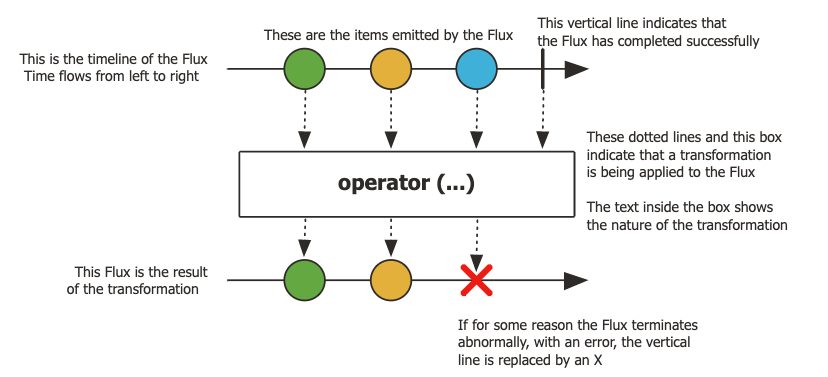
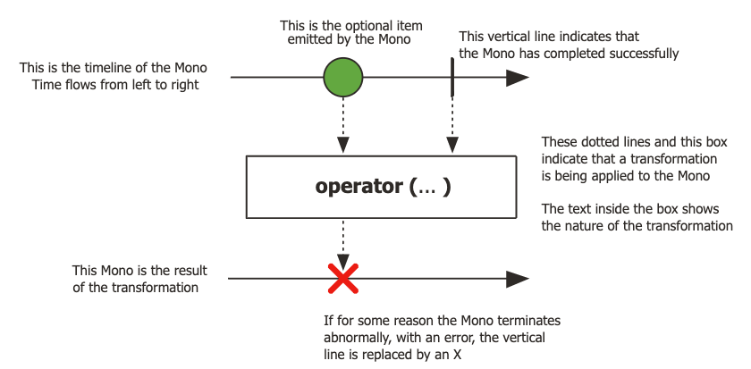

# 04. 리액터 프로젝트

## 리액터 프로젝트의 간략한 역사

리액티브 프레임워크 중에서 가장 유명한 라이브러리가 리액터 프로젝트다. 처리량이 많은 데이터 처리 프레임워크가 필요하여 스프링 프레임워크 팀이 비동기 논블로킹 처리를 지원하도록 설계한 프로젝트다.

### 리액터 프로젝트 버전

리액터 1.x에는 단점이 있었다. 우선 라이브러리에 배압 조절 기능이 없었다. 프로듀서 스레드를 차단하거나 이벤트를 생략하는 것 이외에 다른 배압 제어 방법을 제공하지 못했다. 또한 오류 처리도 복잡하였다.

리액터 2.x에서 가장 중요한 변화는 이벤트버스 및 스트림 기능을 별도의 모듈로 추출한 것이다. 또한 리액티브 스트림 스펙을 완벽하게 준수하도록 핵심 모듈까지 다시 설계했다. 스트림을 생성하고 소비하는 간단한 추가 사항 외에도 배압 관리, 스레드 처리, 복원력 지원 등을 위한 다양한 기능이 추가됐다.

리액터 3.x은 자바8을 기준으로 출시됐고, 스프링 프레임워크 5의 리액티브적인 변형을 담당한다.

## 리액티브 타입

### Flux



Flux는 `0, 1, 또는 여러 요소`를 생성할 수 있는 일반적인 리액티브 스트림을 정의한다. 

```java
onNext x 0..N [onError | onComplete]
```

잠재적으로 무한한 양의 요소를 만들 수도 있다. 구독자는 언제든지 구독을 취소할 수 있고 무한 스트림을 유한 스트림으로 변환할 수 있다.

### Mono



Mono는 `최대 하나의 요소`를 생성할 수 있는 스트림을 정의한다.

```java
onNext x 0..1 [onError | onComplete]
```

Flux와 Mono의 차이는 메서드 시그니처뿐만 아니라 버퍼 중복과 동기화 작업을 생략하기 때문에 Mono를 보다 효율적으로 사용할 수 있다. Mono&lt;T&gt;는 응용 프로그램 API가 최대 하나의 원소를 반환하는 경우 유용하다. 결과적으로 CompletableFuture&lt;T&gt;와 의미론적으로 동일하기 때문에 비슷한 용도로 사용할 수 있다. 다른점은 CompletableFuture는 반드시 반환값을 반환해야 한다. 또한 CompletableFuture는 즉시 처리를 시작하고 Mono는 구독자가 나타날 때까지 아무 작업도 수행하지 않는다. Mono 타입의 이점은 리액티브 연산자를 많이 제공하고, 더 큰 규모의 리액티브 워크플로와 완벽하게 통합할 수 있다는 점이다.

또한 클라이언트에게 작업이 완료됐음을 알리는 데 사용할 수 있다. 그 경우 Mono&lt;Void&gt; 유형을 반환하고 처리가 완료되면 onComplete\(\) 또는 onError\(\) 신호를 보낸다.

Mono와 Flux는 서로 완전히 분리된 것이 아니라 서로 쉽게 변환할 수 있다. Flux&lt;T&gt;.collectList\(\)는 Mono&lt;List&lt;T&gt;&gt;를 반환하고, Mono&lt;T&gt;.flux\(\)는 Flux&lt;T&gt;를 반환한다.

### RxJava 2의 리액티브 타입

RxJava 2.x와 리액터는 동일한 부분을 기초로 하지만, RxJava 2의 게시자는 형태가 다르다. RxJava 1.x에서는 처음에 Observable 이라는 하나의 리액티브 타입만 존재했다. 추후에 Single, Completable이 추가됐다. 버전2에는 Observable, Flowable, Sinigle, Maybe, Completable과 같은 리액티브 타입이 추가됐다.

#### 리액티브 타입 - Observable

RxJava 1.x와 거의 동일하지만 null 값을 허용하지 않는다. 또한 배압을 지원하지 않으며 Publisher 인터페이스를 구현하지 않는다. 그래서 리액티브 스트림 스펙과 직접 호환되지 않는다. 따라서 여러 요소가 있는 스트림\(몇천개 이상\)에 사용할 때 주의해야 한다. 반면 Flowable타입보다 오버헤드가 적다.

#### 리액티브 타입 - Flowable

리액터의 Flux타입과 동일한 역할로서 리액티브 스트림의 Publisher를 구현했다. Flux가 라이브러리에 좀 더 의존적인 반면, Flowable은 Publisher 유형의 인수를 사용할 수 있도록 잘 설계돼 있기 때문에 리액터 프로젝트로 구현된 리ㅣ액티브 워크플로에서 쉽게 사용할 수 있다.

#### 리액티브 타입 - Single

정화깋 하나의 요소를 생성하는 스트림을 나타낸다. Publisher를 상속하지 않았다. Single은 리액터의 Mono 타입보다 CompletableFuture의 의미를 더 잘 표현한다. 그러나 구독이 발생했을 때만 처리를 시작한다.

#### 리액티브 타입 - Maybe

리액터의 Mono 타입과 동일한 의도를 구현한다. 그러나 Publisher를 구현하지 않기 때문에 리액티브 스트림과 호환성이 없다

#### Completable

onError 또는 onComplete 신호만 발생시키고 onNext 신호는 생성할 수 없는 유형이다. Publisher를 구현하지 않으며, 의미상으로는 onNext 신호를 생성할 수 없는 Mono&lt;Void&gt; 타입에 해당한다.

요약하면, Flowable 타입만 리액티브 스트림과 호환된다. Observable은 동일한 역할을 하지만, 배압을 지원하지 않는다. Maybe&lt;T&gt;는 리액터의 Mono&lt;T&gt;에 해당하고, Completable은 리액터의 Mono&lt;Void&gt;에 해당한다. Single은 리액터로 직접 표현할 수 없다. 리액티브 스트림과 호환되는 다른 코드와 통합하려면 RxJava 유형을 Flowable 유형으로 변환해야 한다.

## 참고

* [RxJava vs Reactor 뭐가 좋나요](https://hyoj.github.io/blog/java/spring/rxjava-vs-reactor/)

