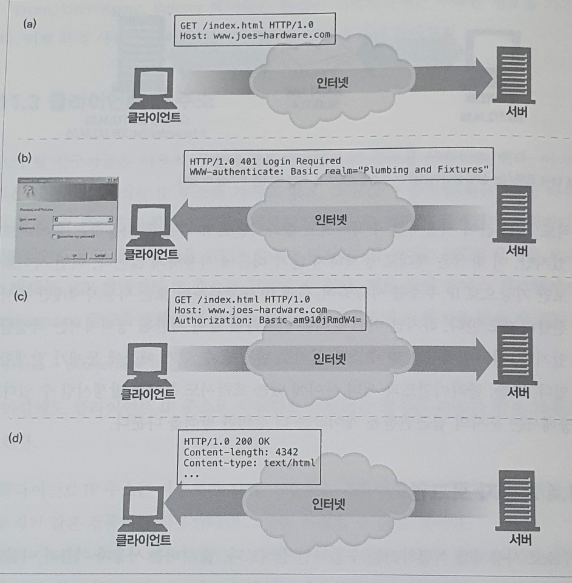

# 11. 클라이언트 식별과 쿠키

## 개별 접촉

HTTP는 익명으로 사용하며 상태가 없고 요청과 응답으로 통신하는 프로토콜이다. 서버는 클라이언트가 보낸 요청을 처리하고 나서 그 응답을 클라이언트로 전송한다. 웹 서버는 요청을 보낸 사용자를 식별하거나 방문자가 보낸 연속적인 요청을 추적하기 위해 약간의 정보를 이용할 수 있다.

* 개별 인사
* 사용자 맞춤 추천
* 저장된 사용자 정보
* 세션 추적

HTTP 자체에 식별 관련 기능이 풍부하지는 않아서, 초기 웹 사이트 설계자들은 사용자를 식별하는 그들만의 기술을 개발했다.

## HTTP 헤더

#### 사용자에 대한 정보를 전달하는 HTTP 헤더

| 헤더 이름 | 헤더 타입 | 설명 |
| :--- | :--- | :--- |
| From | 요청 | 사용자의 이메일 주소 |
| User-Agent | 요청 | 사용자의 브라우저 |
| Referer | 요청 | 사용자가 현재 링크를 타고 온 근원 페이지 |
| Authorization | 요청 | 사용자 이름과 비밀번호 |
| Client-ip | 확장\(요청\) | 클라이언트의 IP 주소 |
| X-Forwarded-For | 확장\(요청\) | 클라이언트의 IP 주소 |
| Cookie | 확장\(요청\) | 서버가 생성한 ID 라벨 |



From 헤더는 사용자가 서로 다른 이메일 주소를 가지므로 사용자를 식별할 수 있다. 하지만, 악의적인 서버가 이메일 주소를 모아서 스팸 메일을 발송하는 문제가 있어서 From 헤더를 보내는 브라우저는 많지 않다.



User-Agent 헤더는 특정 브라우저에서 제대로 동작하도록 그것들의 속성에 맞추어 콘텐츠를 최적화하는 데 유용할 수 있지만, 특정 사용자를 식별하는 데는 큰 도움이 되지 않는다.



Referer 헤더 자체만으로 사용자를 식별할 수는 없지만, 사용자가 이전에 어떤 페이지를 방문했었는지는 알려준다. 이 헤더를 통해서 사용자의 웹 사용 행태나 사용자의 취향을 더 잘 파악할 수 있다.



## 클라이언트 IP 주소

초기에는 사용자 식별에 클라이언트의 IP 주소를 사용하려 했다. 이 방식은 사용자가 확실한 IP 주소를 가지고 있고, 그 주소가 좀처럼 바뀌지 않고, 웹 서버가 요청마다 클라이언트의 IP를 알 수 있다면 문제없이 동작한다.

하지만 클라이언트 IP 주소로 사용자를 식별하는 방식은 다음과 같은 약점을 가진다.

* 클라이언트 IP 주소는 사용자가 아닌, 사용하는 컴퓨터를 가리킨다. 여러 사용자가 같은 컴퓨터를 사용한다면 그들을 식별할 수 없을 것이다.
* 많은 인터넷 서비스 제공자\(ISP\)는 사용자가 로그인하면 동적으로 IP 주소를 할당한다. 로그인한 시간에 따라, 사용자는 매번 다른 주소를 받으므로, 웹 서버는 사용자를 IP 주소로 식별할 수 없다.
* 보안을 강화하고 부족한 주소들을 관리하려고 많은 사용자가 네트워크 주소 변환\(NAT\) 방화벽을 통해 인터넷을 사용한다. 이 NAT 장비들은 클라이언트의 실제 IP 주소를 방화벽 뒤로 숨기고 클라이언트의 실제 IP 주소를 내부에서 사용하는 하나의 방화벽 IP 주소로 변환한다.
* HTTP 프락시와 게이트웨이는 원 서버에 새로운 TCP 연결을 한다. 웹 서버는 클라이언트의 IP 주소 대신 프락시 서버의 IP 주소를 본다.

## 사용자 로그인

웹 서버는 사용자 이름과 비밀번호로 인증할 것을 요구해서 사용자에게 명시적으로 식별 요청을 할 수 있다. 웹 사이트 로그인이 더 쉽도록 HTTP는 WWW-Authenticate와 Authorization 헤더를 사용해 웹 사이트에 사용자 이름을 전달하는 자체적인 체계를 가지고 있다.



## 뚱뚱한 URL

어떤 웹 사이트는 사용자의 URL마다 버전을 기술하여 사용자를 식별하고 추적하였다. 보통, URL은 URL 경로의 처음이나 끝에 어떤 상태 정보를 추가해 확장한다.

```markup
<!-- 사용자에게 할당된 식별번호(002-1145265-8016838)를 붙여서 사용자 추적 -->
...
<a href="/exec/obidos/tg/browse/-/229220/ref=gr_gifts/002-1145265-8016838">All Gifits</a><br>
...
<a href="httpL//s1.amazon.com/exec/varzea/tg/armed-forces/-//ref=gr_af_/002-1145265-8016838">Salute Our Troops</a><br>
...
```

사용자의 상태 정보를 포함하고 있는 URL을 뚱뚱한 URL이라고 부른다. 사용자가 웹 사이트에 처음 방문하면 유일한 ID가 생성되고, 그 값은 서버가 인식할 수 있는 방식으로 URL에 추가되며, 서버는 클라이언트를 이 뚱뚱한 URL로 리다이렉트 시킨다. 서버가 뚱뚱한 URL을 포함한 요청을 받으면, 사용자 아이다와 관련된 추가적인 정보를 찾아서 밖으로 향하는 모든 하이퍼링크를 뚱뚱한 URL로 바꾼다.

뚱뚱한 URL은 사이트를 브라우징하는 사용자를 식별하는데 사용할 수 있다. 하지만 이 기술에는 여러 심각한 문제가 있다.

#### 못생긴 URL

브라우저에 보이 뚱뚱한 URL은 새로운 사용자들에게 혼란을 준다

#### 공유하지 못하는 URL

뚱뚱한 URL은 특정 사용자와 세션에 대한 상태 정보를 포함한다. 만약 그 주소를 공유하게 된다면, 누적된 개인 정보를 본의 아니게 공유하게 되는 것이다.

#### 캐시를 사용할 수 없음

URL로 만드는 것은, URL이 달라지기 때문에 기존 캐시에 접근할 수 없다는 것을 의미한다.

#### 서버 부하 가중

서버는 뚱뚱한 URL에 해당하는 HTML 페이지를 다시 그려야 한다.

#### 이탈

사용자가 이탈하게 되면 지금까지의 진척사항들이 초기화되고 다시 처음부터 시작해야 될 것이다.

#### 세션 간 지속성의 부재

사용자가 특정 뚱뚱한 URL을 북마킹하지 않는 이상, 로그아웃하면 모든 정보를 잃는다.

## 쿠키

쿠키는 사용자를 식별하고 세션을 유지하는 방식 중에서 현재까지 가장 널리 사용하는 방식이다. 쿠키는 캐시와 충돌할 수 있어서, 대부분의 캐시나 브라우저는 쿠키에 있는 내용물을 캐싱하지 않는다.

### 쿠키의 타입

쿠키는 크게 세션 쿠기와 지속 쿠키 두 가지 타입으로 나눌 수 있다. `세션 쿠키`는 사용자가 사이트를 탐색할 때, 관련한 설정과 선호 사항들을 저장하는 임시 쿠키. 사용자가 브라우저를 닫으면 삭제 된다. `지속 쿠키`는 삭제되지 않고 더 길게 유지될 수 있다. 지속 쿠키는 디스크에 저장되어 브라우저를 닫거나 컴퓨터를 재시작하더라도 남아있다.

세션 쿠키와 지속 쿠키의 다른 점은 파기되는 시점뿐이다.

### 쿠키, 보안 그리고 개인정보

쿠키를 사용하지 않도록 비활성화시킬 수 있고, 로그 분석 같은 다른 방법으로 대체하는 것도 가능하므로, 그 자체가 보안상으로 엄청나게 위험한 것은 아니다.

개인정보를 다루거나 사용자를 추적하는 기술은 잘못된 의도로 사용될 수 있기 때문에 항상 조심하는 것이 좋다. 가장 큰 오용 중 하나는 협력업체 웹 사이트가 사용자를 추적하려고 지속 쿠키를 사용하는 것이다.

제공하는 개인정보를 누가 받는지 명확히 알고 사이트의 개인정보 정책에만 유의한다면, 쿠키에 관련한 위험성보다 세션 조작이나 트랜잭션상의 편리함이 더 크다.

## 참고

* [NAT](https://dany-it.tistory.com/36)

