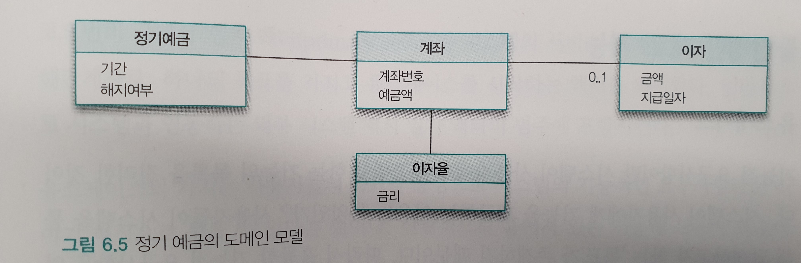
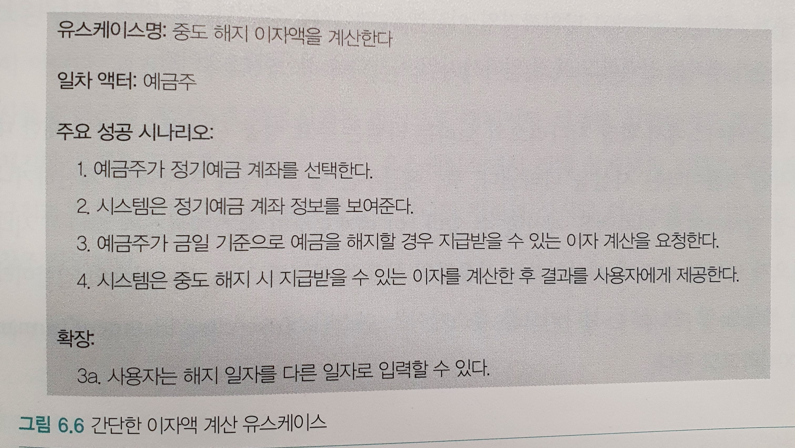

# 6. 객체 지도

> 유일하게 변하지 않는 것은 모든 것이 변한다는 사실뿐이다.
>
> Heraclitus of Ephesus

## 기능 설계 대 구조 설계

모든 소프트웨어 제품의 설계에는 두 가지 측면이 존재한다. 하나는 `기능(function)` 측면의 설계이고, 다른 하나는 `구조(structure)` 측면의 설계다. 기능 설계는 제품이 사용자를 위해 무엇을 할 수 있는지에 초점을 맞춘다. 구조 설계는 제품의 형태가 어떠해야 하는지에 초점을 맞춘다. 설계의 가장 큰 도전은 기능과 구조라는 두 가지 측면을 함께 녹여 조화를 이루도록 만드는 것이다.

설계라는 행위를 중요하게 만드는 것은 변경에 대한 필요성이다. 변경을 피할 수 있는 방법은 없기 때문에 좋은 설계에 대한 압력 역시 피할 수 없다.

좋은 설계는 나중에라도 변경할 수 있는 여지를 남겨 놓는 설계다. 설계를 하는 목적은 나중에 설계하는 것을 허용하는 것이며, 설계의 일차적인 목표는 변경에 소요되는 비용을 낮추는 것이다.

전통적인 기능 분해는 자주 변경되는 기능을 중심으로 설계한 후 구조가 기능에 따르게 한다. 이것이 바로 전통적인 기능 분해 방법이 변경에 취약한 이유다. 시스템 기능은 더 작은 기능으로 분해되고 각 기능은 서로 밀접하게 관련된 하나의 덩어리를 이루기 때문에 기능이 변경될 경우 기능의 축을 따라 설계된 소프트웨어가 전체적으로 요동치게 된다.

객체지향 접근방법은 자주 변경되지 않는 안정적인 객체 구조를 바탕으로 시스템 기능을 객체 간의 책임으로 분배한다. 객체지향은 객체의 구조에 집중하고 기능이 객체의 구조를 따르게 만든다. 시스템 기능은 더 작은 책임으로 분할되고 적절한 객체에게 분배되기 때문에 기능이 변경되더라도 객체 간의 구조는 그대로 유지된다.

## 두 가지 재료: 기능과 구조

객체지향 세계를 구축하기 위해서는 사용자에게 제공할 `기능`과 기능을 담을 안정적인 `구조`라는 재료가 준비돼 있어야 한다. 기능은 사용자가 자신의 목표를 달성하기 위해 사용할 수 있는 시스템의 서비스다. 구조는 시스템의 기능을 구현하기 위한 기반으로, 기능 변경을 수용할 수 있도록 안정적이어야 한다.

* 구조는 사용자나 이해관계자들이 도메인에 관해 생각하는 개념과 개념들 간의 관계로 표현한다.
* 기능은 사용자의 목푤르 만족시키기 위해 책임을 수행하는 시스템의 행위로 표현한다.

일반적으로 기능을 수집하고 표현하기 위한 기법을 **유스케이스 모델링**이라고 하고 구조를 수집하고 표현하기 위한 기법을 **도메인 모델링**이라고 한다. 두 가지 모델링 활동의 결과물을 각각 **유스케이스**와 **도메인 모델**이라고 한다.

## 안정적인 재료: 구조

### 도메인 모델

소프트웨어를 사용하는 사람들은 자신이 관심을 가지고 있는 특정한 분야의 문제를 해결하기 위해 소프트웨어를 사용한다. 이처럼 사용자가 프로그램을 사용하는 대상 분야를 `도메인`이라고 한다.

`모델`이란 대상을 단순화해서 표현한 것이다. 모델은 지식을 선택적으로 단순화하고 의식적으로 구조화한 형태다. 즉, 대상을 추상화하고 단순화한 것이다. 모델은 복잡성을 관리하기 위해 사용하는 기본적인 도구다.

도메인과 모델의 정의를 연결하면 도메인 모델을 쉽게 정의할 수 있다. `도메인 모델`이란 사용자가 프로그램을 사용하는 대상 영역에 관한 지식을 선택적으로 단순화하고 의식적으로 구조화한 형태다.

### 도메인의 모습을 담을 수 있는 객체지향

소프트웨어 개발의 최종 코드는 사용자가 도메인을 바라보는 관점을 반영해야 한다. 이것은 곧 애플리케이션이 도메인 모델을 기반으로 설계돼야 한다는 것을 의미한다. 도메인 모델이란 사용자들이 도메인을 바라보는 관점이며, 설계자가 시스템의 구조를 바라보는 관점인 동시에 소프트웨어 안에 구현된 코드의 모습 그 자체이기 때문이다.

객체지향을 사용하면 사용자들이 이해하고 있는 도메인의 구조와 최대한 유사하게 코드를 구조화할 수 있다. 객체지향 패러다임은 사용자의 관점, 설계자의 관점, 코드의 모습을 모두 유사한 형태로 유지할 수 있게 하는 유용한 사고 도구와 프로그래밍 기법을 제공한다.

객체지향을 이용하면 도메인에 대한 사용자 모델, 디자인 모델, 시스템 이미지 모두가 유사한 모습을 유지하도록 만드는 것이 가능하다. 객체지향의 이러한 특징을 **연결완전성** 또는 **표현적 차이**라고 한다.

### 표현적 차이

소프트웨어 객체는 현실 객채에 대한 추상화가 아니다. 소프트웨어 객체와 현실 객체 사이의 관계를 가장 효과적으로 표현할 수 있는 단어는 바로 은유다. 소프트웨어 객체는 현실 객체를 모방한 것이 아니라 은유를 기반으로 재창조한 것이다. 비록 소프트웨어 객체가 현실 객체를 왜곡한다고 하더라도 소프트웨어 객체는 현실 객체의 특성을 토대로 구축된다. 이처럼 소프트웨어 객체와 현실 객체 사이의 의미적 거리를 가리켜 `표현적 차이` 또는 `의미적 차이`라고 한다. 핵심은 은유를 통해 현실 객체와 소프트웨어 객체 사이의 차이를 최대한 줄이는 것이다.

우리는 은유를 통해 사용자가 도메인에 대해 생각하는 개념들을 투영해야 한다. 즉 소프트웨어 객체를 창조하기 위해 우리가 은유해야 하는 대상은 바로 도메인 모델이다. 도메인 모델을 기반으로 설계하고 구현하는 것은 사용자가 도메인을 바라보는 관점을 그대로 코드에 반영할 수 있게 한다. 결과적으로 표현적 차이는 줄어들 것이다.

표현적 차이가 중요한 이유는 소프트웨어를 이해하고 수정하기 쉽게 만들어주기 때문이다. 코드의 구조가 도메인의 구조를 반영하기 때문에 도메인을 이해하면 코드를 이해하기가 훨씬 수월해진다.

### 불안정한 기능을 담는 안정적인 도메인 모델

도메인 모델을 기반으로 코드를 작성하는 두 번째 이유는 도메인 모델이 제공하는 구조가 상대적으로 안정적이기 때문이다.

도메인 모델의 핵심은 사용자가 도메인을 바라보는 관점을 반영해 소프트웨어를 설계하고 구현하는 것이다. 도메인에 대한 사용자의 관점을 반영해야 하는 이유는 사용자들이 누구보다도 도메인의 본질적인 측면을 가장 잘 이해하고 있기 때문이다. 본질적이라는 것은 변경이 적고 비교적 그 특성이 오랜 시간 유지된다는 것을 의미한다. 소프트웨어 개발의 가장 큰 적은 변경이며 변경은 항상 발생한다는 사실을 기억하라. 사용자 모델에 포함된 개념과 규칙은 비교적 변경될 확률이 적기 때문에 사용자 모델을 기반으로 설계와 코드를 만들면 변경에 쉽게 대처할 수 있을 가능성이 커진다.

안정적인 구조를 제공하는 도메인 모델을 기반으로 소프트웨어의 구조를 설계하면 변경에 유연하게 대응할 수 있는 탄력적인 소프트웨어를 만들 수 있다. 도메인 모델은 기능을 구현할 때 참조할 수 있는 궁극적인 지도다.

도메인 모델이 도메인과 관련된 중요한 개념과 관계를 보여준다고 해도 실제로 사용자에게 중요한 것은 모데인 모델이 아니라 소프트웨어의 기능이다. 따라서 사용자에게 제공할 기능을 기술한 정보가 필요하다. 소프트웨어의 기능을 기술하기 위해 **유스케이스**라는 유용한 기법을 사용할 수 있다.

## 불안정한 재료: 기능

### 유스케이스

기능적 요구사항이란 시스템이 사용자에게 제공해야 하는 기능의 목록을 정리한 것이다. 사용자는 자신의 목표를 달성하기 위해 시스템과의 상호작용을 시작한다. 사용자가 시스템에게 작업을 요청하면 시스템은 요청을 처리한 후 사용자에게 원하는 결과를 제공한다. 이러한 상호작용은 사용자의 목표를 만족시키거나 에러 등의 이유로 상호작용을 더 이상 진행할 수 없을 때까지 계속된다.

사용자의 목표를 달성하기 위해 사용자와 시스템 간에 이뤄지는 상호작용의 흐름을 텍스트로 정리한 것을 `유스케이스`라고 한다. 유스케이스의 가치는 사용자들의 목표를 중심으로 시스템의 기능적인 요구사항들을 이야기 형식으로 묶을 수 있다는 점이다. 사용자 목표가 유스케이스의 핵심이다. 유스케이스는 공통의 사용자 목표를 통해 강하게 연관된 시나리오의 집합이다. 

### 유스케이스의 특성

#### 유스케이스는 사용자와 시스템 간의 상호작용을 보여주는 텍스트다

유스케이스는 다이어그램이 아니다. 중요한 것은 유스케이스 안에 포함돼 있는 상호작용의 흐름이다. 다이어그램에 노력을 쏟지 말라. 중요한 것은 유스케이스에 담겨 있는 이야기다.

#### 유스케이스는 하나의 시나리오가 아니라 여러 시나리오들의 집합이다

시나리오는 유스케이스를 통해 시스템을 사용하는 하나의 특정한 이야기 또는 경로다.

#### 유스케이스는 단순한 피쳐 목록과 다르다

피처\(feature\)는 시스템이 수행해야 하는 기능의 목록을 단순하게 나열한 것이다. 피처의 단점은 각 피처를 서로 연관이 없는 독립적인 기능으로 보이게끔 만든다는 점이다. 각 피처를 유스케이스로 묶고 사용자와의 상호작용 흐름 속에서 각 피처를 포함하는 이야기를 제공함으로써 시스템의 기능에 대해 의사소통할 수 있는 문맥을 얻을 수 있다.

#### 유스케이스는 사용자 인터페이스와 관련된 세부 정보를 포함하지 말아야 한다

유스케이스는 자주 변경되는 사용자 인터페이스 요소는 배제하고 사용자 관점에서 시스템의 행위에 초점을 맞춘다.

#### 유스케이스는 내부 설계와 관련된 정보를 포함하지 않는다

유스케이스에서 객체 설계로의 전환은 공학적인 규칙과 원칙을 기반으로 한 변환 작업이 아니라 경험과 상식과 의사소통을 기반으로 한 창조 작업이다.

### 유스케이스는 설계 기법도, 객체지향 기법도 아니다

유스케이스는 시스템의 내부 구조나 실행 메커니즘에 관한 어떤 정보도 제공하지 않는다. 유스케이스에는 단지 사용자가 시스템을 통해 무엇을 얻을 수 있고 어떻게 상호작용할 수 있는냐에 관한 정보만 기술된다. 유스케이스는 단지 기능적 요구사항을 사용자의 목표라는 문맥을 중심으로 묶기 위한 정리 기법일 뿐이다. 유스케이스는 객체의 구조나 책임에 대한 어떤 정보도 제공하지 않는다.

## 재료 합치기: 기능과 구조의 통합

### 도메일 모델, 유스케이스, 그리고 책임 주도 설계

도메인 모델은 안정적인 구조를 개념화하기 위해, 유스케이스는 불안정한 기능을 서술하기 위해 가장 일반적으로 사용되는 도구다. 변경에 유연한 소프트웨어를 만들기 위해서는 유스케이스에 정리된 시스템의 기능을 도메인 모델을 기반으로 한 객체들의 책임으로 분배해야 한다.

유스케이스에 명시된 기능을 구현하는 프로그래머는 시스템을 사용자로부터 전송된 메시지를 수행하기 위해 책임을 수행하는 거대한 자율적인 객체로 본다. 사용자에게 시스템이 수행하기로 약속한 기능은 결국 시스템의 책임으로 볼 수 있다.

시스템이 수행해야 하는 커다란 규모의 책임은 시스템 안의 더 작은 크기의 객체들의 협력을 통해 구현될 수 있다. 책임 주도 설계는 이 지점부터 적용된다. 협력의 첫 번째 메시지는 시스템의 기능을 시스템의 책임으로 바꾼 후 얻어진 것이다. 시스템에 할당된 커다락 책임은 시스템 안의 작은 규모의 객체들이 수행해야 하는 더 작은 규모의 책임으로 세분화된다.

그렇다면 어떤 객체를 선택할 것인가? 이 시점에 도메인 모델이 등장한다. 도메인 모델에 포함된 개념을 은유하는 소프트웨어 객체를 선택해야 한다. 이것은 소프트웨어와 코드 사이의 표현적 차이를 줄이는 첫걸음이다.

협력을 완성하는 데 필요한 메시지를 식별하면서 객체들에게 책임을 할당해 나간다. 마지막으로 협력에 참여하는 객체를 구현하기 위해 클래스를 추가하고 속성과 함께 메서드를 구현하면 시스템의 기능이 완성된 것이다.


요구사항들을 식별하고 도메인 모델을 생성한 후, 소프트웨어 클래스에 메서드들을 추가하고, 요구사항을 충족시키기 위해 객체들 간의 메시지 전송을 정의하라.


유스케이스는 사용자에게 제공할 기능을 시스템의 책임으로 보게 함으로써 객체 간의 안정적인 구조에 책임을 분배할 수 있는 출발점을 제공한다. 도메인 모델은 기능을 수용하기 위해 은유할 수 있는 안정적인 구조를 제공한다. 책임 주도 설계는 유스케이스로부터 첫 번째 메시지와 사용자가 달성하려는 목표를, 도메인 모델로부터 기능을 수요할 수 있는 안정적인 구조를 제공받아 실제로 동작하는 객체들의 협력 공동체를 창조한다. 책임 주도 설계 방법은 시스템의 기능을 역하로가 책임을 수행하는 객체들의 협력 관계로 바라보게 함으로써 두 가지 기본 재료인 유스케이스와 도메인 모델을 통합한다.

안정적인 도메인 모델을 기반으로 시스템의 기능을 구현하라. 도메인 모델과 코드를 밀접하게 연관시키기 위해 노력하라. 그것이 유지보수하기 쉽고 유연한 객체지향 시스템을 만드는 첫걸음이 될 것이다.

