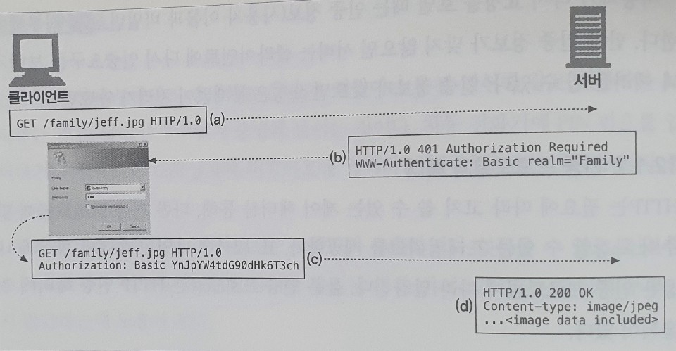

# 12. 기본 인증

서버가 사용자가 누구인지 알면, 그 사용자가 어떤 작업이나 리소스에 접근할 수 있는지 결정할 수 있다. 인증은 당신이 누구인지 증명하는 것이다. 보통 사용자 이름과 비밀번호를 입력해서 인증한다. HTTP는 자체적인 인증 관련 기능을 제공한다

## 인증

### HTTP의 인증요구/응답 프레임워크

웹 애플리케이션이 HTTP 요청 메시지를 받으면, 서버는 요청을 처리하는 대신에 현재 사용자가 누구인지를 알 수 있게 비밀번호 같이 개인 정보를 요구하는 `인증 요구`로 응답할 수 있다.

### 인증 프로토콜과 헤더

HTTP는 필요에 따라 고쳐 쓸 수 있는 제어 헤더를 통해, 다른 인증 프로토콜에 맞추어 확장할 수 있는 프레임워크를 제공한다. HTTP에는 기본 인증과 다이제스트 인증이라는 두 가지 공식적인 인증 프로토콜이 있다.

서버가 사용자에게 인증요구를 보낼 때, 서버는 401 응답과 함께 WWW-Authenticate 헤더를 기술해서 어디서 어떻게 인증할지 설명한다.

웹 서버는 기밀문서를 보안 영역\(realm\) 그룹으로 나눈다. 보안 영역은 저마다 다른 사용자 권한을 요구한다.

## 기본 인증

기본 인증에서 웹 서버는 클라이언트의 요청을 거부하고 유효한 사용자 이름과 비밀번호를 요구할 수 있다. 인증 정보를 포함하여 요청하라는 응답을 받은 브라우저는, 사용자에게 계정과 비밀번호를 입력할 수 있는 대화상자를 연다. 브라우저는 사용자가 입력한 사용자 이름과 비밀번호를 Authorization 요청 헤더 안에 암호화해서 서버로 다시 보낸다.

#### 인증요구

각 사이트는 보안 영역마다 다른 비밀번호가 있을 것이다. realm은 요청 받은 문서 집합의 이름을 따옴표로 감싼 것으로, 사용자는 이 정보를 보고 어떤 비밀번호를 사용해야 하는지 알 수 있다.

_**WWW-Authenticate: Basic realm=따옴표로 감싼 문서 집합 정보**_

#### 응답

사용자 이름과 비밀번호는 콜론으로 잇고, base-64로 인코딩해서 사용자 이름과 비밀번호에 쉽게 국제문자를 포함할 수 있게 하고, 네트워크 트래픽에 사용자 이름과 비밀번호가 노출되지 않게 한다.

_**Authorization: Basic base-64로 인코딩한 사용자 이름과 비밀번호**_

### Base-64 사용자 이름/비밀번호 인코딩

HTTP 기본 인증은 사용자 이름과 비밀번호를 콜론으로 이어서 합치고, base-64 인코딩 메서드를 사용해 인코딩 한다. base-64 인코딩은 8비트 바이트로 이루어져 있는 시퀀스를 6비트 덩어리의 시퀀스로 변환한다. 각 6비트 조각은 대부분 문자와 숫자로 이루어진 특별한 64개의 문자 중에서 선택된다.

base-64 인코딩은 국제 문자나 HTTP 헤더에서 사용할 수 없는 문자\(큰따옴표, 콜론, 캐리지 리턴\)를 포함한 사용자 이름이나 비밀번호를 보내야 할 때 유용할 수 있다. 또한 서버나 네트워크를 관리하면서 뜻하지 않게 사용자 이름과 비밀번호가 노출되는 문제를 예방하는 데 도움이 된다.

### 프락시 인증

중개 프락시 서버를 통해 인증할 수도 있다. 프락시 서버에서 접근 정책을 중앙 관리 할 수 있기 때문에, 회사 리소스 전체에 대해 통합적인 접근 제어를 하기 위해서 프락시 서버를 사용하면 좋다. 이 절차의 첫 번째 단계는 프락시 인증으로 사용자를 식별하는 것이다. 프락시 인증은 웹 서버의 인증과 헤더와 상태 코드만 다르고 절차는 같다.

## 기본 인증의 보안 결함

기본 인증은 단순하고 편리하지만 안심할 수는 없다. 기본 인증은 악의적이지 않은 누군가가 의도치 않게 리소스에 접근하는 것을 막는데 사용하거나, SSL 같은 암호 기술과 혼용한다.

기본 인증은 일반적인 환경에서 개인화나 접근을 제어하는데 편리하며, 다른 사람들이 보지 않기를 원하기는 하지만, 보더라도 치명적이지 않은 경우에는 여전히 유용하다. 이렇게 기본 인증은 사용자가 우연이나 사고로 정보에 접근해서 보는 것을 예방하는데 사용한다.

