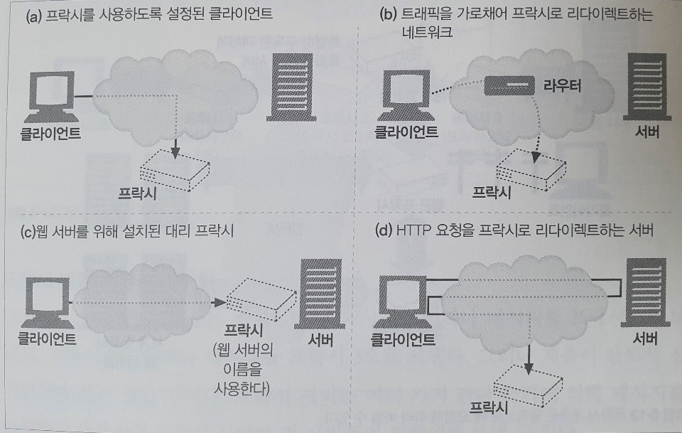

# 06. 프락시

## 웹 중개자

웹 프락시 서버는 클라이언트의 입장에서 트랜잭션을 수행하는 중개인이다. HTTP 프락시 서버는 웹 서버이기도 하고 웹 클라이언트이기도 하다. 프락시는 HTTP 클라이언트의 요청을 받게 되므로, 반드시 웹 서버처럼 요청과 커넥션을 적절히 다루고 응답을 돌려줘야 한다. 동시에 프락시는 요청을 서버로 보내기도 하므로, 요청을 보내고 응답을 받는 올바른 HTTP 클라이언트처럼 동작해야 한다.

### 개인 프락시와 공유 프락시

#### 공유 프락시

대부분의 프락시는 공용이며 공유된 프락시다. 중앙 집중형 프락시를 관리하는 게 더 비용효율이 높고 쉽다.

#### 개인 프락시

개인 전용 프락시는 그다지 흔하지는 않지만 꾸준히 사용되고 있다. 어떤 브라우저 보조 제품들은 브라우저의 기능을 확장하거나 성능을 개선하거나 무료 [ISP](https://namu.wiki/w/인터넷%20서비스%20제공사업자) 서비스를 위한 광고를 운영하기 위해 작은 프락시를 사용자의 컴퓨터에서 직접 실행한다.

### 프락시 vs 게이트웨이

프락시는 같은 프로토콜을 사용하는 둘 이상의 애플리케이션을 연결하고, 게이트웨이는 서로 다른 프로토콜을 사용하는 둘 이상을 연결한다. 게이트웨이는 클라이언트와 서버가 서로 다른 프로토콜로 말하더라도 서로 간의 트랜잭션을 완료할 수 있도록 해주는 프로토콜 변환기처럼 동작한다.

실질적으로 프락시와 게이트웨이의 차이점은 모호하다. 브라우저와 서버는 다른 버전의 HTTP를 구현하기 때문에, 프락시는 때때로 약간의 프로토콜 변환을 하기도 한다. 그리고 상용 프락시 서버는 SSL 보안 프로토콜, [SOCKS](https://docs.oracle.com/cd/E19438-01/819-3161/agsocks.html) 방화벽, FTP 접근, 그리고 웹 기반 애플리케이션을 지원하기 위해 게이트웨이 기능을 구현한다.

## 왜 프락시를 사용하는가?

프락시 서버는 실용적이고 유용한 것이라면 무슨 일이든 한다. 보안을 개선하고, 성능을 높여주며, 비용을 절약한다. 그리고 프락시 서버는 모든 HTTP 트래픽을 들여다보고 건드릴 수 있기 때문에, 부가적인 가치를 주는 여러 웹 서비스를 구현하기 위해 트래픽을 감시하고 수정할 수 있다.

* 어린이 필터 : 필터링 사용
* 문서 접근 제어자 : 단일한 접근 제어 전략을 구현하고 감사 추적을 하기 위해 사용. \(ex. 기업 환경\)
* 보안 방화벽 : 보안을 강화하기 위해 프락시 사용
* 웹 캐시 : 문서의 로컬 사본을 관리하고 해당 문서에 대한 요청이 오면 빠르게 제공
* [대리\(리버스\) 프락시](https://www.lesstif.com/system-admin/forward-proxy-reverse-proxy-21430345.html) : 웹 서버인 것처럼 위장한다. 웹 서버와는 달리 요청 받은 콘텐츠의 위치를 찾아내기 위해 다른 서버와 커뮤니케이션을 시작한다.
* 콘텐츠 라우터 : 인터넷 트래픽 조건과 콘텐츠의 종류에 따라 요청을 특정 웹 서버로 유도하는 콘텐츠 라우터로 동작할 수 있다. \(ex. 요금에 따른 캐시 서버 사용\)
* 트랜스코더 : 콘텐츠를 클라이언트에게 전달하기 전에 본문 포맷을 수정할 수 있다. 이와 같이 데이터의 표현 방식을 자연스럽게 변환하는 것을 트랜스코딩이라고 부른다. \(ex. 언어 변환\)
* 익명화 프락시 : HTTP 메시지에서 신원을 식별할 수 있는 특성들\(IP, 헤더, 쿠키, 세션 아이디 등\)을 적극적으로 제거함으로써 개인 정보 보호와 익명성 보장에 기여한다.

## 프락시는 어디에 있는가?

### 프락시 서버 배치

#### 출구 프락시

로컬 네트워크와 더 큰 인터넷 사이를 오가는 트래픽을 제어하기 위해 프락시를 로컬 네트워크의 출구에 박아 넣을 수 있다. \(ex. 회사, 학교 등\)

#### 접근\(입구\) 프락시

고객으로부터의 모든 요청을 종합적으로 처리하기 위해 프락시는 ISP 접근 지점에 위치하기도 한다.

#### 대리\(리버스\) 프락시

대리 프락시는 네트워크의 가장 끝에 있는 웹 서버들의 바로 앞에 위치하여 웹 서버로 향하는 모든 요청을 처리하고 필요할 때만 웹 서버에게 자원을 요청할 수 있다.

#### 네트워크 교환 프락시

캐시를 이용해 혼잡을 완하하고 트래픽 흐름을 감시하기 위해, 네트워크 사이의 인터넷 피어링 교환 지점들에 놓일 수 있다.


### 프락시 계층

프락시는 프락시 계층이라고 불리는 연쇄를 구성할 수 있다. 프락시 계층에서, 메시지는 최종적으로 원 서버에 도착할 때까지 프락시와 프락시를 거쳐 이동한다.

프락시 계층에서 프락시 서버들은 부모와 자식의 관계를 갖는다. 다음번 인바운드 프락시\(서버에 가까운 쪽\)를 부모라고 부르고 다음번 아웃바운드 프락시\(클라이언트 가까운 쪽\)는 자식이라고 부른다.

#### 프락시 계층 콘텐츠 라우팅

프락시 서버는 여러 가지 판단 근거에 의해 메시지를 다양하고 유동적인 프락시 서버와 원 서버들의 집합에게 보낼 수 있다.

#### 부하 균형

자식 프락시는 부하를 분산하기 위해 현재 부모들의 작업량 수준에 근거하여 부모 프락시를 고른다

#### 지리적 인접성에 근거한 라우팅

자식 프락시는 원 서버의 지역을 담당하는 부모를 선택할 수도 있다.

#### 프로토콜/타입 라우팅

어떤 자식 프락시는 URI에 근거하여 다른 부모나 원 서버로 라우팅 할 수 있다.

#### 유료 서비스 가입자를 위한 라우팅

웹서비스 운영자가 빠른 서비스를 위해 추가금을 지불했다면, 그들의 URI는 대형 캐시나 성능 개선을 위한 압축 엔진으로 라우팅 될 수 있다.

### 어떻게 프락시가 트래픽을 처리하는가

클라이트 트래픽이 프락시로 가도록 만드는 방법에는 다음 네가지가 있다.

#### 클라이언트를 수정한

많은 웹 클라이언트들은 수동 혹은 자동 프락시 설정을 지원한다.

#### 네트워크를 수정한다

클라이언트는 간섭 할 수 없는 상태에서, 네트워크 인프라를 가로채서 웹 트래픽을 프락시로 가도록 조정하는 기법도 있다. 트래픽을 가로채어 클라이언트 모르게 트래픽을 프락시로 보내는 스위칭 장치와 라우팅 장치를 필요로 한다. 이것을 인터셉트 프락시라고 부른다

#### DNS 이름공간을 수정한다

대리 프락시는 웹 서버의 이름과 IP 주소를 자신이 직접 사용한다. 그래서 모든 요청은 서버 대신 대리 프락시로 간다. 이는 DNS 이름 테이블을 수동으로 편집하거나 사용할 적절한 프락시나 서버를 계산해주는 특별한 동적 DNS 서버를 이용해서 조정될 수 있다.

#### 웹 서버를 수정한다

몇몇 웹 서버는 HTTP 리다이렉션 명령을 클라이언트에게 돌려줌으로써 클라이언트의 요청을 프락시로 리다이렉트 하도록 설정할 수 있다. 리다이렉트를 받는 즉시 클라이언트는 프락시와의 트랜잭션을 시작한다.



## 클라이언트 프락시 설정

모든 현대적인 브라우저는 프락시를 사용할 수 있도록 설정할 수 있다.

#### 수동 설정

프락시를 사용하겠다고 명시적으로 설정한다

#### 브라우저 기본 설정

브라우저 벤더나 배포자는 브라우저를 소비자에게 전달하기 전에 프락시를 미리 설정해 놓을 수 있다.

#### 프락시 자동 설정 \(Proxy auto-configuration, PAC\)

자바스크립트 프락시 자동 설정\(PAC\) 파일에 대한 URI를 제공할 수 있다.

#### WPAD 프락시 발견

대부분의 브라우저는 자동설정 파일을 다운받을 수 있는 설정 서버를 자동으로 찾아주는, 웹 프락시 자동발견 프로토콜 \(Web Proxy Autodiscovery Protocol, WPAD\)을 제공한다.

## 프락시 요청의 미묘한 특징들

### 프락시 URI는 서버 URI와 다르다

클라이언트가 웹 서버로 요청을 보낼 때, 요청줄은 스킴, 호스트, 포트번호가 없는 부분 URI를 가진다.

```text
GET /index.html HTTP/1.0
User-Agent: SuperBrowser v1.3
```

그러나 클라이언트가 프락시로 요청을 보낼 때, 요청줄은 완전한 URI를 갖는다.

```text
GET http://www.haky.com/index.html HTTP/1.0
User-Agent: SuperBrowser v1.3
```

원래의 HTTP 설계에서 클라이언트는 단일한 서버와 직접 대화했다. 하지만 프락시가 부상하면서, 부분 URI는 문제가 되었다. 프락시는 목적지 서버와 커넥션을 맺어야 하기 때문에, 그 서버의 이름을 알 필요가 있었다. 그리고 프락시 기반 게이트웨이는 여러 스킴과 연결하기 위해 URI의 스킴을 알 필요가 있었다. 그래서 서버로는 부분 URI를, 프락시로는 완전한 URI를 보낼 필요가 있다.

* 클라이언트가 프락시를 사용하지 않도록 설정되어 있다면, 부분 URI를 보낸다.
* 클라이언트가 프락시를 사용하도록 설정되어 있다면, 완전한 URI를 보낸다.

### 가상 호스팅에서 일어나는 같은 문제

가상으로 호스팅 되는 웹 서버는 여러 웹 사이트가 같은 물리적 웹 서버를 공유한다. 요청 하나가 부분 URI로 오면, 가상으로 호스팅 되는 웹 서버는 그 요청이 접근하고자 하는 웹 사이트의 호스트 명을 알 필요가 있다.

* 명시적인 프락시는 요청 메시지가 완전한 URI를 갖도록 함으로써 이 문제를 해결했다.
* 가상으로 호스팅 되는 웹 서버는 호스트와 포트에 대한 정보가 담겨 있는 Host 헤더를 요구한다.

### 인터셉트 프락시는 부분 URI를 받는다

클라이언트는 자신이 프락시와 대화하고 있음을 항상 알고 있는 것은 아니다. 인터셉트 프락시는 클라이언트에서 서버로 가는 트래픽을 가로채기 때문에, 웹 서버로 보내는 부분 URI를 얻게 될 것이다.

### 프락시는 프락시 요청과 서버 요청을 모두 다룰 수 있다

다목적 프락시 서버는 요청 메시지의 완전한 URI와 부분 URI를 모두 지원해야 한다. 명시적인 프락시 요청에 대해서는 완전한 URI를 사용하고 아니면 부분 URI를 사용해야 하며, 웹 서버 요청의 경우에는 가상 Host 헤더를 사용해야 한다.

* 완전한 URI가 주어졌다면, 프락시는 그것을 사용해야 한다
* 부분 URI가 주어졌고 Host 헤더가 있다면, Host 헤더를 이용해 원 서버의 이름과 포트 번호를 알아내야 한다
* 부분 URI가 주어졌으나 Host 헤더가 없다면, 다음의 방법으로 원 서버를 알아내야 한다.
  * 대리 프락시라면, 프락시에 실제 서버의 주소와 포트가 설정되어 있을 수 있다
  * 인터셉트 프락시가 트래픽을 받았고, 그 프락시가 원 IP 주소와 포트번호를 사용할 수 있도록 해두었다면 사용할 수 있다.
  * 모두 실패했다면 원 서버를 알아낼 충분한 정보를 갖고 있지 못한 것이므로 반드시 에러 메시지를 반환해야 한다

### 전송 중 URI 변경

일반적으로 프락시 서버는 가능한 한 관대하도록 애써야 한다. 그들은 프로토콜을 엄격하게 준수하도록 강제하는 프로토콜 경찰처럼 되려고 해서는 안된다. 이는 기존에 잘 동작하던 기능들을 망가뜨리는 결과를 수반할 수 있기 때문이다. 특히 HTTP 명세는 일반적인 인터셉트 프락시가 URI를 전달할 때 절대 경로를 고쳐 쓰는 것을 금지한다. 유일한 예외는 빈 경로를 `/`로 교체하는 것 뿐이다.

## 메시지 추적

오늘날 웹 요청의 상당수가 프락시를 지나간다. 프락시는 여러 벤더에 의해 개발되며 그들은 서로 다른 기능과 버그들을 갖고 있으며 여러 조직에 의해 관리된다. 프락시가 점점 더 흔해지면서, 서로 다른 스위치와 라우터를 넘나드는 IP 패킷의 흐름을 추적하는 것 못지 않게 프락시를 넘나드는 메시지의 흐름을 추적하고 문제점을 찾아내는 것도 필요한 일이 되었다.

### Via 헤더

메시지가 지나는 각 중간 노드\(프락시나 게이트웨이\)의 정보를 나열한다. 메시지가 또 다른 노드를 지날 때마다, 중간 노드는 VIa 목록의 끝에 반드시 추가되어야 한다.

```text
Via: 1.1 proxy-62.irenes-isp.net, 1.0 cache.joes-hardware.com
```

### TRACE 메서드

HTTP/1.1의 TRACE 메서드는 요청 메시지를 프락시의 연쇄를 따라가면서 어떤 프락시를 지나가고 어떻게 각 프락시가 요청 메시지를 수정하는지 관찰/추적할 수 있도록 해준다.

TRACE 요청이 목적지 서버에 도착했을 때, 서버는 전체 요청 메시지를 HTTP 응답 메시지의 본문에 포함시켜 송신자에게 그대로 돌려보낸다. TRACE 응답이 도착했을 때, 클라이언트는 서버가 받은 메시지와 그 메시지가 지나간 프락시들의 목록\(Via 헤더 안에 있다\)을 검사할 수 있다. TRACE 응답의 Content-Type은 message/http이며 상태는 200 OK 이다.

## 프락시 인증

프락시는 접근 제어 장치로서 제공될 수 있다. HTTP는 사용자가 유효한 접근 권한 자격을 프락시에 제출하지 않는 한 콘텐츠에 대한 요청을 차단하는 프락시 인증이라는 메커니즘을 정의하고 있다.

## 프락시 상호운용성

### 지원하지 않는 헤더와 메서드 다루기

프락시 서버는 넘어오는 헤더 필드들을 모두 이해하지 못할 수도 있다. 프락시는 이해할 수 없는 헤더 필드는 반드시 그대로 전달해야 하며, 같은 이름의 헤더 필드가 여러 개 있는 경우에는 그들의 상대적인 순서도 반드시 유지해야 한다. 비슷하게, 만약 프락시가 어떤 메서드와 친숙하지 않다면, 가능한 한 그 메시지를 다음 홉으로 전달하려 시도해야 한다.

### OPTIONS: 어떤 기능을 지원하는지 알아보기

HTTP OPTIONS 메서드는 서버나 웹 서버의 특정 리소스가 어떤 기능을 지원하는지 클라이언트가 알아볼 수 있게 해준다. 서로 다른 기능 수준의 서버와 프락시가 더 쉽게 상호작용할 수 있도록 클라이언트는 OPTIONS를 이용해 서버의 능력을 먼저 알아낼 수 있다.

### Allow 헤더

[Allow 엔터티 헤더 필드](https://developer.mozilla.org/ko/docs/Web/HTTP/Headers/Allow)는 요청 URI에 의해 식별되는 자원에 대해 지원되는 메서드들이나 서버가 지원하는 모든 메서드를 열거한다.

