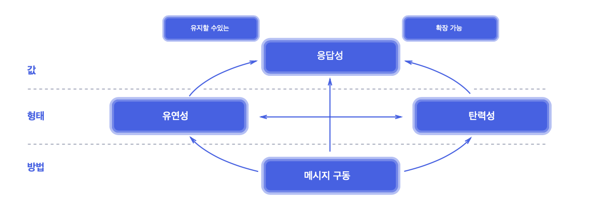

# 01. 왜 리액티브 스프링인가?

## 왜 리액티브인가?

애플리케이션은 변화에 대응해야 한다. 여기에는 수요\(부하\)의 변화 및 외부 서비스의 가용성 변화가 포함된다. 즉, 사용자 요청에 대한 `응답 능력`에 영향을 미칠 수 있는 모든 변화에 대응해야 한다.

일차적인 목표를 달성하는 첫 번째 방법은 `탄력성`을 통한 것이다. 이는 다양한 작업 부하에서 응답성을 유지하는 능력을 의미한다. 즉, 더 많은 사용자가 작업을 시작할 때 시스템 처리량이 자동으로 증가해야 하고 수요가 감소하면 자동으로 감소해야 한다. 예를 들어 추가 연산 자원 또는 추가 인스턴스를 제공해 시스템의 처리량을 증가시킬 수 있다. 수평적 또는 수직적 확장을 통해 탄력성을 달성할 수 있다.

시스템에 대한 허용 기준은 시스템 실패에도 반응성을 유지할 수 있는 능력, 시스템 `복원력`을 유지하는 것이다. 이는 시스템의 기능 요소를 격리해 모든 내부 장애를 격리하고 독립성을 확보함으로써 달성할 수 있다.

 탄력성과 복원력은 밀접하게 결합돼 있으며, 이 두 가지를 모두 사용할 때만 시스템의 진정한 응답성을 달성할 수 있다. 확장성을 통해 다수의 복제본을 가질 수 있으므로 하나의 노드에 장애가 발생한 경우 이를 탐지하고 시스템의 나머지 부분에 미치는 영향을 최소화하며 다른 복제본으로 전환할 수 있다.

### 메시지 기반 통신

```java
// spring 4 http
@RequestMapping("/resource")
public Object processRequest() {
    RestTemplate template = new RestTemplate();
    
    ExampleCollection result = template.getForObject(
        "http://example.com/api/resource2",
        ExamplesCollection.class
    );
    
    ...
    
    processResultFurther(result);
}
```

코드는 처리 시간의 일부만 효과적인 CPU 사용을 위해 할당되고, 나머지 시간 동안 스레드는 I/O에 의해 차단되며 다른 요청을 처리할 수 없다. 자바에는 병렬 처리를 위해 추가 스레드를 할당할 수 있는 `스레드 풀`이 있다. 그러나 부하가 높은 상태에서는 이러한 기법이 새로운 I/O 작업을 동시에 처리하는 데 매우 비효율적일 수 있습니다.

I/O 측면에서 리소스 활용도를 높이려면 비동기 논블로킹 모델을 사용해야 한다. 현실에서 이런 종류의 커뮤니케이션은 문자 메시지이다.

일반적으로 분산 시스템에서 서비스 간에 통신할 때 자원을 효율적으로 사용하기 위해서는 메시지 기반 통신 원칙을 따라야 한다. 메시지 기반 통신을 수행하는 방법의 하나는 메시지 브로커를 사용하는 것이다. 이 경우 메시지 대기열을 모니터링해 시스템이 부하 관리 미치 탄력성을 제어할 수 있다. 또한 메시지 통신은 명확한 흐름 제어를 제공하고 전체 설계를 단순화한다.



분산 시스템으로 구현되는 모든 비즈니스의 핵심 가치는 응답성이다. 시스템이 높은 응답성을 확보한다는 것은 탄력성 및 복원력 같은 기본 기법을 따른다는 의미이다. 마지막으로 응답성, 탄력성 및 복원력을 모두 확보하는 기본적인 방법의 하나는 메시지 기반 통신을 사용하는 것이다. 또한 이러한 원칙에 따라 구축된 시스템은 모든 구성 요소가 독립적이고 적절하게 격리돼 있기 때문에 유지 보수 및 확장이 매우 용이하다. 

## 왜 리액티브 스프링인가?

리액티브 시스템에 대한 수요 증가로 스프링 클라우드라는 새로운 스프링 프로젝트가 시작됐다. 스프링 클라우드 프레임워크는 몇 가지 문제점을 해결하고 분산 시스템 구축을 단순화하는 기반 프로젝트이다. 결과적으로 스프링 프레임워크 생태계는 리액티브 시스템을 구축하는 데 적합할 수 있다.

### 서비스 레벨에서의 반응성

전체 시스템 설계는 리액티브 시스템을 구축하는 데 있어 하나의 요소일 뿐이다. 따라서 구성 요소 수준에서도 리액티브 설계 및 구현을 제공하는 것이 중요하다. 이러한 맥락에서 설계 원칙이란 컴포넌트 사이의 관계, 예를 들면 각 기본 요소를 조합하는 데 사용되는 프로그래밍 기법을 말한다.

> 큰 시스템은 더 작은 규모의 시스템으로 구성되기 때문에 구성 요소의 리액티브 특성에 의존합니다. 즉, 리액티브 시스템은 설계 원칙을 적용하고, 이 특성을 모든 규모에 적용해 그 구성 요소를 합성할 수 있게 하는 것을 의미합니다.

```java
interface ShoppingCardService {
    Output calculate(Input value);
}

class OrdersService {
    private final ShoppingCardService scService;
    
    void process() {
        Input input = ...;
        Output output = scService.calculate(input);
        ...
    }
}
```

자바에서는 calculdate 메서드를 실행하면 OrderService 로직을 처리하는 동안 스레드가 차단된다. 따라서 별도의 독립적인 처리를 실행하려면 추가 스레드를 할당해야 한다. 하지만 추가 스레드 할당은 낭비일 수 있다. 결과적으로, 리액티브 시스템의 관점으로 본다면 그런 식의 동작은 허용되지 않는다.

하지만 자바에서 이 문제를 콜백 기법을 적용해 해결할 수 있다. 이러한 방식의 장점은 컴포넌트가 콜백 함수에 의해 분리된다는 것이다. 즉, scService.caculate 메서드를 호출한 후 ShoppingCardService의 응답을 기다리지 않고 즉시 다른 작업을 진행할 수 있다. 콜백 외에 대안은 Future가 있다.

```java
interface ShoppingCardService {
    void calculate(Input value, Consumer<Output> c);
}

class OrdersService {
    private final ShoppingCardService scService;
    void process() {
        Input input = ...;
        scService.calculate(input, output -> {
            ...
        });
    }
}
```

```java
class SyncShoppingCardService implements ShoppingCardService {
    public void calculate(Input value, Consumer<Output> c) {
        Output result = new Output();
        c.accept(result);
    }
}

class AsyncShoppingCardService implements ShoppingCardService {
    public void calculate(input value, Consumer<Output> c) {
        new Thread(() -> {
            Output result = template.getForObject(...);
            ...
            c.accept(result);
        }).start();
    }
}
```


스프링 프레임워크 5와 새로운 리액티브 웹 클라이언트가 출시되면서 많은 부분이 변경됐으며 WebClient의 도입을 통해 모든 서비스 간 통신에 논블로킹 통신을 지원합니다. 또한 서블릿 3.0은 비동기적은 클라이언트-서버 통신을 토입했는데, 서블릿 3.1은 논블로킹 I/O 쓰기를 허용합니다. 서블릿3 API에 포함된 대부분 비동기 논블로킹 기능은 스프링 MVC에 잘 통합돼 있습니다. 그러나 한 가지 문제는 스프링 MVC가 비동기 논블로킹 클라이언트를 제공하지 않음으로써 개선된 서블릿 API의 모든 이점을 무효로 만들었다는 것입니다.


## 참고

* [리액티브 선언문](https://www.reactivemanifesto.org/ko)

