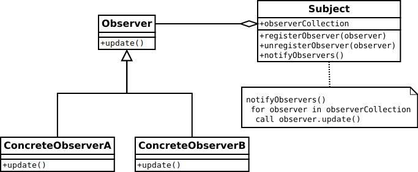

# 02. 스프링을 이용한 리액티브 프로그래밍

## 리액티브를 위한 스프링 프레임워크의 초기 해법

### 관찰자 패턴

관찰자 패턴\(Observer partern\)을 약간만 수정하면 그것이 리액티브 프로그래밍의 기초가 된다. 관찰자 패턴에는 이벤트를 발생시키는 역할\(주체\)과 이벤트를 수신하는 역할\(객체, 즉 관찰자\)이라는 두 가지 핵심 요소가 존재합니다. 이 패턴은 이벤트 처리를 기반으로 시스템을 구현할 떄 필수적이다. MVC패턴의 중요한 부분이며, 거의 모든 UI 라이브러리가 내부적으로 이 패턴을 사용한다.



일반적인 관찰자 패턴은 Subject와 Observer 2개의 인터페이스로 구성된다. 관찰자는 주체에 등록되고 주체로부터 알림을 수신한다. 주체는 스스로 이벤트를 발생시키거나 다른 구성 요소에 의해 호출 될 수 있다.

```java
public class ConcreteObserverA implements Observer<String> {
   @Override
   public void observe(String event) {
      System.out.println("Observer A: " + event);
   }
}

public class ConcreteObserverB implements Observer<String> {
   @Override
   public void observe(String event) {
      System.out.println("Observer B: " + event);
   }
}

public class ConcreteSubject implements Subject<String> {
   private final Set<Observer<String>> observers =
           new CopyOnWriteArraySet<>();

   public void registerObserver(Observer<String> observer) {
      observers.add(observer);
   }

   public void unregisterObserver(Observer<String> observer) {
      observers.remove(observer);
   }

   public void notifyObservers(String event) {
      observers.forEach(observer -> observer.observe(event));
   }
}
```

대기 시간이 긴 이벤트를 처리하는 관찰자가 많을 경우 추가적인 스레드 할당 또는 스레드 풀을 사용해 메시지를 병렬로 전달할 수 있다는 것을 기억해야 한다. 그러나 이러한 개선은 비효율성 및 내재된 버그를 포함하는 파악하기 어려운 코드를 만드는 길일 수 있다. 가령 스레드 풀 크기를 제한하는 것을 깜박할 수 있고  그것은 OOM을 발생시킬 것이다. 고민 없이 작성된 ExecutorService는 클라이언트가 executor가 현재의 작업을 마치기도 전에 새로운 작업을 예약하도록 요청하는 상황에서 점점 더 많은 수의 스레드를 생성하게 된다. 각 스레드는 자바에서 약 1MB를 소비하므로 일반 JVM 응용 프로그램은 단 몇천 개의 스레드만으로도 사용 가능한 메모리를 모두 소모할 수 있다. 결과적으로 다중 스레드를 위한 관찰자 패턴이 필요할 때는 검증된 라이브러리를 사용하는 것이 좋다.

### @EventListener를 사용한 발행-구독 패턴

스프링은 이벤트 처리를 위한 @EventListener와 이벤트 발행을 위한 ApplicationEventPublisher 클래스를 제공한다. @EventListener와 ApplicationEventPublisher가 관찰자 패턴의 변형으로 보일 수도 있지만, 발행-구독 패턴을 구현한다는 것을 명확히 알 필요가 있다. 관찰자 패턴과는 달리, 발행-구독 패턴에서 게시자와 구독자는 서로를 알 필요가 없습니다.


발행-구독 패턴은 게시자와 구독자 간에 간접적인 계층\(이벤트 채널. 메시지 브로커 또는 이벤트 버스라고도 함\)을 제공한다.

## 리액티브 프레임워크 RxJava

### 관찰자 + 반복자 = 리액티브 스트림


## 참고

* [Observer 패턴과 Publisher/Subscriber\(Pub-Sub\) 패턴의 차이점](https://jistol.github.io/software%20engineering/2018/04/11/observer-pubsub-pattern/)

